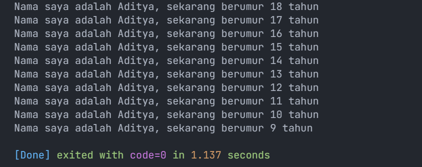
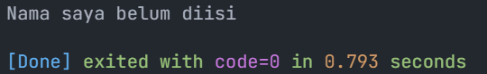
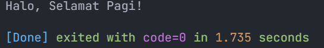

# Pertemuan 2 - Variabel dan Tipe Data

Nama : Aditya Atadewa  
Kelas : TI 2H  
NIM : 2341720174  
No. Absen : 01

---

## Soal 1

### Pertanyaan

Modifikasilah kode pada baris 3 di VS Code atau Editor Code favorit Anda berikut ini agar mendapatkan keluaran (output) sesuai yang diminta!

### Jawaban

Kode: [main.dart](./src/main.dart)

```dart
void main() {
  for (var i = 0; i < 10; i++) {
    print('Nama saya adalah Aditya, sekarang berumur ${18 - i} tahun');
  }
}
```

Output yang dihasilkan:



---

## Soal 2

### Pertanyaan

Mengapa sangat penting untuk memahami bahasa pemrograman Dart sebelum kita menggunakan framework Flutter? Jelaskan!

### Jawaban

Karena Dart merupakan bahasa dasar dari framework Flutter. Sama halnya seperti Laravel yang berbasis PHP, kita perlu menguasai PHP terlebih dahulu agar dapat menggunakan Laravel dengan baik. Demikian pula dengan Flutter, kita harus menguasai Dart karena semua fitur dan pengembangan Flutter menggunakan bahasa Dart.

---

## Soal 3

### Pertanyaan

Rangkumlah materi dari codelab ini menjadi poin-poin penting yang dapat Anda gunakan untuk membantu proses pengembangan aplikasi mobile menggunakan framework Flutter.

### Jawaban

### Pertanyaan

Rangkumlah materi dari codelab ini menjadi poin-poin penting yang dapat Anda gunakan untuk membantu proses pengembangan aplikasi mobile menggunakan framework Flutter.

### Jawaban

**1. Keunggulan & Fitur Utama Dart**

- Productive tooling: dukungan IDE, analisis kode, ekosistem paket besar.
- Garbage collection: manajemen memori otomatis.
- Type annotations (opsional) dan type inference: keamanan dan konsistensi dalam mengontrol data.
- Statically typed dan type-safe: bug lebih cepat ditemukan saat kompilasi.
- Portability: bisa berjalan di web (JavaScript) dan native (ARM/x86).

**2. Cara Kerja Dart**

- Dart bisa dieksekusi melalui Dart VM atau dikompilasi ke JavaScript untuk web.
- JIT (Just-In-Time compilation): digunakan saat development karena mendukung debugging dan hot reload.
- AOT (Ahead-Of-Time compilation): digunakan untuk release agar aplikasi lebih cepat dan efisien, meskipun debugging/hot reload tidak tersedia.
- Didukung oleh runtime system, core libraries, dan garbage collector untuk mengelola eksekusi aplikasi.
- Memberikan fleksibilitas cross-platform, sehingga kode bisa dijalankan di berbagai platform tanpa banyak perubahan.

**3. Struktur Bahasa Dart untuk Flutter**

- Menganut konsep Object-Oriented Programming (OOP) dengan dukungan Encapsulation, Inheritance, Polymorphism, Abstraction, dan Composition.
- Operator adalah method (contoh: `x == y` artinya `x.==(y)`).
- Mendukung operator aritmatika (+, -, *, /, ~/), increment/decrement (++/--), equality/relational (==, !=, >, <, >=, <=), dan logical (!, ||, &&).

---

## Soal 4

### Pertanyaan

Buatlah penjelasan dan contoh eksekusi kode tentang perbedaan Null Safety dan Late variabel !

### Jawaban

#### 1. Null Safety
- Null safety adalah fitur di Dart untuk mencegah error karena nilai null.
- Secara default, variabel tidak boleh bernilai null kecuali ditandai dengan `?`.
- Dengan null safety, kita bisa lebih aman menghindari **Null Reference Error**.

Contoh Kode Null Safety: [null_safety.dart](./src/null_safety.dart)
```dart
void main() {
  // String name = null; // Error, karena String default non-nullable
  String? name; // nullable, bisa menampung null

  if (name == null) {
    print('Nama saya belum diisi');
  } else {
    print('Nama saya adalah $name');
  }
}
```

Output:


#### 2. Late Variable

- `late` digunakan untuk mendeklarasikan variabel non-nullable tetapi inisialisasinya bisa ditunda.  
- Cocok digunakan ketika nilai variabel baru bisa diketahui nanti, bukan saat deklarasi.  
- Jika variabel `late` diakses sebelum diinisialisasi, maka akan terjadi error runtime. 

Contoh Kode Late Variable: [late_variable.dart](./src/late_variable.dart)
```dart
void main(){
  late String message;

  // print(message); // Error karena digunakan sebelum diinisialisasi

  message = "Halo, Selamat Pagi!";
  print(message);
}
```

Output:
