# Pertemuan 3 - Percabangan dan Perulangann

**Nama : Aditya Atadewa**  
**Kelas : TI 3G**  
**NIM : 2341720174**  
**No. Absen : 01**

---

## Praktikum 1: Menerapkan Control Flows ("if/else")

### Langkah 1

Mengetik kode program berikut ke [if_else.dart](./src/if_else.dart).

```dart
void main() {
  String test = "test2";
  if (test == "test1") {
    print("Test1");
  } else If (test == "test2") {
    print("Test2");
  } Else {
    print("Something else");
  }

  if (test == "test2") print("Test2 again");
}
```

### Langkah 2

Eksekusi (Run) kode pada langkah 1.

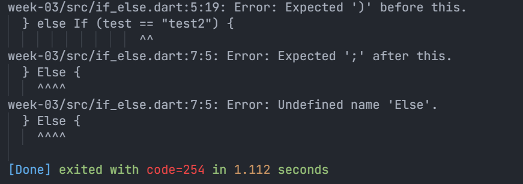

Terjadi error karena penulisan `else If` dan `Else `menggunakan huruf besar, sedangkan Dart hanya mengenali kata kunci dengan huruf kecil (else if, else).

#### Perbaikan Kode Program

```dart
void main() {
  String test = "test2";

  if(test == "test1") {
    print("Test1");
  } else if(test == "test2"){
    print("Test2");
  } else {
    print("Something else");
  }

  if (test == "test2") print("Test2 again");
}
```
Mengganti penulisan `else If` menjadi `else if` dan `Else` menjadi `else`, sehingga kode dapat dijalankan.

#### Output

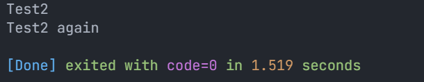

Kode program tersebut menggunakan struktur kontrol alur if-else if untuk memeriksa nilai dari variabel `test` yang berisi string `"test2"` dan mencetak output berdasarkan kondisi yang diuji.

#### Bagian Pertama: Struktur if-else if

```dart
  if(test == "test1") {
    print("Test1");
  } else if(test == "test2"){
    print("Test2");
  } else {
    print("Something else");
  }
```

- Kondisi pertama:  
  Program memeriksa apakah nilai `test == "test1"`. Karena nilai `test` adalah "test2", kondisi ini bernilai false dan blok kode di dalam if tidak dijalankan.

- Kondisi kedua (else if):  
  Program memeriksa apakah nilai `test == "test2"`. Karena nilai `test` adalah "test2", kondisi ini bernilai true dan program mengeksekusi perintah untuk mencetak "Test2".

- Kondisi else:  
  Kondisi ini hanya dijalankan jika kondisi if dan else if gagal. Karena kondisi else if sudah terpenuhi, bagian ini tidak dijalankan.

#### Bagian Kedua

```dart
  if (test == "test2") print("Test2 again");
```

- Program memeriksa apakah nilai `test == "test2"`. Karena nilai `test` adalah "test2", kondisi ini bernilai true dan program mencetak "Test2 again".

### Langkah 3

Menambahkan kode berikut ke [if_else.dart](./src/if_else.dart).

```dart
  String test = "true";

  if (test) {
    print("Kebenaran");
  }
```

Output:

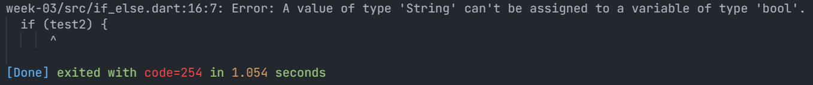

Kode tersebut akan menghasilkan error karena if di Dart memerlukan kondisi bertipe bool, sementara variabel `test` bertipe String.

#### Perbaikan Kode Program:

```dart
  String test = "true";

  if (test == "true") {
    print("Kebenaran");
  }
```

Dengan menggunakan `test == "true"`, kondisi if sekarang membandingkan isi dari variabel test2 dengan string "true".

atau

```dart
  bool test = true;

  if (test) {
    print("Kebenaran");
  }
```

Dengan mengubah variabel test2 dari tipe String menjadi bool, kondisi `if (test)` bisa langsung dievaluasi karena test2 bertipe bool, yang menghasilkan nilai true atau false.

#### Output:

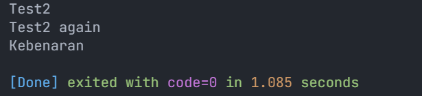

---

## Praktikum 2: Menerapkan Perulangan "while" dan "do-while"

### Langkah 1

Mengetik kode program berikut ke [while_do_while.dart](./src/while_do_while.dart).

```dart
void main() {
  while (counter < 33) {
    print(counter);
    counter++;
  }
}
```

### Langkah 2

Eksekusi (Run) kode pada langkah 1.

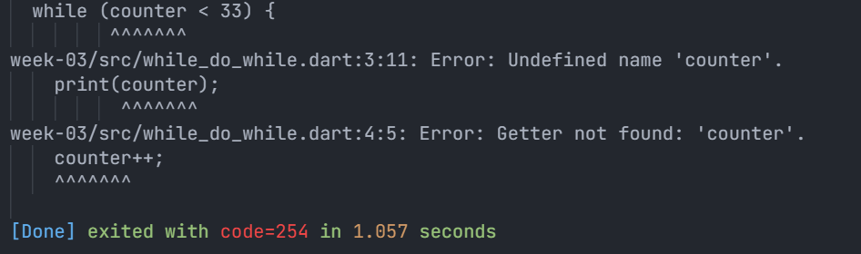

Terjadi error karena variabel counter belum dideklarasikan sebelum digunakan dalam while loop.

#### Perbaikan Kode Program

```dart
void main() {
  int counter = 0;

  while (counter < 33) {
    print(counter);
    counter++;
  }
}
```

Mendeklarasikan variabel counter sebelum digunakan dalam while loop.

#### Output

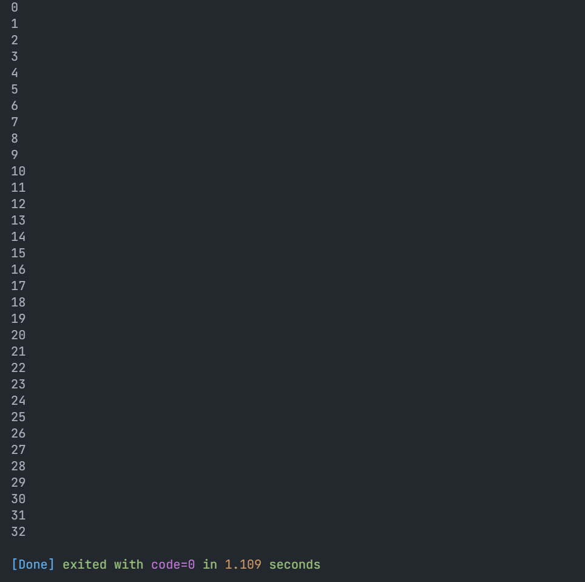

### Langkah 3

Menambahkan kode berikut ke [while_do_while.dart](./src/while_do_while.dart).

```dart
  do {
    print(counter);
    counter++;
  } while (counter < 77);
```

Output:

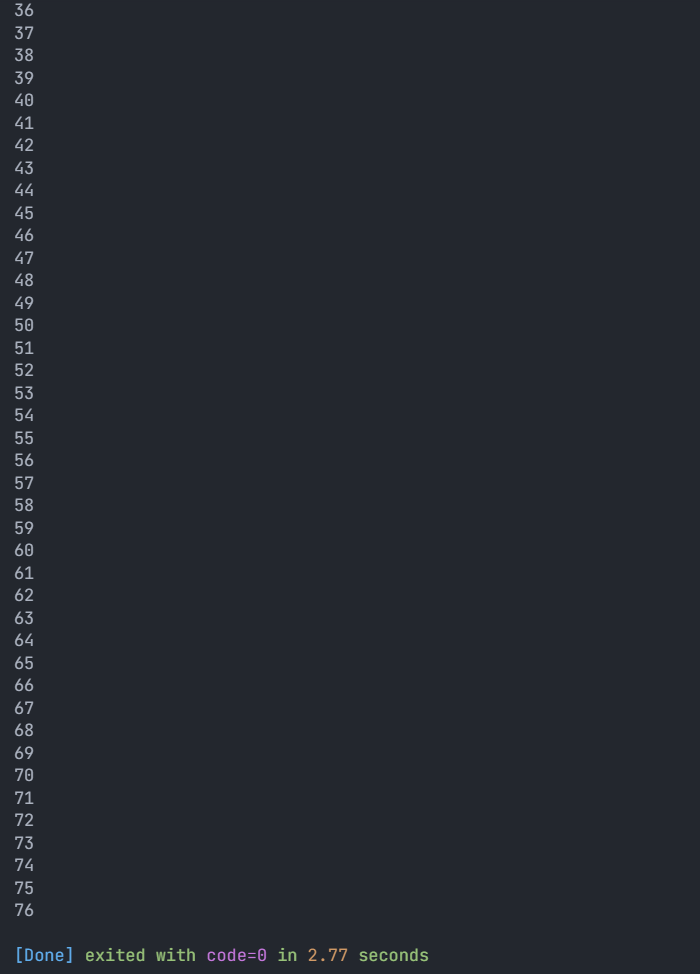

Program mencetak angka 0 hingga 76 karena variabel counter yang telah dideklarasikan pada loop pertama (while) melanjutkan dari nilai 33 pada loop kedua (do-while). Loop pertama mencetak 0 hingga 32, lalu loop kedua melanjutkan hingga 76.

---

## Praktikum 3: Menerapkan Perulangan "for" dan "break-continue"

### Langkah 1

Mengetik kode program berikut ke [break_continue.dart](./src/break_continue.dart).

```dart
void main() {
  for (Index = 10; index < 27; index) {
    print(Index);
  }
}
```

### Langkah 2

Eksekusi (Run) kode pada langkah 1.

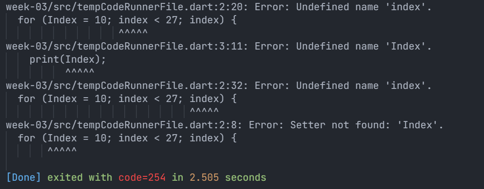

Terjadi error karena variabel Index dan index ditulis tidak konsisten. Selain itu, variabel index pada perulangan for belum dideklarasikan dan tidak menggunakan increment (index++).

#### Perbaikan Kode Program

```dart
void main() {
  for (int index = 10; index < 27; index++) {
    print(index);
  }
}
```

Mendeklarasikan variabel index dengan `int index = 10;` dan menjaga konsistensi penulisan nama variabel (index), serta menambahkan increment `index++` agar perulangan berjalan.

#### Output

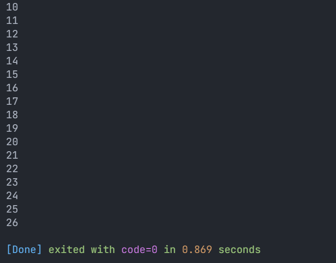

### Langkah 3

Menambahkan kode berikut ke [break_continue.dart](./src/break_continue.dart).

```dart
void main() {
  for (int index = 10; index < 27; index++) {
    if (index == 21) break;
    else if (index > 1 || index < 7) continue;
    print(index);
  }
}
```

Output:

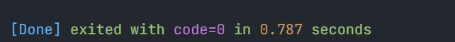

Hasil output kosong karena kondisi `else if (index > 1 || index < 7)` selalu bernilai **true** untuk nilai `index`, sehingga setiap iterasi terkena `continue` dan perintah `print(index)` tidak pernah dijalankan.

#### Perbaikan Kode Program

```dart
void main() {
  for (int index = 10; index < 27; index++) {
    if (index == 21) break;
    else if (index > 1 || index < 7) continue;
    print(index);
  }
}
```

Mengubah kondisi else if menjadi `index > 1 && index < 17`, sehingga ketika nilai `index` berada pada rentang tersebut (yaitu angka 2 sampai 16), perintah `continue` akan dijalankan untuk melewati iterasi dan tidak mengeksekusi `print(index)`.

#### Output

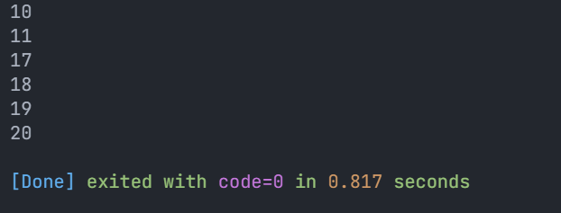

- Pada perulangan `for`, nilai `index` dari **12 sampai 16** terkena perintah `continue`, sehingga kode program di bawahnya tidak dijalankan, yaitu `print(index)`.
- Ketika `index == 21`, program terkena perintah `break`, sehingga perulangan langsung berhenti meskipun kondisi `index < 27` masih terpenuhi.

---

## Tugas Praktikum

Buatlah sebuah program yang dapat menampilkan bilangan prima dari angka 0 sampai 201 menggunakan Dart. Ketika bilangan prima ditemukan, maka tampilkan nama lengkap dan NIM Anda.

### Kode Program

[prime_number.dart](./src/prime_number.dart)

```dart
void main() {
  for (var i = 0; i <= 201; i++) {
    if (i <= 1) continue;

    if (i == 2) {
      print("Aditya Atadewa - 2341720174 - Angka $i merupakan Bilangan Prima");
      continue;
    }

    if (i % 2 == 0) continue;

    bool isPrime = true;

    for (var j = 3; j <= i ~/ 2; j += 2) {
      if (i % j == 0) {
        isPrime = false;
        break;
      }
    }

    if (isPrime) print("Aditya Atadewa - 2341720174 - Angka $i merupakan Bilangan Prima");
  }
}
```

#### Penjelasan:

Menampilkan bilangan prima dari 0 hingga 201 dilakukan dengan ketentuan sebagai berikut:

- Melakukan perulangan dari `i = 0` sampai `i = 201` untuk mengecek bilangan prima.
- Jika `i <= 1`, perulangan langsung dilanjutkan dengan `continue` karena 0 dan 1 bukan bilangan prima.
- Jika `i == 2`, angka langsung dicetak karena 2 merupakan satu-satunya bilangan prima genap.
- Jika `i % 2 == 0`, angka dilewati dengan `continue` karena semua bilangan genap selain 2 bukan bilangan prima.
- Variabel `isPrime` digunakan sebagai penanda untuk menentukan apakah `i` bilangan prima atau bukan.
- Program melakukan perulangan dari `j = 3` sampai `i ~/ 2` dengan increment 2 (hanya memeriksa bilangan ganjil, karena bilangan genap tidak mungkin menjadi pembagi bilangan ganjil).
- Jika ditemukan pembagi (`i % j == 0`), maka `isPrime` diubah menjadi `false` dan perulangan berhenti dengan `break`.
- Jika setelah pemeriksaan nilai `isPrime` tetap `true`, maka nilai `i` dicetak sebagai bilangan prima.

### Output


