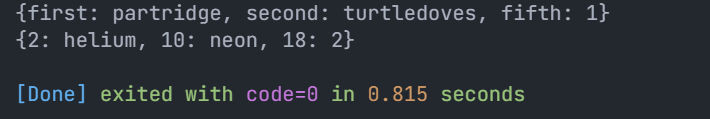

# Pertemuan 4 - Collections dan Functions

**Nama : Aditya Atadewa**  
**Kelas : TI 3G**  
**NIM : 2341720174**  
**No. Absen : 01**

---

## Praktikum 1: Eksperimen Tipe Data List

### Langkah 1

Mengetik kode program berikut di dalam fungsi main ke [list.dart](./src/list.dart).

```dart
void main() {
  var list = [1, 2, 3];

  assert(list.length == 3);
  assert(list[1] == 2);

  print(list.length);
  print(list[1]);

  list[1] = 1;

  assert(list[1] == 1);
  print(list[1]);
}
```

Kode program tersebut membuat list [1, 2, 3]. Assert digunakan untuk memastikan kondisi saat runtime. Pada awalnya dicek panjang List = 3 dan nilai indeks ke-1 = 2. Setelah itu panjang List (3) dan nilai indeks ke-1 (2) dicetak. Nilai indeks ke-1 diubah menjadi 1 lalu dicek lagi dengan assert dan dicetak.

### Langkah 2

Eksekusi (Run) kode pada langkah 1.


Menggunakan `assert` untuk memverifikasi kondisi tertentu saat runtime. Fungsi `assert` hanya berjalan jika program dijalankan dalam mode debug atau menggunakan flag `--enable-asserts`. Karena kondisi `assert` pada kode program tersebut semuanya bernilai `true`, maka program tetap berjalan lancar dan menampilkan output sesuai harapan, yaitu mencetak panjang list, nilai index ke-1, serta nilai setelah dilakukan perubahan.

### Langkah 3

Mengubah kode pada langkah 1 menjadi variabel final yang mempunyai index = 5 dengan default value = null. Selanjutnya, mengisi nama dan NIM pada elemen index ke-1 dan ke-2 ke kode program [list.dart](./src/list.dart).

```dart
void main() {
  final list = [null, null, null, null, null];

  list[1] = 'Aditya Atadewa';
  list[2] = 2341720174;

  print('NIM: ${list[1]}');
  print('Nama: ${list[2]}');

  print('\nIsi list: $list');
}
```

Output:


Output error karena Dart melakukan type inference terhadap variabel yang diinisialisasi dengan `[null, null, null, null, null]`. Akibatnya, variabel tersebut dianggap bertipe `List<Null>` sehingga hanya dapat berisi `null`. Ketika elemen indeks ke-1 dan ke-2 diisi dengan `int` dan `string`, terdapat error karena tipe data tidak sesuai.

#### Perbaikan Kode Program:

```dart
void main() {
  final list = List<dynamic>.filled(5, null);

  list[1] = 'Aditya Atadewa';
  list[2] = 2341720174;

  print('NIM: ${list[1]}');
  print('Nama: ${list[2]}');

  print('\nIsi list: $list');
}
```

Memperbaiki deklarasi menjadi `List<dynamic>.filled(5, null)` sehingga variabel bertima `List<dynamic>`. Sehingga elemen dapat diisi berbagai tipe data sesuai kebutuhan, termasuk `int` dan `string`.

#### Output:


---

## Praktikum 2: Eksperimen Tipe Data Set

### Langkah 1

Mengetik kode program berikut di dalam fungsi main ke [set.dart](./src/set.dart).

```dart
void main() {
  var hologens = {'fluorine', 'chlorine', 'bromine', 'iodine', 'astatine'};
  print(hologens);
}
```

Kode program tersebut mendeklarasikan sebuah variabel halogens yang berisi lima elemen string, yaitu `{'fluorine', 'chlorine', 'bromine', 'iodine', 'astatine'}` menggunakan struktur data Set. Set pada Dart menyimpan data unik tanpa indeks.

### Langkah 2

Eksekusi (Run) kode pada langkah 1.


Output pada gambar tersebut menunjukkan seluruh elemen Set berhasil dibuat dan ditampilkan.

### Langkah 3

Menambahkan kode program berikut ke [set.dart](./src/set.dart)

```dart
  var names1 = <String>{};
  Set<String> names2 = {};
  var names3 = {};

  print(names1);
  print(names2);
  print(names3);
```

Pada kode program tersebut dibuat tiga variabel berbeda, yaitu:

- Variabel names1 dideklarasikan sebagai Set<String> dengan sintaks <String>{}
- Variabel names2 juga dideklarasikan sebagai Set<String> dengan sintaks eksplisit
- Variabel names3 dideklarasikan hanya dengan {} sehingga dianggap sebagai Map kosong oleh Dart, bukan Set

Output:


Ketika program dijalankan, tidak muncul error tetapi output yang ditampilkan kosong karena ketiga variabel belum diisi nilai apa pun. Output {} untuk names1 dan names2 menandakan Set kosong, sedangkan {} untuk names3 sebenarnya adalah Map kosong.

#### Perbaikan Kode Program:

Menambahkan elemen Nama dan NIM pada kedua variabel Set dengan dua fungsi berbeda yaitu `.add()` dan `.addAll()` serta untuk variabel Map dihapus

```dart
void main() {
  var names1 = <String>{};
  Set<String> names2 = {};

  names1.add('2341720174');
  names1.add('Aditya Atadewa');

  names2.addAll({'2341720174, Aditya Atadewa'});

  print('Isi Set names1: $names1');
  print('Isi Set names2: $names2');
}
```

Menambahkan elemen NIM dan Nama ke `names1` menggunakan metode `.add()` satu per satu. Sedangkan pada `names2`, menambahkan elemen NIM dan Nama menggunakan metode `.addAll()` sekaligus.

#### Output:


Pada gambar tersebut, output menunjukkan bahwa kedua variabel Set telah berisi nilai NIM dan Nama sesuai metode penambahannya dan berhasil ditampilkan.

---

## Praktikum 3: Eksperimen Tipe Data Maps

### Langkah 1

Mengetik kode program berikut di dalam fungsi main ke [map.dart](./src/map.dart).

```dart
void main() {
  var gifts = {
    'first': 'partridge',
    'second': 'turtledoves',
    'fifth': 1
  };

  var nobleGases = {
    2: 'helium',
    10: 'neon',
    18: 2
  };

  print(gifts);
  print(nobleGases);
}
```

Kode program tersebut mendeklarasikan dua variabel Map, yaitu:

1. gifts yang memiliki key bertipe String dengan data {'first': 'partridge', 'second': 'turtledoves', 'fifth': 1}
2. nobleGases yang memiliki key bertipe int dengan data {2: 'helium', 10: 'neon', 18: 2}
   Map berfungsi untuk menyimpan data dalam pasangan key-value, sehingga setiap key memiliki value masing-masing.

### Langkah 2

Eksekusi (Run) kode pada langkah 1.


Pada gambar tersebut, output menampilkan isi Map `gifts` dan `nobleGases` sesuai dengan key-value yang telah diinputkan. Data yang dimasukkan sudah sesuai dengan tipe masing-masing key dan value sehingga kode berjalan normal tanpa error.

### Langkah 3

Menambahkan kode program berikut ke [map.dart](./src/map.dart)

```dart
  var mhs1 = Map<String, String>();
  gifts['first'] = 'partridge';
  gifts['second'] = 'turtledoves';
  gifts['fifth'] = 'golden rings';

  var mhs2 = Map<int, String>();
  nobleGases[2] = 'helium';
  nobleGases[10] = 'neon';
  nobleGases[18] = 'argon';
```

Kode program tersebut menambahkan dua variabel Map baru, yaitu:

1. `mhs1` yang bertipe `Map<String, String>`
2. `mhs2` yang bertipe `Map<int, String>`
   Selain itu, isi Map gifts dan nobleGases diperbarui atau diulang kembali.

Output:



Ketika dijalankan, tampilan output tetap sama seperti sebelumnya karena variabel `gifts` dan `nobleGases` tidak diprint ulang setelah diperbarui sehingga perubahan nilainya tidak terlihat, sedangkan variabel `mhs1` dan `mhs2` belum memiliki isi dan juga tidak diprint sehingga tidak muncul di tampilan output.

##### Perbaikan Kode Program:

Menambahkan elemen nama dan NIM pada tiap variabel (gifts, nobleGases, mhs1, dan mhs2)

```dart
void main() {
  var gifts = {
    'first': 'partridge',
    'second': 'turtledoves',
    'fifth': 1
  };

  var nobleGases = {
    2: 'helium',
    10: 'neon',
    18: 2
  };

  gifts['first'] = 'partridge';
  gifts['second'] = 'turtledoves';
  gifts['fifth'] = 'golden rings';

  nobleGases[2] = 'helium';
  nobleGases[10] = 'neon';
  nobleGases[18] = 'argon';

  gifts['third'] = 'Aditya Atadewa';
  gifts['fourth'] = '2341720174';

  nobleGases[22] = 'Aditya Atadewa';
  nobleGases[37] = '2341720174';

  var mhs1 = Map<String, String>();
  mhs1['nama'] = 'Aditya Atadewa';
  mhs1['nim'] = '2341720174';

  var mhs2 = Map<int, String>();
  mhs2[1] = 'Aditya Atadewa';
  mhs2[2] = '2341720174';

  print('Isi Map gifts: $gifts');
  print('Isi Map nobleGases: $nobleGases');
  print('Isi Map mhs1: $mhs1');
  print('Isi Map mhs2: $mhs2');
}
```

Pada kode perbaikan, elemen Nama dan NIM ditambahkan ke dalam Map `gifts`, `nobleGases`, `mhs1`, dan `mhs2` sebagai berikut:

- Map gifts
  - Data awal → 'first': 'partridge', 'second': 'turtledoves', 'fifth': 1
  - Diperbarui → 'fifth': 1 diubah menjadi 'fifth': 'golden rings'
  - Ditambahkan → 'third': 'Aditya Atadewa' dan 'fourth': '2341720174'
- Map nobleGases
  - Data awal → 2: 'helium', 10: 'neon', 18: 2
  - Diperbarui → 18: 2 diubah menjadi 'argon': 2
  - Ditambahkan → 22: 'Aditya Atadewa' dan 37: '2341720174'
- Map mhs1
  - Kosong pada awalnya
  - Diisi → mhs1['nama'] = 'Aditya Atadewa' dan mhs1['nim'] = '2341720174'
- Map mhs2
  - Kosong pada awalnya
  - Diisi → mhs2[1] = 'Aditya Atadewa' dan mhs2[2] = '2341720174'

#### Output:


Pada gambar tersebut, terlihat pada output bahwa semua Map berhasil menampilkan dan menyimpan data tambahan Nama dan NIM sesuai dengan tipe key masing-masing.

---

## Praktikum 4: Eksperimen Tipe Data List: Spread dan Control-flow Operators

### Langkah 1

Mengetik kode program berikut ke [list_operators.dart](./src/list_operators.dart).

```dart
void main() {
  var list = [1, 2, 3];
  var list2 = [0, ...list];

  print(list1);
  print(list2);
  print(list2.length);
}
```

### Langkah 2

Eksekusi (Run) kode pada langkah 1.


Terjadi error `Undefined name 'list1'` karena nama variabel tidak konsisten. Variabel yang dideklarasikan adalah list, tetapi yang dipanggil untuk dicetak adalah list1.

#### Kode Perbaikan Program:

```dart
void main() {
  var list1 = [1, 2, 3];
  var list2 = [0, ...list1];

  print(list1);
  print(list2);
  print(list2.length);
}
```

Mengubah penamaan variabel `list` menjadi `list1` agar konsisten dan program dapat berjalan dengan baik.

#### Output:


Kode program tersebut membuat list `list1` berisi [1,2,3] lalu membuat list `list2` berisi 0 dan seluruh isi `list1` menggunakan spread operator (`...list1`).

### Langkah 3

Menambahkan kode program berikut ke [list_operators.dart](./src/list_operators.dart)

```dart
  list1 = [1, 2, null];
  print(list1);
  var list3 = [0, ...?list1];
  print(list3.length);
```

Kode program tersebut mengubah nilai `list1` menjadi [1, 2, null] dan mencoba menggunakan spread operator dengan null-aware (`...?`) agar tidak error jika nilai list null.

Output:


Terjadi error karena tipe data `list1` sebelumnya adalah List<int> sehingga tidak bisa diisi null.

##### Perbaikan Kode Program:

Tambahkan variabel list berisi NIM Anda menggunakan Spread Operators

```dart
void main() {
  List<int?> list1 = [1, 2, 3];
  var list2 = [0, ...list1];

  print(list1);
  print(list2);
  print(list2.length);

  list1 = [1, 2, null];
  print(list1);

  listNIM = [2, 3, 4, 1, 7, 2, 0, 1, 7, 4]; // NIM: 2341720174

  var list3 = [0, ...?list1, ...listNIM];
  print(list3.length);
  print(list3);
}
```

- Mengubah tipe `list1` menjadi `List<int?>` agar bisa menampung null.
- Menambahkan variabel `listNIM` berisi NIM.
- Menggabungkan `list1` dan `listNIM` ke `list3` menggunakan spread operator.

#### Output:


Pada gambar tersebut terlihat bahwa `list1` bisa menyimpan null dan `list3` berhasil menggabungkan `list1` (yang berisi null) dengan `listNIM` menggunakan spread operator.

### Langkah 4

Menambahkan kode program berikut ke [list_operators.dart](./src/list_operators.dart). Tunjukkan hasilnya jika variabel `promoActive` ketika true dan false.

```dart
  var nav = ['Home', 'Furniture', 'Plants', if (promoActive) 'Outlet'];
  print(nav);
```

Kode program tersebut akan menambahkan elemen 'Outlet' ke dalam list `nav` jika kondisi `promoActive` bernilai `true`. Jika `promoActive` bernilai `false`, maka 'Outlet' tidak akan ditambahkan ke dalam list `nav`.

Output:


Terjadi error `Undefined name 'promoActive'` karena `promoActive` belum dideklarasikan.

##### Perbaikan Kode Program (Kondisi True):

```dart
  var promoActive = true;

  var nav = ['Home', 'Furniture', 'Plants', if (promoActive) 'Outlet'];
  print(nav);
```

Output:


Output menunjukkan list `nav` berisi ['Home', 'Furniture', 'Plants', 'Outlet'] karena `promoActive` bernilai  .

##### Perbaikan Kode Program (Kondisi False):

```dart
  var promoActive = false;

  var nav = ['Home', 'Furniture', 'Plants', if (promoActive) 'Outlet'];
  print(nav);
```

Output:


Output menunjukkan list `nav` berisi ['Home', 'Furniture', 'Plants'] tanpa 'Outlet' karena `promoActive` bernilai `false`.

### Langkah 5

Menambahkan kode program berikut ke [list_operators.dart](./src/list_operators.dart). Tunjukkan hasilnya jika variabel login mempunyai kondisi lain.

```dart
  var nav2 = ['Home', 'Furniture', 'Plants', if (login case 'Manager') 'Inventory'];
  print(nav2);
```

Kode program tersebut menggunakan pattern matching dengan case untuk memeriksa apakah variabel login bernilai 'Manager'. Jika benar, maka 'Inventory' akan ditambahkan ke dalam list `nav2`. Jika tidak, maka 'Inventory' tidak akan ditambahkan ke dalam list `nav2`.

Output:


Terdapat error `Undefined name 'login'` karena variabel login belum dideklarasikan.

##### Perbaikan Kode Program (login = 'Manager'):

```dart
  var login = 'Manager';

  var nav2 = ['Home', 'Furniture', 'Plants', if (login case 'Manager') 'Inventory'];
  print(nav2);
```

Output:


Output menunjukkan list `nav2` berisi ['Home', 'Furniture', 'Plants', 'Inventory'] karena login bernilai 'Manager'.

##### Perbaikan Kode Program (login = 'Employee'):

```dart
  var login = 'Employee';

  var nav2 = ['Home', 'Furniture', 'Plants', if (login case 'Manager') 'Inventory'];
  print(nav2);
```

Output:


Output menunjukkan list `nav2` berisi ['Home', 'Furniture', 'Plants'] tanpa 'Inventory' karena login bernilai 'Employee' dan tidak memenuhi kondisi 'Manager'.

### Langkah 6

Menambahkan kode program berikut ke [list_operators.dart](./src/list_operators.dart). Jelaskan manfaat Collection For.

```dart
  var listOfInts = [1, 2, 3];
  var listOfStrings = ['#0', for (var i in listOfInts) '#$i'];
  assert(listOfStrings[1] == '#1');
  print(listOfStrings);
```

Kode program tersebut membuat sebuah list baru `listOfStrings` yang berisi string '#0' diikuti hasil iterasi dari `listOfInts` dengan format `'#angka'`. Dengan kata lain, for di dalam list digunakan untuk membentuk elemen-elemen list baru secara otomatis dari list lain dengan format tertentu.

Output:


- `listOfStrings` berhasil berisi string sesuai format `'#angka'` yang diambil dari `listOfInts`.
- `assert(listOfStrings[1] == '#1')` bernilai `true` sehingga program berjalan lancar.

#### Collection For

Collection For merupakan fitur Dart yang memungkinkan kita membuat list baru dengan menyertakan elemen dari list lain secara langsung di dalam deklarasi list menggunakan sintaks for. Kita juga bisa memformat atau mentransformasi elemen saat proses pembentukan list berlangsung.

Manfaat Collection For:
- Membuat list baru secara ringkas tanpa loop terpisah.
- Memungkinkan format atau transformasi elemen sebelum dimasukkan.
- Kode lebih mudah dibaca karena deklarasi dan logika pembentukan list jadi satu.
- Berbeda dengan spread operator yang hanya menyebarkan isi list tanpa transformasi langsung.

---

## Praktikum 5: Eksperimen Tipe Data Records

### Langkah 1

Mengetik kode program berikut ke [record.dart](./src/record.dart).

```dart
void main() {
  var record = ('first', a: 2, b: true, 'last');
  print(record)
}
```

Kode di atas membuat record dengan nilai `('first', a: 2, b: true, 'last')` lalu mencetaknya.

### Langkah 2

Eksekusi (Run) kode pada langkah 1.


Terjadi error karena tidak ada tanda titik koma ';' pada perintah `print(record)`.

#### Kode Perbaikan Program:

```dart
void main() {
  var record = ('first', a: 2, b: true, 'last');
  print(record);
}
```

Menambahkan titik koma ';' setelah `print(record)` agar kode valid.

#### Output:


Output berhasil menampilkan Record: `('first', a: 2, b: true, 'last')`. Hal tersebut menunjukkan bahwa record berhasil dibuat dan dicetak.

### Langkah 3

Menambahkan kode program berikut di luar `scope void main()`.

```dart
(int, int) tukar((int, int) record) {
  var (a, b) = record;
  return (b, a);
}
```

Kode program tersebut mendefinisikan fungsi `tukar()` yang menerima record bertipe (int, int). Fungsi ini mendestruktur record menjadi variabel a dan b, lalu mengembalikan record baru dengan nilai b dan a yang posisinya tertukar.

Output:


Belum ada tambahan output apa pun karena fungsi `tukar()` baru didefinisikan tetapi belum dipanggil di dalam `main()`.

##### Perbaikan Kode Program:

Gunakan fungsi `tukar()` di dalam `main()` sehingga tampak jelas proses pertukaran value field di dalam Records.

```dart
(int, int) tukar((int, int) record) {
  var (a, b) = record; 
  return (b, a);
}

void main() {
  var record = ('first', a: 2, b: true, 'last');
  print(record);

  var angka = (5, 7);
  print('\nRecord awal: $angka');

  var angkaBaru = tukar(angka);
  print('Record baru setelah ditukar: $angkaBaru');
}
```

Kode program tersebut menambahkan pemanggilan fungsi `tukar()` di dalam `main()`. Record angka berisi (5, 7) kemudian diproses oleh `tukar()` sehingga menjadi (7, 5). Hal tersebut menunjukkan bahwa record dapat dimanipulasi menggunakan fungsi.

#### Output:


Output menunjukkan record angka sebelum ditukar (5, 7), dan output terakhir menunjukkan hasil setelah ditukar (7, 5). Hal tersebut membuktikan bahwa fungsi `tukar()` bekerja sesuai dengan yang diharapkan.

### Langkah 4

Menambahkan kode program berikut di dalam scope `void main()`

```dart
  // Record type annotation in a variable declaration:
  (String, int) mahasiswa;
  print(mahasiswa);
```

Kode program tersebut mendeklarasikan variabel mahasiswa dengan tipe record `(String, int)`, yang berarti record ini harus berisi 2 field positional:
- field pertama bertipe String.
- field kedua bertipe int.

Output:


Terjadi error karena record `mahasiswa` belum diinisialisasi sehingga saat diprint akan error.

##### Perbaikan Kode Program:

Inisialisasi field nama dan NIM Anda pada variabel record mahasiswa.

```dart
  (String, int) mahasiswa;
  mahasiswa = ('Aditya Atadewa', 2341720174);

  print(mahasiswa);
```

Output:


Output menampilkan record `('Aditya Atadewa', 2341720174)` yang menunjukkan bahwa variabel `mahasiswa` berhasil menyimpan data nama dan NIM sesuai tipe yang dideklarasikan.

### Langkah 5

Menambahkan kode program berikut di dalam scope `void main()`

```dart
  var mahasiswa2 = ('first', a: 2, b: true, 'last');

  print(mahasiswa2.$1);
  print(mahasiswa2.a); 
  print(mahasiswa2.b); 
  print(mahasiswa2.$2);
```

Kode program tersebut membuat record `mahasiswa2` dengan 2 positional field ('first' dan 'last') dan 2 named field (a: 2 dan b: true).
- mahasiswa2.$1 mengakses field pertama 'first'.
- mahasiswa2.a mengakses field bernama a yaitu 2.
- mahasiswa2.b mengakses field bernama b yaitu true.
- mahasiswa2.$2 mengakses field kedua 'last'.

Output:


Pada gambar tersebut, output menunjukkan bahwa record `mahasiswa2` berhasil dibuat dan setiap field-nya dapat diakses menggunakan nama field (a, b) maupun posisi elemen ($1, $2). Hal tersebut membuktikan bahwa record sudah terbentuk dengan benar dan bisa diakses sesuai struktur yang ditentukan.

##### Perbaikan Kode Program:

Gantilah salah satu isi record dengan nama dan NIM Anda

```dart
  var mahasiswa2 = ('first', a: 2, b: true, 'last');

  print(mahasiswa2.$1);
  print(mahasiswa2.a);
  print(mahasiswa2.b);
  print(mahasiswa2.$2);

  mahasiswa2 = ('Aditya Atadewa', a: 2341720174, b: true, 'Politeknik Negeri Malang');

  print('\nRecord mahasiswa2: $mahasiswa2');

  print(mahasiswa2.$1);
  print(mahasiswa2.a);
  print(mahasiswa2.b);
  print(mahasiswa2.$2);
```

Output:


Output pertama menampilkan data default record `mahasiswa2`. Setelah diubah dengan data nama dan NIM, output kedua menampilkan record baru yang berisi `('Aditya Atadewa', a: 2341720174, b: true, 'Politeknik Negeri Malang')`. Hal tersebut membuktikan bahwa record dapat diperbarui dan tiap fieldnya bisa diakses menggunakan nama field atau urutan posisinya.

---

## Tugas Praktikum

### Soal 1

#### Pertanyaan:

Jelaskan yang dimaksud Functions dalam bahasa Dart!

#### Jawab:

Function dalam bahasa Dart adalah sekumpulan kode yang digunakan untuk menjalankan tugas tertentu. Ketika kita memanggil function dan memberikan input berupa parameter, function akan memprosesnya sesuai instruksi yang telah ditentukan dan mengembalikan hasil pemrosesan dalam bentuk output (return value) yang bisa digunakan di bagian lain dari program.

Contoh function di Dart:

```dart
int tambah(int a, int b) {
  return a + b;
}

void main() {
  print(tambah(7, 5));
}
```

Output:

```
12
```

### Soal 2

#### Pertanyaan

Jelaskan jenis-jenis parameter di Functions beserta contoh sintaksnya!

#### Jawaban

Dalam Dart, function bisa punya beberapa jenis parameter:

a. Positional Parameter (Wajib)

Parameter yang urutannya harus sesuai saat memanggil function.

```dart
void greet(String name, int age) {
  print("Halo $name, umur kamu $age tahun");
}

void main() {
  greet("Budi", 19);
}
```

Output:

```
Halo Budi, umur kamu 19 tahun
```

b. Optional Positional Parameter (ditulis dengan [])

Parameter boleh diisi, boleh juga tidak.

```dart
void greet(String name, [String? hobby]) {
  print("Halo $name");
  if (hobby != null) {
    print("Hobimu adalah $hobby");
  }
}

void main() {
  greet("Dimas");           // tanpa hobby
  greet("Tono", "Futsal");  // dengan hobby
}
```

Output:
```
Halo Dimas
Halo Tono
Hobimu adalah Futsal
```

c. Named Parameter (ditulis dengan {})

Parameter dipanggil dengan nama, sehingga lebih jelas.

```dart
void greet({required String name, int age = 10}) {
  print("Halo $name, umur $age tahun");
}

void main() {
  greet(name: "Joko", age: 19);
  greet(name: "Andi",);
}
```

Output:

```
Halo Joko, umur 19 tahun 
Halo Andi, umur 10 tahun 
```

d. Default Parameter

Parameter yang bisa mempunyai nilai default.

```dart
void greet(String name, {String city = "Blitar"}) {
  print("Halo $name dari $city");
}

void main() {
  greet("Bima");                  // city = Blitar
  greet("Sandi", city: "Malang"); // city = Malang
}
```

Output:

```
Halo Bima dari Blitar
Halo Sandi dari Malang
```

### Soal 3

#### Pertanyaan

Jelaskan maksud Functions sebagai first-class objects beserta contoh sintaknya!

#### Jawaban

Di Dart, function diperlakukan seperti object biasa. Artinya function bisa:
- Disimpan ke dalam variabel
- Dikirim sebagai parameter ke function lain
- Dikembalikan dari function lain

a. Contoh function disimpan ke variabel:

```dart
void sayHello(String name) {
  print("Hello $name");
}

void main() {
  var myFunction = sayHello;  // menyimpan function ke variabel
  myFunction("Aditya");         // memanggil function lewat variabel
}
```

Output:
```
Hello Aditya
```

b. Contoh function sebagai parameter:

```dart
void printResult(int a, int b, Function operasi) {
  print("Hasil: ${operasi(a, b)}");
}

int tambah(int x, int y) => x + y;
int kali(int x, int y) => x * y;

void main() {
  printResult(5, 4, tambah);
  printResult(5, 4, kali);
}
```

Output:
```
Hasil: 9
Hasil: 20
```

### Soal 4

#### Pertanyaan

Apa itu Anonymous Functions? Jelaskan dan berikan contohnya!

#### Jawaban

Anonymous Function (atau fungsi tanpa nama) adalah function yang tidak diberi nama, biasanya langsung ditulis di tempat saat dibutuhkan. Selain itu, anonymous function biasanya dipakai ketika function hanya dipanggil sekali atau dipakai sebagai callback.

Contoh Anonymous Function di Dart:
```dart
void main() {
  // Anonymous function sebagai variabel
  var greet = (String name) {
    print("Halo $name");
  };

  greet("Agus");

  // Anonymous function di dalam List.forEach
  var angka = [3, 9, 1];
  angka.forEach((n) {
    print("Angka: $n");
  });
}
```

Output:
```
Halo Agus
Angka: 3
Angka: 9
Angka: 1
```

### Soal 5

#### Pertanyaan

Jelaskan perbedaan Lexical scope dan Lexical closures! Berikan contohnya!

#### Jawaban

**a. Lexical Scope**

Lingkup (scope) dari sebuah variabel ditentukan oleh posisi kode di saat penulisan program (compile time), bukan saat runtime. Jadi, function hanya bisa mengakses variabel yang berada di dalam scope-nya.

Contoh Lexical Scope:
```dart
void main() {
  var name = "Udin";

  void sayHello() {
    print("Hello $name"); // bisa akses variabel 'name' karena dalam lexical scope
  }

  sayHello();
}
```

Output:
```
Halo Udin
```

**b. Lexical Closure**

Closure adalah function yang “mengingat” lingkungan (scope) tempat ia dibuat, walaupun dipanggil di luar scope tersebut. Closure bisa menyimpan dan menggunakan variabel dari scope luarnya.

Contoh Lexical Closure:
```dart
Function makeMultiplier(int factor) {
  return (int value) {
    return value * factor; // "factor" diingat meski fungsi sudah keluar
  };
}

void main() {
  var doubleIt = makeMultiplier(2);
  var tripleIt = makeMultiplier(3);

  print(doubleIt(5));
  print(tripleIt(5));
}
```

Output:
```
10
15
```

**Perbedaan Lexical Scope dan Lexical Closure:**
- Lexical Scope → aturan akses variabel berdasarkan posisi kode.
- Lexical Closure → function yang menyimpan “jejak” scope asalnya dan tetap bisa mengakses variabel itu.

### Soal 6

#### Pertanyaan

Jelaskan dengan contoh cara membuat return multiple value di Functions!

#### Jawaban

Di Dart, function hanya bisa return satu nilai, tapi nilai itu bisa berupa:
- List
- Map
- Class/Record

**Contoh Return Multiple Value dengan List**

```dart
List<int> hitung(int a, int b) {
  return [a + b, a - b, a * b];
}

void main() {
  var hasil = hitung(6, 3);
  print("Tambah: ${hasil[0]}");
  print("Kurang: ${hasil[1]}");
  print("Kali: ${hasil[2]}");
}
````

Output:

```
Tambah: 9
Kurang: 3
Kali: 18
```

**Contoh Return Multiple Value dengan Map**

```dart
Map<String, int> hitung(int a, int b) {
  return {
    "tambah": a + b,
    "kurang": a - b,
    "kali": a * b,
  };
}

void main() {
  var hasil = hitung(6, 3);
  print("Tambah: ${hasil['tambah']}");
  print("Kurang: ${hasil['kurang']}");
  print("Kali: ${hasil['kali']}");
}
```

Output:

```
Tambah: 9
Kurang: 3
Kali: 18
```

**Contoh Return Multiple Value dengan Record** 

```dart
(int, int, int) hitung(int a, int b) {
  return (a + b, a - b, a * b);
}

void main() {
  var (tambah, kurang, kali) = hitung(6, 3);
  print("Tambah: $tambah");
  print("Kurang: $kurang");
  print("Kali: $kali");
}
```

Output:

```
Tambah: 9
Kurang: 3
Kali: 18
```