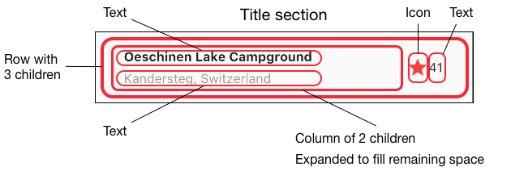

# Pertemuan 5 - Aplikasi Pertama dan Widget Dasar Flutter

**Nama : Aditya Atadewa**  
**Kelas : TI 3G**  
**NIM : 2341720174**  
**No. Absen : 01**

---

## Praktikum 1: Membuat Project Flutter Baru

#### Langkah 1: Buat Project Baru

Membuat project flutter dengan nama layout_flutter


#### Langkah 2: Buka file `lib/main.dart`

Modifikasi file `main.dart`

```dart
import 'package:flutter/material.dart';

void main() => runApp(const MyApp());

class MyApp extends StatelessWidget {
  const MyApp({super.key});

  @override
  Widget build(BuildContext context) {
    return MaterialApp(
      title: 'Flutter layout: Nama dan NIM Anda',
      home: Scaffold(
        appBar: AppBar(
          title: const Text('Flutter layout demo'),
        ),
        body: const Center(
          child: Text('Hello World'),
        ),
      ),
    );
  }
}
```

Output yang dihasilkan:


#### Langkah 3: Identifikasi Layout Diagram

Langkah pertama adalah memecah tata letak menjadi elemen dasarnya:

- Identifikasi baris dan kolom.
- Apakah tata letaknya menyertakan kisi-kisi (grid)?
- Apakah ada elemen yang tumpang tindih?
- Apakah UI memerlukan tab?
- Perhatikan area yang memerlukan alignment, padding, atau borders.

Pertama, identifikasi elemen yang lebih besar. Dalam contoh ini, empat elemen disusun menjadi sebuah kolom: sebuah gambar, dua baris, dan satu blok teks.


Selanjutnya, buat diagram setiap baris. Baris pertama, disebut bagian Judul, memiliki 3 anak: kolom teks, ikon bintang, dan angka. Anak pertamanya, kolom, berisi 2 baris teks. Kolom pertama itu memakan banyak ruang, sehingga harus dibungkus dengan widget yang Diperluas.



Baris kedua, disebut bagian Tombol, juga memiliki 3 anak: setiap anak merupakan kolom yang berisi ikon dan teks.


Setelah tata letak telah dibuat diagramnya, cara termudah adalah dengan menerapkan pendekatan bottom-up. Untuk meminimalkan kebingungan visual dari kode tata letak yang banyak bertumpuk, tempatkan beberapa implementasi dalam variabel dan fungsi.

#### Langkah 4: Implementasi Title Row

**soal 1**:
Letakkan widget Column di dalam widget Expanded agar menyesuaikan ruang yang tersisa di dalam widget Row. Tambahkan properti crossAxisAlignment ke CrossAxisAlignment.start sehingga posisi kolom berada di awal baris.

**soal 2**:
Letakkan baris pertama teks di dalam Container sehingga memungkinkan Anda untuk menambahkan padding = 8. Teks ‘Batu, Malang, Indonesia' di dalam Column, set warna menjadi abu-abu.

**soal 3**:
Dua item terakhir di baris judul adalah ikon bintang, set dengan warna merah, dan teks "41". Seluruh baris ada di dalam Container dan beri padding di sepanjang setiap tepinya sebesar 32 piksel

**Output yang dihasilkan:**


---

## Praktikum 2: Implementasi button row

#### Langkah 1: Membuat method Column `_buildButtonColumn`

Membuat metode pembantu pribadi bernama buildButtonColumn(), yang mempunyai parameter warna, Icon dan Text, sehingga dapat mengembalikan kolom dengan widgetnya sesuai dengan warna tertentu.

`lib/main.dart (_buildButtonColumn)`:

```dart
Column _buildButtonColumn(Color color, IconData icon, String label) {
  return Column(
    mainAxisSize: MainAxisSize.min,
    mainAxisAlignment: MainAxisAlignment.center,
    children: [
      Icon(icon, color: color),
      Container(
        margin: const EdgeInsets.only(top: 8),
        child: Text(
          label,
          style: TextStyle(
            fontSize: 12,
            fontWeight: FontWeight.w400,
            color: color,
          ),
        ),
      ),
    ],
  );
}
```

#### Langkah 2: Membuat widget `buttonSection`

`lib/main.dart (_buildButtonColumn)`:

```dart
Color color = Theme.of(context).primaryColor;

Widget buttonSection = Row(
  mainAxisAlignment: MainAxisAlignment.spaceEvenly,
  children: [
    _buildButtonColumn(color, Icons.call, 'CALL'),
    _buildButtonColumn(color, Icons.near_me, 'ROUTE'),
    _buildButtonColumn(color, Icons.share, 'SHARE'),
  ],
);
```

#### Langkah 3: Menambah button section ke body

Menambahkan variabel `buttonSection `ke dalam body seperti berikut:

```dart
  return MaterialApp(
    title: 'Flutter layout: Aditya Atadewa - 2341720174',
    home: Scaffold(
      appBar: AppBar(title: const Text('Flutter layout demo')),
      body: Column(children: [titleSection, buttonSection]),
    ),
  );
```

Output yang dihasilkan:


---

## Praktikum 3: Implementasi text section

#### Langkah 1: Membuat widget textSection

Menentukan bagian teks sebagai variabel, lalu memasukkan teks ke dalam `Container` dan menambahkan padding di sepanjang setiap tepinya.

[lib/main.dart](./layout_flutter/lib/main.dart):

```dart
Widget textSection = Container(
  padding: const EdgeInsets.all(32),
  child: const Text(
    'Wisata Gunung Kelud menawarkan pengalaman luar biasa dengan panorama alam yang memukau, mulai dari kawah aktif yang mempesona hingga pemandangan indah pegunungan dan lembah sekitar yang menyegarkan mata.\n'
    'Aditya Atadewa - 2341720174. ',
    softWrap: true,
  ),
);
```

#### Langkah 2: Menambahkan variabel text section ke body

Menambahkan widget variabel textSection ke dalam body seperti berikut:

```dart
  return MaterialApp(
    title: 'Flutter layout: Aditya Atadewa - 2341720174',
    home: Scaffold(
      appBar: AppBar(title: const Text('Flutter layout demo')),
      body: Column(children: [titleSection, buttonSection, textSection]),
    ),
  );
```

Output yang dihasilkan:


---

## Praktikum 4: Implementasi image section

#### Langkah 1: Menyiapkan aset gambar

Gambar:


[pubspec.yaml](./layout_flutter/pubspec.yaml):

```dart
  assets:
    - images/gunung_kelud.jpg
```

#### Langkah 2: Menambahkan gambar ke body

Menambahkan aset gambar ke dalam body seperti berikut:

```dart
  return MaterialApp(
    title: 'Flutter layout: Aditya Atadewa - 2341720174',
    home: Scaffold(
      appBar: AppBar(title: const Text('Flutter layout demo')),
      body: Column(
        children: [
          Image.asset(
            'images/gunung_kelud.jpg',
            width: 600,
            height: 240,
            fit: BoxFit.cover,
          ),
          titleSection,
          buttonSection,
          textSection,
        ],
      ),
    ),
  );
```

Output yang dihasilkan:


#### Langkah 3: Mengubah Column menjadi ListView

Mengatur semua elemen dalam ListView, bukan Column, karena ListView mendukung scroll yang dinamis saat aplikasi dijalankan pada perangkat yang resolusinya lebih kecil.

```dart
    body: ListView(
      children: [
        Image.asset(
          'images/gunung_kelud.jpg',
          width: 600,
          height: 240,
          fit: BoxFit.cover,
        ),
        titleSection,
        buttonSection,
        textSection,
      ],
    ),
```

**Output yang dihasilkan:** (gif)


---

## Tugas Praktikum 1

Silakan implementasikan di project baru `"basic_layout_flutter"` dengan mengakses sumber ini: https://docs.flutter.dev/codelabs/layout-basics

[basic_layout_flutter/lib/main.dart](./basic_layout_flutter/lib/main.dart)

```dart
  return MaterialApp(
    title: 'Flutter layout: Aditya Atadewa - 2341720174',
    home: Scaffold(
      appBar: AppBar(title: const Text('Flutter layout demo')),
      body: ListView(
        children: [
          Stack(
            alignment: AlignmentDirectional.center,
            children: [
              Image.asset(
                'images/gunung_kelud.jpg',
                width: 600,
                height: 240,
                fit: BoxFit.cover,
              ),
              Positioned(
                bottom: 16,
                left: 16,
                child: Container(
                  padding: const EdgeInsets.symmetric(
                    vertical: 8.0,
                    horizontal: 16.0,
                  ),
                  color: Colors.black54,
                  child: const Text(
                    'Wisata Gunung Kelud',
                    style: TextStyle(color: Colors.white),
                  ),
                ),
              ),
            ],
          ),
          titleSection,
          Card(
            elevation: 4.0,
            margin: EdgeInsets.all(16.0),
            child: Column(children: [buttonSection, textSection]),
          ),
        ],
      ),
    ),
  );
```

Output yang dihasilkan:


---

## Praktikum 5

#### Langkah 1: Menyiapkan Project Baru

Membuat sebuah project baru Flutter dengan nama `belanja` dan susunan folder seperti pada gambar berikut. Penyusunan ini dimaksudkan untuk mengorganisasi kode dan widget yang lebih mudah.


#### Langkah 2: Mendefinisikan Route

Membuat dua buah file dart dengan nama `home_page.dart` dan `item_page.dart` pada folder pages. Untuk masing-masing file, mendeklarasikan class `HomePage` pada file `home_page.dart` dan `ItemPage` pada `item_page.dart`. Menurunkan class dari StatelessWidget.

[belanja/lib/pages/home_page.dart](./belanja/lib/pages/home_page.dart)

```dart
import 'package:flutter/material.dart';

class HomePage extends StatelessWidget {
  @override
  Widget build(BuildContext context) {
    // TODO: implement build
    throw UnimplementedError();
  }
}
```

[belanja/lib/pages/item_page.dart](./belanja/lib/pages/item_page.dart)

```dart
import 'package:flutter/material.dart';

class ItemPage extends StatelessWidget {
  @override
  Widget build(BuildContext context) {
    // TODO: implement build
    throw UnimplementedError();
  }
}
```

### Langkah 3: Melengkapi kode di `main.dart`

Mendefinisikan Route untuk kedua halaman tersebut. Definisi penamaan route harus bersifat unique. Halaman `HomePage` didefinisikan sebagai `/`. Dan halaman `ItemPage` didefinisikan sebagai `/item`. Untuk mendefinisikan halaman awal, dapat menggunakan named argument initialRoute.

```dart
import 'package:belanja/pages/home_page.dart';
import 'package:belanja/pages/item_page.dart';
import 'package:flutter/material.dart';

void main() {
  runApp(
    MaterialApp(
      initialRoute: '/',
      routes: {
        '/': (context) => const HomePage(),
        '/item': (context) => const ItemPage(),
      },
    ),
  );
}
```

### Langkah 4: Membuat data modal

Sebelum melakukan perpindahan halaman dari `HomePage` ke `ItemPage`, dibutuhkan proses pemodelan data. Pada desain mockup, dibutuhkan dua informasi yaitu nama dan harga. Untuk menangani hal tesebut, kita bisa membuat sebuah file dengan nama `item.dart` dan meletakkannya pada folder models.

[belanja/lib/models/item.dart](./belanja/lib/models/item.dart)

```dart
class Item {
  String name;
  int price;

  Item({required this.name, required this.price});
}
```

### Langkah 5: Melengkapi kode di class HomePage

Pada halaman `HomePage` terdapat `ListView` widget. Sumber data `ListView` diambil dari model List dari object `Item`.

[belanja/lib/pages/home_page.dart](./belanja/lib/pages/home_page.dart)

```dart
import 'package:belanja/models/item.dart';

class HomePage extends StatelessWidget {
  final List<Item> items = [
    Item(name: 'Sugar', price: 5000),
    Item(name: 'Salt', price: 2000),
  ];
}
```


### Langkah 6: Membuat ListView dan itemBuilder

Untuk menampilkan `ListView` pada praktikum ini digunakan itemBuilder. Data diambil dari definisi model yang telah dibuat sebelumnya. Untuk menunjukkan batas data satu dan berikutnya digunakan widget Card.

[belanja/lib/pages/home_page.dart](./belanja/lib/pages/home_page.dart)

```dart
  Widget build(BuildContext context) {
    return Scaffold(
      appBar: AppBar(
        title: const Text('Shopping List'),
        backgroundColor: Colors.blueAccent,
        foregroundColor: Colors.white,
      ),
      body: Container(
        margin: EdgeInsets.all(8),
        child: ListView.builder(
          padding: EdgeInsets.all(8),
          itemCount: items.length,
          itemBuilder: (context, index) {
            final item = items[index];
            return Card(
              child: Container(
                margin: EdgeInsets.all(8),
                child: Row(
                  children: [
                    Expanded(child: Text(item.name)),
                    Expanded(
                      child: Text(
                        item.price.toString(),
                        textAlign: TextAlign.end,
                      ), // Text
                    ), // Expanded
                  ],
                ), // Row
              ), // Container
            ); // Card
          },
        ), // ListView.builder
      ), // Container
    );
  }
```

Output yang dihasilkan:


### Langkah 7:  Menambahkan aksi pada ListView
Item pada ListView saat ini ketika ditekan masih belum memberikan aksi tertentu. Untuk menambahkan aksi pada ListView dapat digunakan widget InkWell atau GestureDetector. Perbedaan utamanya InkWell merupakan material widget yang memberikan efek ketika ditekan. Sedangkan GestureDetector bersifat umum dan bisa juga digunakan untuk gesture lain selain sentuhan. Pada praktikum ini akan digunakan widget InkWell.

[belanja/lib/pages/home_page.dart](./belanja/lib/pages/home_page.dart)

```dart
//
  Widget build(BuildContext context) {
    return Scaffold(
      appBar: AppBar(
        title: const Text('Shopping List'),
        backgroundColor: Colors.blueAccent,
        foregroundColor: Colors.white,
      ),
      body: Container(
        margin: EdgeInsets.all(8),
        child: ListView.builder(
          padding: EdgeInsets.all(8),
          itemCount: items.length,
          itemBuilder: (context, index) {
            final item = items[index];
            return InkWell(
              onTap: () => Navigator.pushNamed(context, '/item'),
              child: Card(
                child: Container(
                  margin: EdgeInsets.all(8),
                  child: Row(
                    children: [
                      Expanded(child: Text(item.name)),
                      Expanded(
                        child: Text(
                          item.price.toString(),
                          textAlign: TextAlign.end,
                        ), // Text
                      ), // Expanded
                    ],
                  ), // Row
                ), // Container
              ),
            ); // Card
          },
        ), // ListView.builder
      ), // Container
    );
  }
```

Output yang dihasilkan: (gif)


---

## Tugas Praktikum 2

1. Untuk melakukan pengiriman data ke halaman berikutnya, cukup menambahkan informasi arguments pada penggunaan `Navigator`, sehingga memperbarui kode pada bagian `Navigator` menjadi seperti berikut.

```dart
Navigator.pushNamed(context, '/item', arguments: item);
```

2. Pembacaan nilai yang dikirimkan pada halaman sebelumnya dapat dilakukan menggunakan ModalRoute. Menambahkan kode berikut pada blok fungsi build dalam halaman `ItemPage`.
 (https://docs.flutter.dev/cookbook/navigation/navigate-with-arguments)

```dart
final itemArgs = ModalRoute.of(context)!.settings.arguments as Item;
```

3. Menambahkan atribut foto produk, stok, dan rating. Ubahlah tampilan menjadi GridView seperti di aplikasi marketplace pada umumnya.

4. Mengimplementasikan `Hero` widget pada aplikasi belanja dengan mempelajari dari sumber ini: https://docs.flutter.dev/cookbook/navigation/hero-animations

5. Menyesuaikan dan modifikasi tampilan sehingga menjadi aplikasi yang menarik. Selain itu, memecah widget menjadi kode yang lebih kecil. Menambahkan Nama dan NIM di footer aplikasi belanja.

6. Memodifikasi menggunakan plugin go_router

### Output yang dihasilkan


### Output yang dihasilkan (gif)

