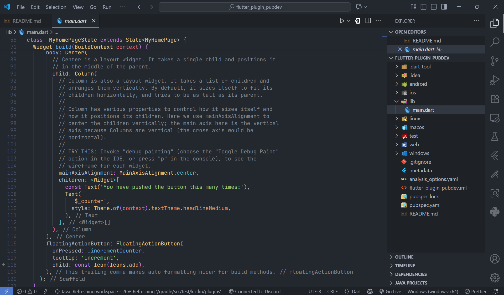
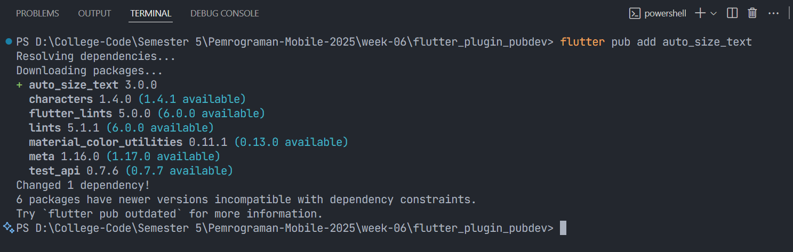
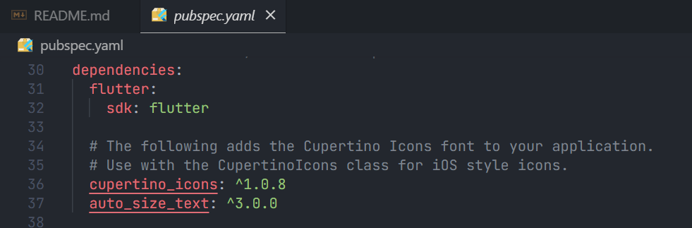
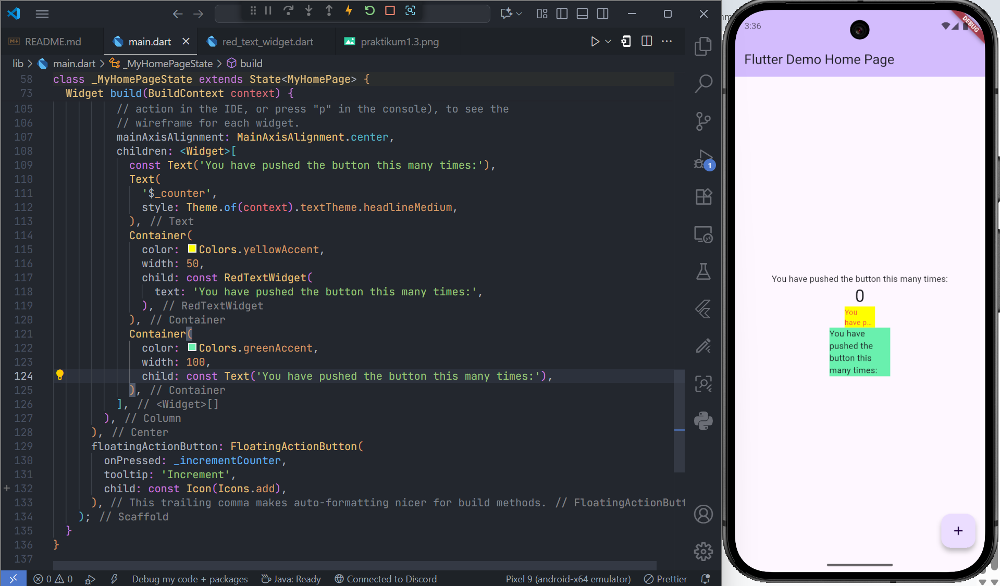

# Pertemuan 6 - Layout dan Navigasi

**Nama : Aditya Atadewa**  
**Kelas : TI 3G**  
**NIM : 2341720174**  
**No. Absen : 01**

---

## Praktikum Menerapkan Plugin di Project Flutter

### Langkah 1: Membuat Project Baru

Membuat sebuah project flutter baru dengan nama `flutter_plugin_pubdev`.



### Langkah 2: Menambahkan Plugin

Menambahkan plugin `auto_size_text` menggunakan perintah berikut di terminal

```cmd
flutter pub add auto_size_text
```



[pubspec.yaml](./flutter_plugin_pubdev/pubspec.yaml)



### Langkah 3: Membuat file `red_text_widget.dart`

Buat file baru bernama `red_text_widget.dart` di dalam folder `lib` lalu isi kode seperti berikut.

```dart
import 'package:flutter/material.dart';

class RedTextWidget extends StatelessWidget {
  const RedTextWidget({Key? key}) : super(key: key);

  @override
  Widget build(BuildContext context) {
    return Container();
  }
}
```

### Langkah 4: Tambah Widget `AutoSizeText`

Masih di file `red_text_widget.dart`, untuk menggunakan plugin `auto_size_text`, perlu mengubah kode `return Container()` menjadi seperti berikut.

```dart
return AutoSizeText(
      text,
      style: const TextStyle(color: Colors.red, fontSize: 14),
      maxLines: 2,
      overflow: TextOverflow.ellipsis,
);
```

Setelah Anda menambahkan kode di atas, Anda akan mendapatkan info error. Mengapa demikian? Jelaskan dalam laporan praktikum Anda!

**Jawaban:**

Error terjadi karena widget `AutoSizeText` membutuhkan import package dan juga parameter text yang belum didefinisikan di dalam class `RedTextWidget`.

#### 1. Import package

Terjadi error karena `AutoSizeText` bukan widget bawaan Flutter, sehingga tidak dikenali oleh compiler. Untuk mengatasinya, perlu menambahkan kode berikut di bagian atas file:

```dart
import 'package:auto_size_text/auto_size_text.dart';
```

#### 2. Property text

Terjadi error karena variabel text yang dipanggil di dalam `AutoSizeText` belum pernah didefinisikan pada class `RedTextWidget`. Untuk memperbaikinya, harus menambahkan deklarasi variabel dan constructor seperti berikut:

```dart
  final String text;
  const RedTextWidget({super.key, required this.text});
```

### Langkah 5: Membuat Variabel Text dan Parameter di Constructor

Menambahkan variabel text dan parameter di constructor seperti berikut.

```dart
final String text;

const RedTextWidget({Key? key, required this.text}) : super(key: key);
```

### Langkah 6: Menambahkan Widget di `main.dart`

Membuka file `main.dart` lalu tambahkan di dalam children: pada class `_MyHomePageState`

```dart
  Container(
    color: Colors.yellowAccent,
    width: 50,
    child: const RedTextWidget(
      text: 'You have pushed the button this many times:',
    ),
  ),
  Container(
    color: Colors.greenAccent,
    width: 100,
    child: const Text('You have pushed the button this many times:'),
  ),
```

#### Output yang dihasilkan:



---

## Tugas Praktikum

### Soal 1

**Pertanyaan:**

Jelaskan maksud dari langkah 2 pada praktikum tersebut!

**Jawaban:**

Langkah 2 pada praktikum bertujuan untuk menambahkan dependency `auto_size_text` ke dalam project Flutter. Dengan perintah:

```cmd
flutter pub add auto_size_text
```

Maka plugin tersebut otomatis ditambahkan ke file `pubspec.yaml` sehingga bisa digunakan dalam kode. Tanpa menambahkan plugin tersebut, widget `AutoSizeText` tidak akan dikenali oleh Flutter dan tidak akan bisa digunakan.

### Soal 2

**Pertanyaan:**

Jelaskan maksud dari langkah 5 pada praktikum tersebut!

**Jawaban:**

Langkah 5 pada praktikum tersebut menambahkan variabel text ke dalam class `RedTextWidget` dan membuat parameter di constructor:

```dart
final String text;
const RedTextWidget({Key? key, required this.text}) : super(key: key);
```

- `final String text;` digunakan untuk menyimpan data teks yang akan ditampilkan.
- `required this.text` memastikan bahwa setiap kali `RedTextWidget` dipanggil, parameter text wajib diisi.
- `super.key` mewarisi key dari widget `StatelessWidget`.

Dengan cara tersebut, widget menjadi lebih fleksibel karena bisa menampilkan teks sesuai input dari pemanggilnya.

### Soal 3

**Pertanyaan:**

Pada langkah 6 terdapat dua widget yang ditambahkan, jelaskan fungsi dan perbedaannya!

**Jawaban:**

Pada langkah 6 ditambahkan dua widget berbeda dalam children:

#### 1. Container dengan RedTextWidget

Menggunakan `AutoSizeText` (di dalam `RedTextWidget`).
Teks akan menyesuaikan ukuran (auto-resize) agar muat di dalam container dengan lebar terbatas (50).
Jika teks terlalu panjang, maka akan dipotong sesuai maxLines dan aturan overflow.

#### 2. Container dengan Text biasa

Menggunakan widget Text bawaan Flutter. Teks tidak otomatis menyesuaikan ukuran font. Jika teks terlalu panjang, maka bisa overflow keluar container atau dipotong secara manual dengan overflow.

**Perbedaan utama**: `AutoSizeText` lebih responsif karena secara otomatis menyesuaikan ukuran font agar tetap terbaca dengan baik di berbagai ukuran layar dan ruang yang terbatas, sementara Text tetap dengan ukuran font yang statis.

### Soal 4

**Pertanyaan:**

Jelaskan maksud dari tiap parameter yang ada di dalam plugin auto_size_text berdasarkan tautan pada dokumentasi: https://pub.dev/documentation/auto_size_text/latest/ !

**Jawaban:**

| Parameter               | Deskripsi                                                                                    |
| ----------------------- | -------------------------------------------------------------------------------------------- |
| **key***                | Identitas widget untuk membedakan dalam widget tree.                                         |
| **textKey**             | Key khusus untuk widget `Text` hasil dari `AutoSizeText`.                                    |
| **style***              | Mengatur gaya teks (warna, ukuran, tebal, dll).                                              |
| **minFontSize**         | Ukuran font minimum saat auto-sizing.                                                        |
| **maxFontSize**         | Ukuran font maksimum saat auto-sizing.                                                       |
| **stepGranularity**     | Interval/tingkat perubahan ukuran font ketika menyesuaikan (misalnya turun 1px, 0.5px, dll). |
| **presetFontSizes**     | Daftar ukuran font yang sudah ditentukan (harus descending order).                           |
| **group**               | Sinkronisasi ukuran font pada beberapa `AutoSizeText` sekaligus.                             |
| **textAlign***          | Mengatur perataan teks secara horizontal (start, center, end, justify).                      |
| **textDirection***      | Arah teks (LTR/RTL).                                                                         |
| **locale***             | Menentukan font berdasarkan bahasa/locale.                                                   |
| **softWrap***           | Apakah teks boleh dipotong ke baris baru jika panjang.                                       |
| **wrapWords**           | Apakah kata dipotong ke baris baru atau dibiarkan panjang.                                   |
| **overflow***           | Cara menangani teks yang melebihi batas (ellipsis, fade, dll).                               |
| **overflowReplacement** | Widget pengganti jika teks overflow.                                                         |
| **textScaleFactor***    | Faktor skala teks (default mengikuti pengaturan device).                                     |
| **maxLines**            | Batas maksimal jumlah baris teks yang ditampilkan.                                           |
| **semanticsLabel***     | Label alternatif untuk screen reader (aksesibilitas).                                        |

Parameter yang ditandai dengan (*) memiliki fungsi yang sama dengan widget Text bawaan Flutter.


