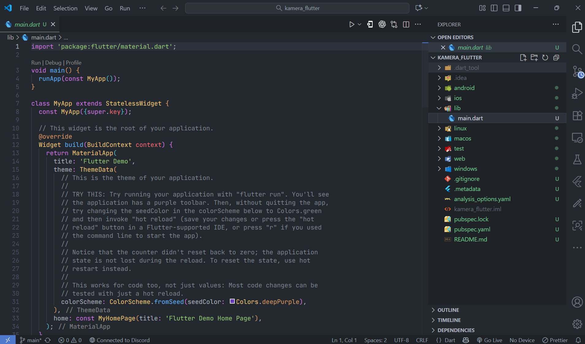
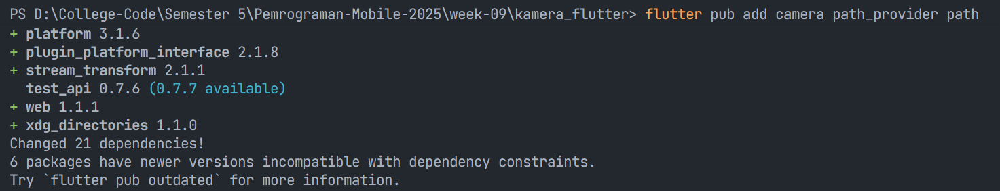
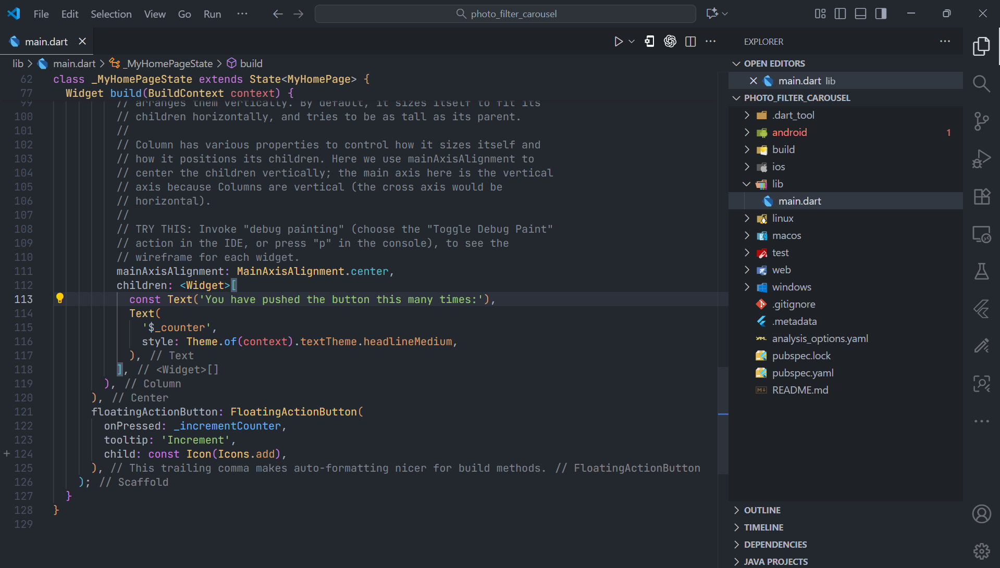

# Pertemuan 9 - Kamera

**Nama : Aditya Atadewa**  
**Kelas : TI 3G**  
**NIM : 2341720174**  
**No. Absen : 01**

---

## Praktikum 1: Mengambil Foto dengan Kamera di Flutter

### Langkah 1: Membuat Project Baru

Buatlah sebuah project flutter baru dengan nama kamera_flutter, lalu sesuaikan style laporan praktikum yang Anda buat.



### Langkah 2: Menambahkan dependensi yang diperlukan

Menambahkan tiga dependensi pada project flutter, yaitu:
1. camera → menyediakan seperangkat alat untuk bekerja dengan kamera pada device.
2. path_provider → menyediakan lokasi atau path untuk menyimpan hasil foto.
3. path → membuat path untuk mendukung berbagai platform.

Untuk menambahkan dependensi plugin, jalankan perintah flutter pub add seperti berikut di terminal:



### Langkah 3: Mengambil Sensor Kamera

Selanjutnya, mengecek jumlah kamera yang tersedia pada perangkat menggunakan plugin camera seperti pada kode berikut ini.

lib/main.dart

```dart
import 'package:camera/camera.dart';
import 'package:flutter/material.dart';


Future<void> main() async {
  WidgetsFlutterBinding.ensureInitialized();

  final cameras = await availableCameras();

  final firstCamera = cameras.first;

  runApp(
    MaterialApp(
      home: Scaffold(
        body: Center(
          child: Text('Menunggu Langkah 8...'),
        ),
      ),
    ),
  );
}
```

Mengubah fungsi main menjadi async dan ditambahkan logika kamera.

### Langkah 4: Membuat dan Menginisialisasi CameraController

Setelah dapat mengakses kamera, menggunakan langkah-langkah berikut untuk membuat dan menginisialisasi CameraController. 

1. Membuat `StatefulWidget` dengan kelas State pendamping.
2. Menambahkan variabel ke kelas State untuk menyimpan `CameraController`.
3. Menambahkan variabel ke kelas State untuk menyimpan Future yang dikembalikan dari `CameraController.initialize()`.
4. Membuat dan menginisialisasi controller dalam metode `initState()`.
5. Menghapus controller dalam metode `dispose()`.

lib/widget/takepicture_screen.dart

```dart
import 'package:camera/camera.dart';
import 'package:flutter/material.dart';

class TakePictureScreen extends StatefulWidget {
  const TakePictureScreen({
    super.key,
    required this.camera,
  });

  final CameraDescription camera;

  @override
  TakePictureScreenState createState() => TakePictureScreenState();
}

class TakePictureScreenState extends State<TakePictureScreen> {
  late CameraController _controller;
  late Future<void> _initializeControllerFuture;

  @override
  void initState() {
    super.initState();
    _controller = CameraController(
      widget.camera,
      ResolutionPreset.medium,
    );

    _initializeControllerFuture = _controller.initialize();
  }

  @override
  void dispose() {
    _controller.dispose();
    super.dispose();
  }

  @override
  Widget build(BuildContext context) {
    return Container();
  }
}
```

### Langkah 5: Menggunakan CameraPreview untuk menampilkan preview foto

Menggunakan widget CameraPreview dari package camera untuk menampilkan preview foto. Disini perlu tipe objek void berupa FutureBuilder untuk menangani proses async.

lib/widget/takepicture_screen.dart

```dart
@override
Widget build(BuildContext context) {
  return Scaffold(
    appBar: AppBar(title: const Text('Take a picture - Aditya Atadewa - 2341720174')),
    body: FutureBuilder<void>(
      future: _initializeControllerFuture,
      builder: (context, snapshot) {
        if (snapshot.connectionState == ConnectionState.done) {
          return CameraPreview(_controller);
        } else {
          return const Center(child: CircularProgressIndicator());
        }
      },
    ),
  );
}
```

### Langkah 6: Mengambil foto dengan CameraController


Membuat sebuah FloatingActionButton yang digunakan untuk mengambil gambar menggunakan CameraController saat pengguna mengetuk tombol.

Pengambilan gambar memerlukan 2 langkah:

1. Memastikan kamera telah diinisialisasi.
2. Menggunakan controller untuk mengambil gambar dan pastikan ia mengembalikan objek Future.

lib/widget/takepicture_screen.dart

```dart
@override
Widget build(BuildContext context) {
  return Scaffold(
    appBar: AppBar(title: const Text('Take a picture - Aditya Atadewa - 2341720174')),
    body: FutureBuilder<void>(
      // ... (Kode FutureBuilder dari Langkah 5) ...
    ),
    floatingActionButton: FloatingActionButton(
      onPressed: () async {
        // Ambil gambar dalam try/catch block.
        try {
          // Pastikan kamera terinisialisasi.
          await _initializeControllerFuture;

          // Ambil gambar
          final image = await _controller.takePicture();

          // (Logika navigasi akan ditambahkan di Langkah 9)
        } catch (e) {
          // Jika error, log ke console.
          print(e);
        }
      },
      child: const Icon(Icons.camera_alt),
    ),
  );
}
```

### Langkah 7: Membuat widget baru DisplayPictureScreen

Membuat file baru pada folder widget yang berisi kode berikut.

lib/widget/displaypicture_screen.dart

```dart
import 'dart:io';
import 'package:flutter/material.dart';

class DisplayPictureScreen extends StatelessWidget {
  final String imagePath;

  const DisplayPictureScreen({super.key, required this.imagePath});

  @override
  Widget build(BuildContext context) {
    return Scaffold(
      appBar: AppBar(title: const Text('Display the Picture - Aditya Atadewa - 2341720174')),
      body: Image.file(File(imagePath)),
    );
  }
}
```

### Langkah 8: Mengedit main.dart

Mengedit pada file main.dart bagian runApp seperti kode berikut.

lib/main.dart

```dart
import 'package:kamera_flutter/widget/takepicture_screen.dart'; 

Future<void> main() async {
  WidgetsFlutterBinding.ensureInitialized();
  final cameras = await availableCameras();
  final firstCamera = cameras.first;

  runApp(
    MaterialApp(
      theme: ThemeData.dark(),
      home: TakePictureScreen(
        camera: firstCamera,
      ),
      debugShowCheckedModeBanner: false,
    ),
  );
}
```

### Langkah 9: Menampilkan hasil foto

Menambahkan kode seperti berikut pada bagian try / catch agar dapat menampilkan hasil foto pada `DisplayPictureScreen`.

lib/widget/takepicture_screen.dart

```dart
import 'package:kamera_flutter/widget/displaypicture_screen.dart'; 

floatingActionButton: FloatingActionButton(
  onPressed: () async {
    try {
      await _initializeControllerFuture;
      final image = await _controller.takePicture();

      if (!context.mounted) return;

      await Navigator.of(context).push(
        MaterialPageRoute(
          builder: (context) => DisplayPictureScreen(
            imagePath: image.path,
          ),
        ),
      );
    } catch (e) {
      print(e);
    }
  },
  child: const Icon(Icons.camera_alt),
),
```

**Output Aplikasi kamera_flutter: (gif)**


---

## Praktikum 2: Membuat photo filter carousel

### Langkah 1: Membuat project baru

Membuat project flutter baru di pertemuan 09 dengan nama photo_filter_carousel



### Langkah 2: Membuat widget Selector ring dan dark gradient

Membuat folder widget dan file baru yang berisi kode berikut.

lib/widget/filter_selector.dart

```dart
@immutable
class FilterSelector extends StatefulWidget {
  const FilterSelector({
    super.key,
    required this.filters,
    required this.onFilterChanged,
    this.padding = const EdgeInsets.symmetric(vertical: 24),
  });

  final List<Color> filters;
  final void Function(Color selectedColor) onFilterChanged;
  final EdgeInsets padding;

  @override
  State<FilterSelector> createState() => _FilterSelectorState();
}

class _FilterSelectorState extends State<FilterSelector> {
  static const _filtersPerScreen = 5;
  static const _viewportFractionPerItem = 1.0 / _filtersPerScreen;

  late final PageController _controller;
  late int _page;

  int get filterCount => widget.filters.length;

  Color itemColor(int index) => widget.filters[index % filterCount];

  @override
  void initState() {
    super.initState();
    _page = 0;
    _controller = PageController(
      initialPage: _page,
      viewportFraction: _viewportFractionPerItem,
    );
    _controller.addListener(_onPageChanged);
  }

  void _onPageChanged() {
    final page = (_controller.page ?? 0).round();
    if (page != _page) {
      _page = page;
      widget.onFilterChanged(widget.filters[page]);
    }
  }

  void _onFilterTapped(int index) {
    _controller.animateToPage(
      index,
      duration: const Duration(milliseconds: 450),
      curve: Curves.ease,
    );
  }

  @override
  void dispose() {
    _controller.dispose();
    super.dispose();
  }

  @override
  Widget build(BuildContext context) {
    return Scrollable(
      controller: _controller,
      axisDirection: AxisDirection.right,
      physics: const PageScrollPhysics(),
      viewportBuilder: (context, viewportOffset) {
        return LayoutBuilder(
          builder: (context, constraints) {
            final itemSize = constraints.maxWidth * _viewportFractionPerItem;
            viewportOffset
              ..applyViewportDimension(constraints.maxWidth)
              ..applyContentDimensions(0.0, itemSize * (filterCount - 1));

            return Stack(
              alignment: Alignment.bottomCenter,
              children: [
                _buildShadowGradient(itemSize),
                _buildCarousel(
                  viewportOffset: viewportOffset,
                  itemSize: itemSize,
                ),
                _buildSelectionRing(itemSize),
              ],
            );
          },
        );
      },
    );
  }

  Widget _buildShadowGradient(double itemSize) {
    return SizedBox(
      height: itemSize * 2 + widget.padding.vertical,
      child: const DecoratedBox(
        decoration: BoxDecoration(
          gradient: LinearGradient(
            begin: Alignment.topCenter,
            end: Alignment.bottomCenter,
            colors: [
              Colors.transparent,
              Colors.black,
            ],
          ),
        ),
        child: SizedBox.expand(),
      ),
    );
  }

  Widget _buildCarousel({
    required ViewportOffset viewportOffset,
    required double itemSize,
  }) {
    return Container(
      height: itemSize,
      margin: widget.padding,
      child: Flow(
        delegate: CarouselFlowDelegate(
          viewportOffset: viewportOffset,
          filtersPerScreen: _filtersPerScreen,
        ),
        children: [
          for (int i = 0; i < filterCount; i++)
            FilterItem(
              onFilterSelected: () => _onFilterTapped(i),
              color: itemColor(i),
            ),
        ],
      ),
    );
  }

  Widget _buildSelectionRing(double itemSize) {
    return IgnorePointer(
      child: Padding(
        padding: widget.padding,
        child: SizedBox(
          width: itemSize,
          height: itemSize,
          child: const DecoratedBox(
            decoration: BoxDecoration(
              shape: BoxShape.circle,
              border: Border.fromBorderSide(
                BorderSide(width: 6, color: Colors.white),
              ),
            ),
          ),
        ),
      ),
    );
  }
}
```

# Langkah 3: Membuat widget photo filter carousel

Buat file baru di folder widget dengan kode seperti berikut.

lib/widget/filter_carousel.dart

```dart
@immutable
class PhotoFilterCarousel extends StatefulWidget {
  const PhotoFilterCarousel({super.key});

  @override
  State<PhotoFilterCarousel> createState() => _PhotoFilterCarouselState();
}

class _PhotoFilterCarouselState extends State<PhotoFilterCarousel> {
  final _filters = [
    Colors.white,
    ...List.generate(
      Colors.primaries.length,
      (index) => Colors.primaries[(index * 4) % Colors.primaries.length],
    ),
  ];

  final _filterColor = ValueNotifier<Color>(Colors.white);

  void _onFilterChanged(Color value) {
    _filterColor.value = value;
  }

  @override
  Widget build(BuildContext context) {
    return Material(
      color: Colors.black,
      child: Stack(
        children: [
          Positioned.fill(child: _buildPhotoWithFilter()),
          Positioned(
            left: 0.0,
            right: 0.0,
            bottom: 0.0,
            child: _buildFilterSelector(),
          ),
        ],
      ),
    );
  }

  Widget _buildPhotoWithFilter() {
    return ValueListenableBuilder(
      valueListenable: _filterColor,
      builder: (context, color, child) {
        // Anda bisa ganti dengan foto Anda sendiri
        return Image.network(
          'https://avatars.githubusercontent.com/u/142544526?v=4',
          color: color.withOpacity(0.5),
          colorBlendMode: BlendMode.color,
          fit: BoxFit.cover,
          errorBuilder: (context, error, stackTrace) {
            return Container(
              color: Colors.grey,
              child: const Center(
                child: Icon(Icons.error, color: Colors.white, size: 64),
              ),
            );
          },
        );
      },
    );
  }

  Widget _buildFilterSelector() {
    return FilterSelector(onFilterChanged: _onFilterChanged, filters: _filters);
  }
}
```

# Langkah 4: Membuat filter warna - bagian 1

Membuat file baru di folder widget seperti kode berikut.

lib/widget/carousel_flowdelegate.dart

```dart
class CarouselFlowDelegate extends FlowDelegate {
  CarouselFlowDelegate({
    required this.viewportOffset,
    required this.filtersPerScreen,
  }) : super(repaint: viewportOffset);

  final ViewportOffset viewportOffset;
  final int filtersPerScreen;

  @override
  void paintChildren(FlowPaintingContext context) {
    final count = context.childCount;

    // All available painting width
    final size = context.size.width;

    // The distance that a single item "page" takes up from the perspective
    // of the scroll paging system. We also use this size for the width and
    // height of a single item.
    final itemExtent = size / filtersPerScreen;

    // The current scroll position expressed as an item fraction, e.g., 0.0,
    // or 1.0, or 1.3, or 2.9, etc. A value of 1.3 indicates that item at
    // index 1 is active, and the user has scrolled 30% towards the item at
    // index 2.
    final active = viewportOffset.pixels / itemExtent;

    // Index of the first item we need to paint at this moment.
    // At most, we paint 3 items to the left of the active item.
    final min = math.max(0, active.floor() - 3).toInt();

    // Index of the last item we need to paint at this moment.
    // At most, we paint 3 items to the right of the active item.
    final max = math.min(count - 1, active.ceil() + 3).toInt();

    // Generate transforms for the visible items and sort by distance.
    for (var index = min; index <= max; index++) {
      final itemXFromCenter = itemExtent * index - viewportOffset.pixels;
      final percentFromCenter = 1.0 - (itemXFromCenter / (size / 2)).abs();
      final itemScale = 0.5 + (percentFromCenter * 0.5);
      final opacity = 0.25 + (percentFromCenter * 0.75);

      final itemTransform = Matrix4.identity()
        ..translate((size - itemExtent) / 2)
        ..translate(itemXFromCenter)
        ..translate(itemExtent / 2, itemExtent / 2)
        ..multiply(Matrix4.diagonal3Values(itemScale, itemScale, 1.0))
        ..translate(-itemExtent / 2, -itemExtent / 2);

      context.paintChild(
        index,
        transform: itemTransform,
        opacity: opacity,
      );
    }
  }

  @override
  bool shouldRepaint(covariant CarouselFlowDelegate oldDelegate) {
    return oldDelegate.viewportOffset != viewportOffset;
  }
}
```

# Langkah 5: Membuat filter warna

Buat file baru di folder widget seperti kode berikut ini.

lib/widget/filter_item.dart

```dart
import 'package:flutter/material.dart';

@immutable
class FilterItem extends StatelessWidget {
  const FilterItem({super.key, required this.color, this.onFilterSelected});

  final Color color;
  final VoidCallback? onFilterSelected;

  @override
  Widget build(BuildContext context) {
    return GestureDetector(
      onTap: onFilterSelected,
      child: AspectRatio(
        aspectRatio: 1.0,
        child: Padding(
          padding: const EdgeInsets.all(8),
          child: ClipOval(
            child: Image.network(
              'https://avatars.githubusercontent.com/u/142544526?v=4',
              color: color.withOpacity(0.5),
              colorBlendMode: BlendMode.hardLight,
              fit: BoxFit.cover,
              errorBuilder: (context, error, stackTrace) {
                return Container(
                  color: Colors.grey,
                  child: const Icon(Icons.error, color: Colors.white),
                );
              },
            ),
          ),
        ),
      ),
    );
  }
}
```

# Langkah 6: Mengimplementasi filter carousel

Mengimpor widget PhotoFilterCarousel ke main seperti kode berikut ini.

lib/main.dart

```dart
import 'package:flutter/material.dart';
import 'package:photo_filter_carousel/widget/filter_carousel.dart';

void main() {
  runApp(
    const MaterialApp(
      home: PhotoFilterCarousel(),
      debugShowCheckedModeBanner: false,
    ),
  );
}
```

**Output Aplikasi photo_filter_carousel: (gif)**


---

## Tugas Praktikum

### Soal 1

**Pertanyaan:**

Gabungkan hasil praktikum 1 dengan hasil praktikum 2 sehingga setelah melakukan pengambilan foto, dapat dibuat filter carouselnya!

**Jawaban:**

Project: [Kamera Filter Carousel](./kamera_filter_carousel_aditya/)

**Output Aplikasi photo_filter_carousel: (gif)**


### Soal 2

**Pertanyaan:**

Jelaskan maksud void async pada praktikum 1?

**Jawaban:**

`async` digunakan untuk menandai bahwa suatu fungsi berjalan secara `asinkron`, yaitu dapat menunggu proses yang memerlukan waktu tanpa menghentikan eksekusi program utama. Sementara itu, `void` menunjukkan bahwa fungsi tersebut tidak mengembalikan nilai setelah prosesnya selesai.

**Kode Pada Praktikum 1:**

```dart
Future<void> main() async {
  WidgetsFlutterBinding.ensureInitialized();
  final cameras = await availableCameras();
  final firstCamera = cameras.first;
  runApp(MaterialApp(
    theme: ThemeData.dark(),
    home: TakePictureScreen(camera: firstCamera),
    debugShowCheckedModeBanner: false,
  ));
}
```

**Penjelasan:**

Penulisan `Future<void> main() async` memungkinkan penggunaan `await` pada `availableCameras()`, karena proses pengambilan daftar kamera membutuhkan waktu. Dengan demikian, `async` membuat fungsi dapat menunggu proses tersebut hingga selesai, sedangkan `Future<void>` menunjukkan bahwa fungsi akan selesai di masa mendatang tanpa menghasilkan nilai.

### Soal 3

**Pertanyaan:**

Jelaskan fungsi dari anotasi @immutable dan @override ?

**Jawaban:**

- `@immutable`
  - Digunakan untuk menandai bahwa suatu kelas bersifat immutable atau tidak dapat diubah setelah objeknya dibuat.
  - Menjaga agar setiap properti widget bersifat final, sehingga tampilan dan perilaku widget tetap konsisten meskipun state berubah.

- `@override`
  - Digunakan untuk menunjukkan bahwa suatu method menimpa (override) method dari kelas induk atau antarmuka.
  - Membantu meningkatkan keterbacaan kode dan mencegah kesalahan penulisan nama method.


