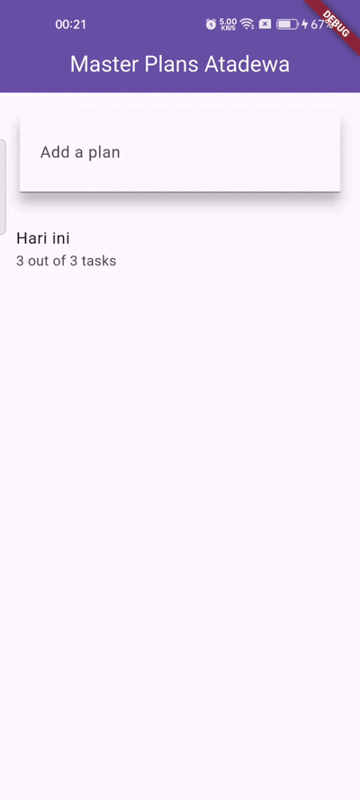
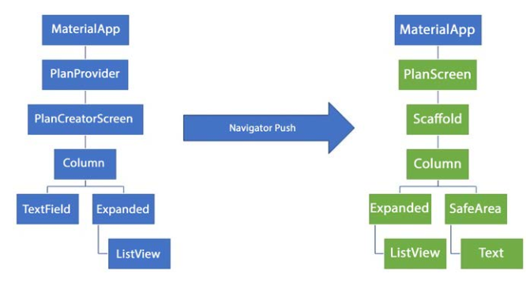

# Pertemuan 10 - Dasar State Management

**Nama : Aditya Atadewa**  
**Kelas : TI 3G**  
**NIM : 2341720174**  
**No. Absen : 01**

---

## Praktikum 1: Dasar State dengan Model-View

### Langkah 1: Membuat Project Baru

Membuat sebuah project Flutter baru dengan nama **master_plan**, kemudian membuat susunan folder dalam project sesuai ketentuan yang telah ditetapkan.


### Langkah 2: Membuat model `task.dart`

Pada folder **models**, dibuat file `task.dart` yang berfungsi sebagai representasi data tugas.  
Class `Task` memiliki atribut `description` (String) dan `complete` (Boolean) serta menggunakan constructor untuk inisialisasi nilai.

```dart
class Task {
  final String description;
  final bool complete;

  const Task({this.complete = false, this.description = ''});
}
```

### Langkah 3: Membuat File `plan.dart`

Masih dalam folder **models**, dibuat file `plan.dart`.  
Class `Plan` digunakan untuk menyimpan nama rencana dan daftar tugas (`List<Task>`).

```dart
import 'task.dart';

class Plan {
  final String name;
  final List<Task> tasks;

  const Plan({this.name = '', this.tasks = const []});
}
```

### Langkah 4: Membuat File `data_layer.dart`

Untuk mempermudah proses import, dibuat file `data_layer.dart` yang berisi export dari file `task.dart` dan `plan.dart`.  
File ini merupakan bagian dari data layer aplikasi.

```dart
export 'plan.dart';
export 'task.dart';
```

### Langkah 5: Mengubah File `main.dart`

Pada file `main.dart`, dilakukan import ke file `plan_screen.dart` dan menambahkan class `MasterPlanApp` yang menjadi root dari aplikasi.  
Kemudian `PlanScreen()` dijadikan sebagai `home` widget dalam `MaterialApp`.

```dart
import 'package:flutter/material.dart';
import './views/plan_screen.dart';

void main() => runApp(MasterPlanApp());

class MasterPlanApp extends StatelessWidget {
  const MasterPlanApp({super.key});

  @override
  Widget build(BuildContext context) {
    return MaterialApp(
      theme: ThemeData(primarySwatch: Colors.purple),
      home: PlanScreen(),
    );
  }
}
```

### Langkah 6: Membuat `plan_screen.dart`

Pada folder **views**, dibuat file `plan_screen.dart`.  
Widget ini berupa `StatefulWidget` yang bertanggung jawab menampilkan daftar tugas serta memberikan kemampuan untuk menambah dan mengubah data.

```dart
import '../models/data_layer.dart';
import 'package:flutter/material.dart';

class PlanScreen extends StatefulWidget {
  const PlanScreen({super.key});

  @override
  State createState() => _PlanScreenState();
}

class _PlanScreenState extends State<PlanScreen> {
  Plan plan = const Plan();

  @override
  Widget build(BuildContext context) {
    return Scaffold(
      appBar: AppBar(title: const Text('Master Plan Atadewa')),
      body: _buildList(),
      floatingActionButton: _buildAddTaskButton(),
    );
  }
}
```

### Langkah 7: Membuat method `_buildAddTaskButton()`

Menambahkan method `_buildAddTaskButton()` untuk menambahkan tugas baru ke dalam list dengan memanggil `setState()` agar UI diperbarui secara otomatis.

```dart
Widget _buildAddTaskButton() {
  return FloatingActionButton(
    child: const Icon(Icons.add),
    onPressed: () {
      setState(() {
        plan = Plan(
          name: plan.name,
          tasks: List<Task>.from(plan.tasks)..add(const Task()),
        );
      });
    },
  );
}
```

### Langkah 8: Membuat Widget `_buildList()`

Menambahkan method `_buildList()` untuk menampilkan daftar task dalam bentuk ListView yang dapat discroll.  
Widget ini menggunakan `ListView.builder()` untuk membuat tampilan dinamis berdasarkan jumlah task.

```dart
Widget _buildList() {
  return ListView.builder(
    itemCount: plan.tasks.length,
    itemBuilder: (context, index) => _buildTaskTile(plan.tasks[index], index),
  );
}
```

### Langkah 9: Membuat Widget `_buildTaskTile`

Menambahkan method `_buildTaskTile(Task task, int index)` untuk menampilkan elemen ListTile yang terdiri dari:

- Checkbox untuk menandai tugas selesai.
- TextFormField untuk mengubah deskripsi tugas secara langsung.

Perubahan data akan diperbarui ke dalam state menggunakan `setState()`.

```dart
Widget _buildTaskTile(Task task, int index) {
  return ListTile(
    leading: Checkbox(
      value: task.complete,
      onChanged: (selected) {
        setState(() {
          plan = Plan(
            name: plan.name,
            tasks: List<Task>.from(plan.tasks)
              ..[index] = Task(
                description: task.description,
                complete: selected ?? false,
              ),
          );
        });
      },
    ),
    title: TextFormField(
      initialValue: task.description,
      onChanged: (text) {
        setState(() {
          plan = Plan(
            name: plan.name,
            tasks: List<Task>.from(plan.tasks)
              ..[index] = Task(description: text, complete: task.complete),
          );
        });
      },
    ),
  );
}
```

### Langkah 10: Menambahkan Scroll Controller

Menambahkan variabel `scrollController` untuk mengontrol scroll dan mengelola perilaku keyboard, terutama saat aplikasi dijalankan pada perangkat iOS.

```dart
late ScrollController scrollController;
```

### Langkah 11: Menambahkan Scroll Listener

Mengimplementasikan method `initState()` untuk menginisialisasi `scrollController` dan menambahkan listener agar keyboard dapat ditutup otomatis saat user melakukan scroll.

```dart
@override
void initState() {
  super.initState();
  scrollController = ScrollController()
    ..addListener(() {
      FocusScope.of(context).requestFocus(FocusNode());
    });
}
```

### Langkah 12: Menambahkan Controller dan keyboard behavior

Pada method `_buildList()`, ListView ditambahkan `controller` dan `keyboardDismissBehavior` agar interaksi scroll dan keyboard berjalan dengan baik.

```dart
Widget _buildList() {
  return ListView.builder(
    controller: scrollController,
    itemCount: plan.tasks.length,
    itemBuilder: (context, index) => _buildTaskTile(plan.tasks[index], index),
  );
}
```

### Langkah 13: Menambahkan method `dispose()`

Method `dispose()` digunakan untuk membersihkan controller ketika widget tidak lagi digunakan sehingga mencegah kebocoran memori.

```dart
@override
void dispose() {
  scrollController.dispose();
  super.dispose();
}
```

### Langkah 14: Hasil

Setelah melakukan hot restart, aplikasi berhasil menampilkan:

- Daftar task
- Checkbox untuk menandai selesai
- TextFormField untuk mengubah deskripsi
- Tombol tambah untuk menambah task baru
- Scroll list dengan perilaku keyboard yang sesuai

**Output Aplikasi yang dihasilkan:**

| GIF Demo | Screenshot |
| -------- | ---------- |
|  |  |

---

## Tugas Praktikum 1

### Soal 1

Jelaskan maksud dari langkah 4 pada praktikum tersebut! Mengapa dilakukan demikian?

### Jawaban

Langkah 4 membuat file `data_layer.dart` yang berfungsi sebagai **barrel file**, yaitu satu file yang mengekspor semua model (`plan.dart` dan `task.dart`).

**Alasan dilakukan:**

- Mempermudah proses import pada file lain (import '../models/data_layer.dart';).
- Menjaga struktur folder tetap rapi dan terorganisir.
- Memisahkan _data layer_ dari _view layer_
- Memudahkan pengembangan aplikasi saat jumlah model bertambah.

### Soal 2

Mengapa perlu variabel plan di langkah 6 pada praktikum tersebut? Mengapa dibuat konstanta ?

### Jawaban

Variabel `plan` digunakan untuk menyimpan **state utama** aplikasi (nama rencana dan daftar tugas). State ini selalu diperbarui dengan `setState()` saat terdapat perubahan (misalnya menambahkan atau mengedit tugas).

**Alasan memakai `const Plan()`:**

- Model (`Plan` dan `Task`) dibuat **immutable**, sehingga setiap perubahan dibuat dengan membuat **objek baru**, bukan memodifikasi yang lama.
- Immutability membuat state lebih aman, mudah dilacak, dan menghindari bug yang muncul karena perubahan data yang tidak terkontrol.
- `const` memungkinkan Flutter melakukan optimasi memori (canonical instance).

### Soal 3

Lakukan capture hasil dari Langkah 9 berupa GIF, kemudian jelaskan apa yang telah Anda buat!

### Jawaban

| GIF Demo | Screenshot|
| -------- | --------- |
|  |  |

**Penjelasan:**
Pada langkah ini, dibuat widget `_buildTaskTile()` yang terdiri dari:

- `Checkbox` → Mengubah status `complete`.
- `TextFormField` → Mengubah `description`.

Setiap perubahan akan:

1. Membuat objek `Task` baru.
2. Membuat objek `Plan` baru yang berisi daftar tugas terbaru.
3. Memanggil `setState()` sehingga tampilan diperbarui.

### Soal 4

Apa kegunaan method pada Langkah 11 dan 13 dalam lifecyle state ?

### Jawaban

| Method        | Lifecycle                          | Fungsi                                                                                               | Alasan                                                                                      |
| ------------- | ---------------------------------- | ---------------------------------------------------------------------------------------------------- | ------------------------------------------------------------------------------------------- |
| `initState()` | Dipanggil sekali saat State dibuat | Menginisialisasi `ScrollController` dan menambahkan listener untuk menghilangkan fokus ketika scroll | Agar keyboard menutup otomatis saat pengguna scroll (mencegah text field tertutup keyboard) |
| `dispose()`   | Dipanggil saat State dihapus       | Menjalankan `scrollController.dispose()`                                                             | Mencegah **memory leak** dan listener yang tertinggal                                       |

---

## Praktikum 2: Mengelola Data Layer dengan InheritedWidget dan InheritedNotifier

### Langkah 1: Membuat File `plan_provider.dart`

Pada folder `lib`, dibuat folder baru bernama **provider**, kemudian file `plan_provider.dart`.

```dart
import 'package:flutter/material.dart';
import '../models/data_layer.dart';

class PlanProvider extends InheritedNotifier<ValueNotifier<Plan>> {
  const PlanProvider({
    super.key,
    required super.child,
    required ValueNotifier<Plan> super.notifier,
  });

  static ValueNotifier<Plan> of(BuildContext context) {
    return context
        .dependOnInheritedWidgetOfExactType<PlanProvider>()!
        .notifier!;
  }
}
```

### Langkah 2: Mengubah `main.dart`

Bagian `home` pada `MaterialApp` diganti dengan `PlanProvider`.

```dart
return MaterialApp(
  theme: ThemeData(primarySwatch: Colors.purple),
  home: PlanProvider(
    notifier: ValueNotifier<Plan>(const Plan()),
    child: const PlanScreen(),
   ),
);
```

### Langkah 3: Menambah method pada `plan.dart`

Menambahkan dua method yaitu:

```dart
int get completedCount => tasks
  .where((task) => task.complete)
  .length;

String get completenessMessage =>
  '$completedCount out of ${tasks.length} tasks';
```

| Method                | Fungsi                                                   |
| --------------------- | -------------------------------------------------------- |
| `completedCount`      | Menghitung jumlah task yang sudah ditandai selesai.      |
| `completenessMessage` | Menampilkan pesan progres seperti: `"3 out of 5 tasks"`. |

### Langkah 4: `PlanScreen`

Mengubah `PlanScreen` agar menggunakan data dari `PlanProvider`. Menghapus deklarasi variabel `plan`.

### Langkah 5: Mengubah Method `_buildAddTaskButton`

Menambahkan `BuildContext` sebagai parameter dan menggunakan `PlanProvider` sebagai sumber datanya.

```dart
Widget _buildAddTaskButton(BuildContext context) {
  ValueNotifier<Plan> planNotifier = PlanProvider.of(context);
  return FloatingActionButton(
    child: const Icon(Icons.add),
    onPressed: () {
      Plan currentPlan = planNotifier.value;
      planNotifier.value = Plan(
        name: currentPlan.name,
        tasks: List<Task>.from(currentPlan.tasks)..add(const Task()),
      );
    },
  );
}
```

### Langkah 6: Mengubah Method `_buildTaskTile`

Menambahkan parameter `BuildContext`, menggunakan `PlanProvider` sebagai sumber data. Kemudian, mengganti `TextField` menjadi `TextFormField` untuk membuat inisial data provider menjadi lebih mudah.

```dart
void main() {
  runApp(
    const MaterialApp(
      home: PhotoFilterCarousel(),
      debugShowCheckedModeBanner: false,
    ),
  );
}
```

### Langkah 7: Mengubah `_buildList`

Menyesuaikan parameter pada bagian `_buildList`.

```dart
Widget _buildList(Plan plan) {
   return ListView.builder(
     controller: scrollController,
     itemCount: plan.tasks.length,
     itemBuilder: (context, index) =>
        _buildTaskTile(plan.tasks[index], index, context),
   );
}
```

### Langkah 8: class `PlansScreen`

Mengubah method build sehingga bisa tampil progress pada bagian bawah (footer). Hal tersebut dapat dilakukan dengan membungkus (wrap)` _buildList` dengan widget `Expanded` dan masukkan ke dalam widget `Column`.

### Langkah 9: Menambahkan Widget `SafeArea`

Menambahkan widget `SafeArea` dengan berisi `completenessMessage` pada akhir widget `Column`.

```dart
@override
Widget build(BuildContext context) {
   return Scaffold(
     appBar: AppBar(title: const Text('Master Plan Atadewa')),
     body: ValueListenableBuilder<Plan>(
       valueListenable: PlanProvider.of(context),
       builder: (context, plan, child) {
         return Column(
           children: [
             Expanded(child: _buildList(plan)),
             SafeArea(child: Text(plan.completenessMessage))
           ],
         );
       },
     ),
     floatingActionButton: _buildAddTaskButton(context),
   );
}
```

**Output Aplikasi yang dihasilkan:**

| GIF Demo | Screenshot |
| -------- | ---------- |
|  |  |

---

## Tugas Praktikum 2

### Soal 1

Jelaskan mana yang dimaksud `InheritedWidget` pada langkah 1 tersebut! Mengapa yang digunakan `InheritedNotifier`?

### Jawaban

```dart
InheritedNotifier<ValueNotifier<Plan>>
```

Pada langkah 1, provider yang dibuat memanfaatkan konsep **InheritedWidget**, yaitu widget yang memungkinkan suatu data **diakses oleh widget-widget turunan** tanpa perlu meneruskan parameter secara manual.

Namun, yang digunakan adalah **InheritedNotifier**, karena selain menyebarkan data seperti InheritedWidget, ia juga **mendukung notifikasi perubahan data** melalui `ValueNotifier`. Dengan demikian, ketika data berubah, widget yang bergantung pada data tersebut akan **secara otomatis melakukan rebuild**.

**Alasan penggunaan InheritedNotifier:**

- Mendukung pembaruan UI secara otomatis saat nilai data berubah.
- Menghindari penggunaan `setState()` di banyak tempat.
- State menjadi terpusat dan mudah dikelola.
- Lebih efisien dan sesuai untuk aplikasi yang datanya dinamis.

### Soal 2

Jelaskan maksud dari method di langkah 3 pada praktikum tersebut! Mengapa dilakukan demikian?

### Jawaban

Pada langkah 3 ditambahkan method pada model `Plan` untuk:

- Menghitung jumlah tugas yang sudah selesai.
- Menampilkan pesan progres dalam bentuk teks.

plan.dart

```dart
int get completedCount => tasks.where((task) => task.complete).length;

String get completenessMessage =>
  '$completedCount out of ${tasks.length} tasks';
```

Tujuan dari penambahan method ini adalah agar logika perhitungan ditempatkan pada model, bukan di dalam tampilan.

Hasilnya:

- View hanya bertugas menampilkan data yang sudah siap.
- Model menyimpan data sekaligus logika yang berkaitan dengan data tersebut.
- Struktur kode menjadi lebih rapi dan sesuai dengan prinsip Separation of Concerns.

### Soal 3

Lakukan capture hasil dari Langkah 9 berupa GIF, kemudian jelaskan apa yang telah Anda buat!

### Jawaban

| GIF Demo | Screenshot |
| -------- | ---------- |
|  |  |

**Penjelasan:**

Pada hasil tersebut terlihat bahwa aplikasi kini dapat menampilkan **progres penyelesaian tugas secara real-time**. Ketika pengguna menambah atau mengubah tugas, data pada provider diperbarui, dan UI langsung menyesuaikan tanpa pemanggilan `setState()` di layar tersebut. Hal tersebut menunjukkan bahwa **state telah berhasil dipisahkan dari tampilan**, dan pembaruan UI terjadi secara otomatis melalui mekanisme listening pada `ValueNotifier`.

---

## Praktikum 3: Membuat State di Multiple Screens

### Langkah 1: Mengubah `PlanProvider`

Mengedit class `PlanProvider` sehingga dapat menangani List Plan.

```dart
class PlanProvider extends
InheritedNotifier<ValueNotifier<List<Plan>>> {
  const PlanProvider({super.key, required Widget child, required
ValueNotifier<List<Plan>> notifier})
     : super(child: child, notifier: notifier);

  static ValueNotifier<List<Plan>> of(BuildContext context) {
    return context.
dependOnInheritedWidgetOfExactType<PlanProvider>()!.notifier!;
  }
}
```

### Langkah 2: Mengubah main.dart

Langkah sebelumnya dapat menyebabkan error pada `main.dart` dan `plan_screen.dart`. Pada method build, mengganti menjadi kode seperti ini.

```dart
Widget build(BuildContext context) {
  return PlanProvider(
    notifier: ValueNotifier<List<Plan>>(const []),
    child: MaterialApp(
      title: 'State management app',
      theme: ThemeData(
        primarySwatch: Colors.blue,
      ),
      home: const PlanScreen(),
    ),
  );
}
```

### Langkah 3: Mengubah Konstruktor plan_screen.dart

Menambahkan variabel `plan` dan atribut pada constructor-nya seperti berikut.

```dart
final Plan plan;
const PlanScreen({super.key, required this.plan});
```

### Langkah 4: Error

Akan terjadi error setiap kali memanggil `PlanProvider.of(context)`. Hal tersebut dapat terjadi karena screen saat ini hanya menerima tugas-tugas untuk satu kelompok `Plan`, tapi sekarang `PlanProvider` menjadi list dari objek plan tersebut.

### Langkah 5: Menambah getter Plan

Menambahkan getter pada `_PlanScreenState` seperti kode berikut.

```dart
class _PlanScreenState extends State<PlanScreen> {
  late ScrollController scrollController;
  Plan get plan => widget.plan;
```

### Langkah 6: Method `initState()`

Pada bagian ini kode tetap seperti berikut.

```dart
@override
void initState() {
   super.initState();
   scrollController = ScrollController()
    ..addListener(() {
      FocusScope.of(context).requestFocus(FocusNode());
    });
}
```

### Langkah 7: Widget `build`

Mengubah ke `List` dan mengubah nilai pada `currentPlan` seperti kode berikut ini.

```dart
  @override
  Widget build(BuildContext context) {
    ValueNotifier<List<Plan>> plansNotifier = PlanProvider.of(context);

    return Scaffold(
      appBar: AppBar(title: Text(_plan.name)),
      body: ValueListenableBuilder<List<Plan>>(
        valueListenable: plansNotifier,
        builder: (context, plans, child) {
          Plan currentPlan = plans.firstWhere((p) => p.name == plan.
name);
          return Column(
            children: [
              Expanded(child: _buildList(currentPlan)),
              SafeArea(child: Text(currentPlan.
completenessMessage)),
            ],);},),
      floatingActionButton: _buildAddTaskButton(context,)
  ,);
 }

  Widget _buildAddTaskButton(BuildContext context) {
    ValueNotifier<List<Plan>> planNotifier = PlanProvider.
of(context);
    return FloatingActionButton(
      child: const Icon(Icons.add),
      onPressed: () {
        Plan currentPlan = plan;
        int planIndex =
            planNotifier.value.indexWhere((p) => p.name == currentPlan.name);
        List<Task> updatedTasks = List<Task>.from(currentPlan.tasks)
          ..add(const Task());
        planNotifier.value = List<Plan>.from(planNotifier.value)
          ..[planIndex] = Plan(
            name: currentPlan.name,
            tasks: updatedTasks,
          );
        plan = Plan(
          name: currentPlan.name,
          tasks: updatedTasks,
        );},);
  }
```

### Langkah 8: Mengedit `_buildTaskTile`

Mengubah ke `List` dan variabel `planNotifier` seperti kode berikut ini.

```dart
  Widget _buildTaskTile(Task task, int index, BuildContext context)
{
    ValueNotifier<List<Plan>> planNotifier = PlanProvider.
of(context);

    return ListTile(
      leading: Checkbox(
         value: task.complete,
         onChanged: (selected) {
           Plan currentPlan = plan;
           int planIndex = planNotifier.value
              .indexWhere((p) => p.name == currentPlan.name);
           planNotifier.value = List<Plan>.from(planNotifier.value)
             ..[planIndex] = Plan(
               name: currentPlan.name,
               tasks: List<Task>.from(currentPlan.tasks)
                 ..[index] = Task(
                   description: task.description,
                   complete: selected ?? false,
                 ),);
         }),
      title: TextFormField(
        initialValue: task.description,
        onChanged: (text) {
          Plan currentPlan = plan;
          int planIndex =
             planNotifier.value.indexWhere((p) => p.name ==
currentPlan.name);
          planNotifier.value = List<Plan>.from(planNotifier.value)
            ..[planIndex] = Plan(
              name: currentPlan.name,
              tasks: List<Task>.from(currentPlan.tasks)
                ..[index] = Task(
                  description: text,
                  complete: task.complete,
                ),
            );
},),);}
```

### Langkah 9: Membuat Screen Baru (PlanCreatorScreen)

Pada folder view, membuat file baru dengan nama `plan_creator_screen.dart` dan dideklarasikan dengan `StatefulWidget` bernama `PlanCreatorScreen`. Kemudian menggani `main.dart` pada atribut home menjadi seperti berikut.

```dart
home: const PlanCreatorScreen(),
```

### Langkah 10: class `_PlanCreatorScreenState`

Menambahkan variabel `TextEditingController` sehingga bisa membuat `TextField` sederhana untuk menambah Plan baru. Kemudian menambahkan dispose ketika widget unmounted seperti kode berikut.

```dart
final textController = TextEditingController();

@override
void dispose() {
  textController.dispose();
  super.dispose();
}
```

### Langkah 11: method `build`

Meletakkan method `Widget` build berikut di atas `void dispose`.

```dart
@override
Widget build(BuildContext context) {
  return Scaffold(
    appBar: AppBar(title: const Text('Master Plans Atadewa')),
    body: Column(children: [
      _buildListCreator(),
      Expanded(child: _buildMasterPlans())
    ]),
  );
}
```

### Langkah 12: Membuat widget `_buildListCreator`

Membuat widget berikut setelah widget build.

```dart
Widget _buildListCreator() {
  return Padding(
     padding: const EdgeInsets.all(20.0),
     child: Material(
       color: Theme.of(context).cardColor,
       elevation: 10,
       child: TextField(
          controller: textController,
          decoration: const InputDecoration(
             labelText: 'Add a plan',
             contentPadding: EdgeInsets.all(20)),
          onEditingComplete: addPlan),
     ));
}
```

### Langkah 13: Membuat void `addPlan()`

Menambahkan method berikut untuk menerima inputan dari user berupa text plan.

```dart
void addPlan() {
  final text = textController.text;
    if (text.isEmpty) {
      return;
    }
    final plan = Plan(name: text, tasks: []);
    ValueNotifier<List<Plan>> planNotifier =
PlanProvider.of(context);
    planNotifier.value = List<Plan>.from(planNotifier.value)..
add(plan);
    textController.clear();
    FocusScope.of(context).requestFocus(FocusNode());
    setState(() {});
}
```

### Langkah 14: Membuat widget `_buildMasterPlans()`

Menambahkan widget seperti kode berikut.

```dart
Widget _buildMasterPlans() {
  ValueNotifier<List<Plan>> planNotifier = PlanProvider.of(context);
    List<Plan> plans = planNotifier.value;

    if (plans.isEmpty) {
      return Column(
         mainAxisAlignment: MainAxisAlignment.center,
         children: <Widget>[
           const Icon(Icons.note, size: 100, color: Colors.grey),
           Text('Anda belum memiliki rencana apapun.',
              style: Theme.of(context).textTheme.headlineSmall)
         ]);
    }
    return ListView.builder(
        itemCount: plans.length,
        itemBuilder: (context, index) {
          final plan = plans[index];
          return ListTile(
              title: Text(plan.name),
              subtitle: Text(plan.completenessMessage),
              onTap: () {
                Navigator.of(context).push(
                   MaterialPageRoute(builder: (_) =>
PlanScreen(plan: plan,)));
              });
        });
}
```

### Hasil Akhir

Setelah menjalankan aplikasi:

- User dapat **membuat lebih dari satu plan**.
- Setiap plan memiliki daftar tugasnya sendiri.
- Perubahan data tersinkronisasi antar screen menggunakan provider.
- State tidak terikat pada layar tertentu (penerapan “Lift State Up”).

**Output Aplikasi yang dihasilkan:**

| GIF Demo | Screenshot 1 | Screenshot 2 |
| -------- | ------------ | ------------ | ------------ |
|  |  |  |

---

## Tugas Praktikum 3

### Soal 1

Berdasarkan Praktikum 3 yang telah Anda lakukan, jelaskan maksud dari gambar diagram berikut ini!



### Jawaban

Diagram tersebut membandingkan struktur layar sebelum dan sesudah dilakukan navigasi antar screen pada aplikasi.

#### Sebelah Kiri (Sebelum Navigasi / Single Screen)

- Aplikasi hanya menggunakan **PlanCreatorScreen** sebagai layar utama.
- Pengguna dapat:
  - Menambahkan nama rencana (Plan) melalui sebuah input.
  - Melihat daftar rencana dalam bentuk ListView.
- Semua proses (membuat dan menampilkan plan) dilakukan dalam satu layar.
- State dikelola secara global melalui `PlanProvider`, namun hanya digunakan dalam satu screen.

#### Sebelah Kanan (Sesudah Navigasi / Multiple Screens)

- Ketika salah satu rencana dipilih, aplikasi berpindah ke **PlanScreen** menggunakan **Navigator.push()**.
- Pada layar baru ini, pengguna dapat:
  - Melihat daftar tugas (Task) milik rencana tersebut.
  - Menambah tugas baru.
  - Melihat informasi progres penyelesaian tugas.
- State tetap berada di `PlanProvider` sehingga:
  - Data rencana tetap konsisten,
  - Perubahan tugas pada rencana tertentu akan tercermin pada state aplikasi secara menyeluruh.

**Inti Diagram:**  

State tidak lagi dianggap milik satu layar tertentu, tetapi ditempatkan pada level yang lebih tinggi sehingga dapat dibagikan ke beberapa layar (konsep _Lift State Up_).

### Soal 2

Lakukan capture hasil dari Langkah 14 berupa GIF, kemudian jelaskan apa yang telah Anda buat!

### Jawaban

| GIF Demo | Screenshot 1 | Screenshot 2 |
| -------- | ------------ | ------------ | ------------ |
|  |  |  |

**Penjelasan**:

Pada praktikum 3, aplikasi telah dikembangkan menjadi mampu mengelola lebih dari satu rencana (multiple plans).

Fungsionalitas yang telah dicapai antara lain:

- User dapat menambahkan rencana baru pada layar `PlanCreatorScreen`.
- Daftar rencana yang telah dibuat ditampilkan dalam bentuk ListView.
- Ketika salah satu rencana dipilih, aplikasi berpindah ke layar `PlanScreen`.
- Pada `PlanScreen`, user dapat menambahkan tugas dan menandai tugas yang telah selesai.
- Informasi progres (jumlah tugas selesai dibanding total tugas) ditampilkan pada bagian bawah layar.
- Semua data tetap tersinkronisasi karena state disimpan di `PlanProvider`, bukan pada layar tertentu.