# Pertemuan 11 - Pemrograman Asynchronous

**Nama : Aditya Atadewa**  
**Kelas : TI 3G**  
**NIM : 2341720174**  
**No. Absen : 01** 

---

## Praktikum 1: Mengunduh Data dari Web Service (API)

### Langkah 1: Membuat Project Baru

Membuat sebuah project flutter baru dengan nama `books` di folder src week-11. Kemudian menambahkan dependensi http dengan mengetik perintah berikut di terminal.

```terminal
flutter pub add http
```

**Output:**


### Langkah 2: Mengecek file `pubspec.yaml`

Memastikan plugin http telah ada di file `pubspec.yaml`

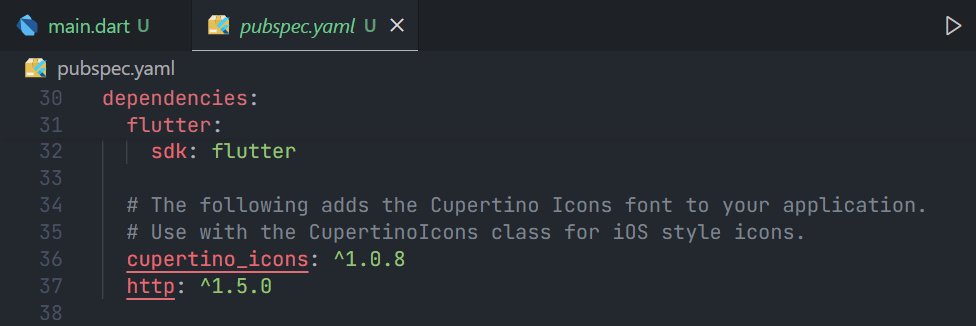

### Langkah 3: Mengubah file `main.dart`

#### Soal 1

> Tambahkan nama panggilan Anda pada title app sebagai identitas hasil pekerjaan Anda.

Mengubah file `main.dart` menjadi seperti berikut.

```dart
import 'dart:async';
import 'package:flutter/material.dart';
import 'package:http/http.dart' as http;

void main() {
  runApp(const MyApp());
}

class MyApp extends StatelessWidget {
  const MyApp({super.key});

  @override
  Widget build(BuildContext context) {
    return MaterialApp(
      title: 'Future Demo - Atadewa',
      theme: ThemeData(
        primarySwatch: Colors.blue,
        visualDensity: VisualDensity.adaptivePlatformDensity,
      ),
      home: const FuturePage(),
    );
  }
}

class FuturePage extends StatefulWidget {
  const FuturePage({super.key});

  @override
  State<FuturePage> createState() => _FuturePageState();
}

class _FuturePageState extends State<FuturePage> {
  String result = '';
  
  @override
  Widget build(BuildContext context) {
    return Scaffold(
      appBar: AppBar(
        title: const Text('Back from the Future - Atadewa'),
      ),
      body: Center(
        child: Column(children: [
          const Spacer(),
          ElevatedButton(
            child: const Text('GO!'),
            onPressed: () {},
          ),
          const Spacer(),
          Text(result),
          const Spacer(),
          const CircularProgressIndicator(),
          const Spacer(),
        ]),
      ),
    );
  }
}
```

### Langkah 4: Menambahkan method `getData()`

Menambahkan method ini ke dalam class `_FuturePageState` yang berguna untuk mengambil data dari API Google Books.

#### Soal 2

> Carilah judul buku favorit Anda di Google Books, lalu ganti ID buku pada variabel path di kode tersebut.
> - Judul buku: Atomic Habits
> - ID buku: lFhbDwAAQBAJ

> Kemudian cobalah akses di browser URI tersebut dengan lengkap.
> - 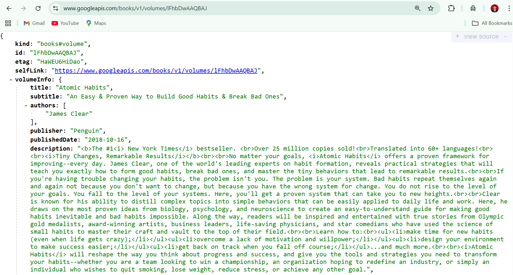
> - Hasilnya menampilkan data JSON 

Method `getData()` pada `main.dart`

```dart
  Future<Response> getData() async {
    const authority = 'www.googleapis.com';
    const path = '/books/v1/volumes/lFhbDwAAQBAJ';
    Uri url = Uri.https(authority, path);
    return http.get(url);
  }
```

### Langkah 5: Menambah kode di `ElevatedButton`

Menambahkan  kode pada `onPressed` di `ElevatedButton` seperti berikut.

```dart
ElevatedButton(
  onPressed: () {
    setState(() {});
    getData()
        .then((value) {
          result = value.body.toString().substring(0, 450);
          setState(() {});
        })
        .catchError((_) {
          result = 'An error occurred';
          setState(() {});
        });
  },
  child: Text('Go!'),
),
```

#### Soal 3

> Jelaskan maksud kode langkah 5 tersebut terkait substring dan catchError!
> - **Penjelasan substring**: `value.body.toString().substring(0, 450);` berfungsi untuk memotong teks hasil response sehingga hanya mengambil 450 karakter pertama. Hal tersebut dilakukan agar tampilan tidak terlalu panjang.
> - **Penjelasan `catchError`**: `catchError` digunakan untuk menangani error yang terjadi saat pemanggilan `getData()`. Jika terjadi kesalahan (misalnya koneksi gagal atau server tidak merespon), maka variabel result diisi dengan pesan 'An error occurred' dan UI diperbarui agar pengguna mengetahui bahwa ada masalah.

**Output yang dihasilkan:**

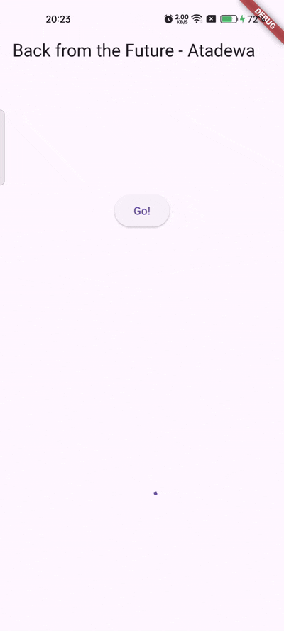

---

## Praktikum 2: Menggunakan await/async untuk Menghindari Callbacks

### Langkah 1: Mengubah file `main.dart`

Menambahkan tiga method berisi kode seperti berikut di dalam class `_FuturePageState`.

```dart
Future<int> returnOneAsync() async {
  await Future.delayed(const Duration(seconds: 3));
  return 1;
}

Future<int> returnTwoAsync() async {
  await Future.delayed(const Duration(seconds: 3));
  return 2;
}

Future<int> returnThreeAsync() async {
  await Future.delayed(const Duration(seconds: 3));
  return 3;
}
```

### Langkah 2: Menambahkan method `count()`

Menambahkan lagi method `count()` di bawah ketiga method pada langkah 1.

```dart
Future count() async {
  int total = 0;
  total = await returnOneAsync();
  total += await returnTwoAsync();
  total += await returnThreeAsync();
  setState(() {
    result = total.toString();
  });
}
```

### Langkah 3: Memanggil `count()`

Melakukan comment kode sebelumnya, kemudian mengubah isi kode `onPressed()` menjadi seperti berikut.

```dart
ElevatedButton(
  child: Text('GO!'),
  onPressed: () {
    count();
  },
),
```

### Langkah 4: Run

Melakukan running aplikasi.

#### Soal 4

> Jelaskan maksud kode langkah 1 dan 2 tersebut!
> 
> **Penjelasan Langkah 1:**
> - Ketiga method pada langkah 1 (`returnOneAsync`, `returnTwoAsync`, `returnThreeAsync`) adalah fungsi asynchronous yang menggunakan await `Future.delayed(Duration(seconds: 3))` untuk mensimulasikan proses yang memerlukan waktu, seperti mengambil data dari server.
> - Setelah jeda 3 detik, masing-masing mengembalikan nilai 1, 2, dan 3.
>
> **Penjelasan Langkah 2:**
> Method `count()` melakukan:
> - Mendeklarasikan variabel total.
> - Menjalankan ketiga fungsi asynchronous sebelumnya secara berurutan menggunakan `await` (total waktu menunggu 9 detik).
>   - `await returnOneAsync()` → menunggu 3 detik
>   - `await returnTwoAsync()` → menunggu 3 detik lagi
>   - `await returnThreeAsync()` → menunggu 3 detik lagi
> - Menjumlahkan hasilnya ke dalam total.
> - Memanggil setState untuk mengubah nilai result pada UI sesuai total yang diperoleh (total = 6).

**Output yang dihasilkan:**

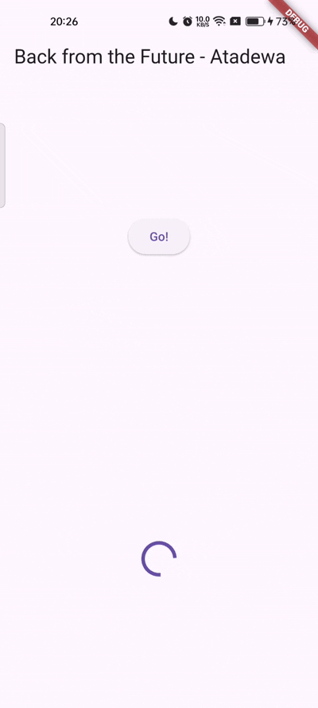

Hasil angka 6 akan tampil setelah delay 9 detik.

---

## Praktikum 3: Menggunakan Completer di Future

### Langkah 1: Menambahkan Kode di `main.dart`

Mengimpor package `async` berikut.

```dart
import 'package:async/async.dart';
```

### Langkah 2: Menambahkan Variabel dan Method

Menambahkan variabel `late` dan method di class `_FuturePageState` seperti berikut ini.

```dart
late Completer completer;

Future getNumber() {
  completer = Completer<int>();
  calculate();
  return completer.future;
}

Future calculate() async {
  await Future.delayed(const Duration(seconds : 5));
  completer.complete(42);
}
```

### Langkah 3: Mengganti isi kode `onPressed()`

Menambahkan kode berikut pada fungsi `onPressed()` dan melakukan comment pada kode sebelumnya.

```dart
getNumber().then((value) {
  setState(() {
    result = value.toString();
  });
});
```

### Langkah 4: Running Aplikasi

#### Soal 5

> Jelaskan maksud kode langkah 2 tersebut!
>
> Pada langkah 2, digunakan Completer untuk membuat Future secara manual.
> - Completer dipakai untuk mengontrol sendiri kapan sebuah Future dianggap selesai.
> - `getNumber()` membuat `Future` baru, lalu memanggil `calculate()`.
> - `calculate()` menunggu 5 detik, lalu menyelesaikan `Future` dengan `completer.complete(42)`.
> - Sehingga, setelah menekan tombol, perlu untuk menunggu selama 5 detik sebelum hasil 42 ditampilkan di UI.

**Output yang dihasilkan:**


### Langkah 5: Mengubah method `calculate()`

Mengubah isi code method `calculate()` menjadi seperti berikut.

```dart
calculate() async {
  try {
    await new Future.delayed(const Duration(seconds: 5));
    completer.complete(42);
    // throw Exception();
  } catch (_) {
    completer.completeError({});
  }
}
```

### Langkah 6: Mengubah kode pada `onPressed()`

Mengubah kode menjadi seperti berikut.

```dart
getNumber().then((value) {
  setState(() {
    result = value.toString();
  });
}).catchError((e) {
  result = 'An error occurred';
});
```

#### Soal 6

> Jelaskan maksud perbedaan kode langkah 2 dengan langkah 5-6 tersebut!
> - Pada langkah 2, `calculate()` diasumsikan selalu berhasil sehingga `Future` hanya dipenuhi dengan complete(42).
> - Sedangkan pada langkah 5, `calculate()` dibuat lebih realistis, yaitu bisa terjadi error. Oleh karena itu `completer.completeError(e);` digunakan saat terjadi kesalahan.
> - Lalu pada langkah 6, tombol menangani kemungkinan error tersebut dengan `.catchError(...)` sehingga aplikasi menampilkan pesan "An error occurred" tanpa crash.

**Output yang dihasilkan:**


---

## Praktikum 4: Memanggil Future secara Paralel

### Langkah 1: Menambahkan Kode di `main.dart`

Menambahkan method berikut ke dalam class `_FuturePageState`.

```dart
void returnFG() {
  FutureGroup<int> futureGroup = FutureGroup<int>();
  futureGroup.add(returnOneAsync());
  futureGroup.add(returnTwoAsync());
  futureGroup.add(returnThreeAsync());
  futureGroup.close();
  futureGroup.future.then((List<int> value) {
    int total = 0;
    for (var element in value) {
      total += element;
    }
    setState(() {
      result = total.toString();
    });
  });
}
```

### Langkah 2: Mengubah Kode pada `onPressed()`

Melakukan comment kode sebelumnya, kemudian memanggil method dari langkah 1.

```dart
onPressed: () {
  returnFG();
}
```

### Langkah 3: Running Aplikasi

#### Soal 7

> Capture hasil praktikum Anda berupa GIF dan lampirkan di README. 


Hasil angka 6 ditampilkan lebih cepat, hanya dalam 3 detik, dibandingkan dengan praktikum sebelumnya yang menunggu hingga 9 detik.

### Langkah 4: Mengganti Variabel `futureGroup`

Menggunakan `FutureGroup` dengan `Future.wait` seperti kode berikut.

```dart
final futures = Future.wait<int>([
  returnOneAsync(),
  returnTwoAsync(),
  returnThreeAsync(),
]);
```

#### Soal 8

> Jelaskan maksud perbedaan kode langkah 1 dan 4!
> - Pada langkah 1, digunakan `FutureGroup` untuk mengumpulkan beberapa `Future` secara manual.
> - Sedangkan pada langkah 4, digunakan `Future.wait` untuk mengeksekusi beberapa `Future` secara paralel dalam satu perintah.

---

## Praktikum 5: Menangani Respon Error pada Async Code

### Langkah 1: Menambahkan kode pada `main.dart`

Menambahkan method berikut ini ke dalam class `_FuturePageState`

```dart
Future returnError() async {
  await Future.delayed(const Duration(seconds: 2));
  throw Exception('Something terrible happened!');
}
```

### Langkah 2: Mengubah kode pada `ElevatedButton`

Mengubah dengan kode berikut.

```dart
returnError()
  .then((value) {
    setState(() {
      result = 'Success';
    });
  })
  .catchError((onError) {
    setState(() {
      result = onError.toString();
    });
  })
  .whenComplete(() => print('Complete'));
```

### Langkah 3: Running Aplikasi

#### Soal 9

> Capture hasil praktikum Anda berupa GIF dan lampirkan di README.

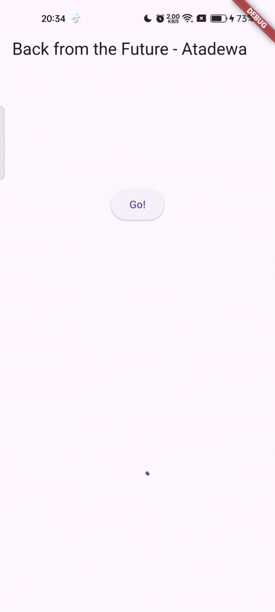

Pada bagian debug console akan melihat teks Complete seperti berikut.

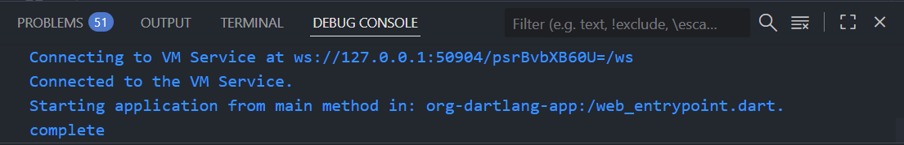

### Langkah 4: Menambahkan method `handleError()`

Menambahkan kode berikut di dalam class `_FutureStatePage`

```dart
Future handleError() async {
  try {
    await returnError();
  } catch (error) {
    setState(() {
      result = error.toString();
    });
  } finally {
    print('Complete');
  }
}
```

#### Soal 10

> Panggil method handleError() tersebut di ElevatedButton, lalu run. Apa hasilnya? Jelaskan perbedaan kode langkah 1 dan 4!
>
> 
>
> - Ketika method `handleError()` dipanggil, hasil yang muncul adalah pesan error ditampilkan pada UI, dan teks complete muncul di debug console.
> - Perbedaan antara langkah 1 dan langkah 4 adalah pada cara penanganan error. Langkah 1 menggunakan `.then(),` `.catchError()`, dan `.whenComplete()` yang merupakan penanganan error berbasis callback pada `Future`. 
> - Sedangkan langkah 4 menggunakan `try-catch-finally`, sehingga penanganan error terlihat lebih terstruktur dan lebih mudah dipahami seperti alur kode sinkron.

---

## Praktikum 6: Menggunakan `Future` dengan `StatefulWidget`

### Langkah 1: Menginstall plugin geolocator

Menambahkan plugin geolocator dengan mengetik perintah berikut di terminal.

```terminal
flutter pub add geolocator
```

**Output:**
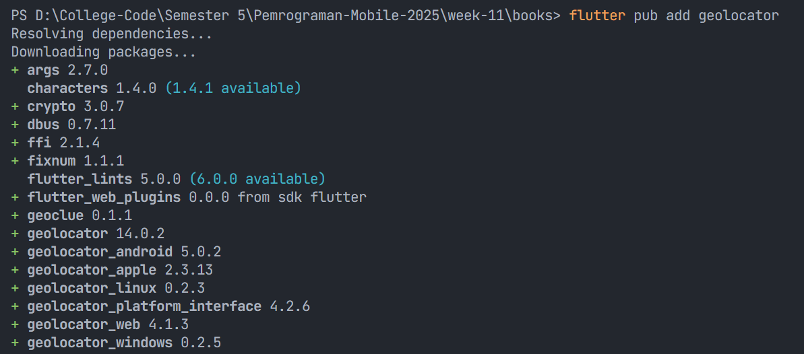

### Langkah 2: Menambahkan Permission GPS

Untuk platform Android, menambahkan baris kode berikut di file `android/app/src/main/androidmanifest.xml`

```dart
<uses-permission android:name="android.permission.ACCESS_FINE_LOCATION"/>
<uses-permission android:name="android.permission.ACCESS_COARSE_LOCATION"/>
```

Untuk platform iOS, menambahkan baris kode berikut di file `Info.plist`

```dart
<key>NSLocationWhenInUseUsageDescription</key>
<string>This app needs to access your location</string>
```

### Langkah 3: Membuat file `geolocation.dart`

Menambahkan file baru di folder lib.

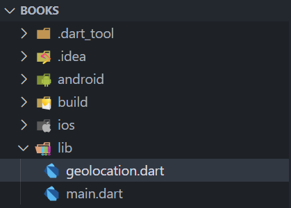

### Langkah 4: Membuat StatefulWidget

Membuat class `LocationScreen` di dalam file `geolocation.dart`

### Langkah 5: Mengisi kode `geolocation.dart`

#### Soal 11

> Tambahkan nama panggilan Anda pada tiap properti title sebagai identitas pekerjaan Anda.

```dart
import 'package:flutter/material.dart';
import 'package:geolocator/geolocator.dart';

class LocationScreen extends StatefulWidget {
  const LocationScreen({super.key});

  @override
  State<LocationScreen> createState() => _LocationScreenState();
}

class _LocationScreenState extends State<LocationScreen> {
  String myPosition = "";

  @override
  void initState() {
    super.initState();
    getPosition().then((Position myPos) {
      myPosition =
          'latitude: ${myPos.latitude.toString()} - Longitude: ${myPos.longitude.toString()}';
      setState(() {
        myPosition = myPosition;
      });
    });
  }

  @override
  Widget build(BuildContext context) {
    return Scaffold(
      appBar: AppBar(title: const Text('Current Location - Atadewa')),
      body: Center(child: Text(myPosition)),
    );
  }

  Future<Position> getPosition() async {
    await Geolocator.requestPermission();
    await Geolocator.isLocationServiceEnabled();
    Position? position = await Geolocator.getCurrentPosition();
    return position;
  }
}
```

### Langkah 6: Edit main.dart

Memanggil screen baru tersebut di file main.dart seperti berikut.

```dart
  home: LocationScreen()
```

### Langkah 7: Running Aplikasi

Running project di device atau emulator (bukan browser), maka akan tampil seperti berikut ini.

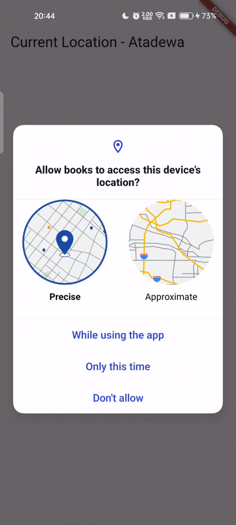

### Langkah 8: Menambahkan Animasi Loading

Menambahkan widget loading seperti kode berikut.

```dart
@override
Widget build(BuildContext context) {
  final myWidget = myPosition == ''
      ? const CircularProgressIndicator()
      : const Text(myPosition);

  return Scaffold(
    appBar: AppBar(title: Text('Current Location - Atadewa')),
    body: Center(child: myWidget),
  );
}
```

#### Soal 12

> - Jika Anda tidak melihat animasi loading tampil, kemungkinan itu berjalan sangat cepat. Tambahkan delay pada method `getPosition()` dengan kode `await Future.delayed(const Duration(seconds: 3));`
> 
>   ```dart
>   Future<Position> getPosition() async {
>     await Geolocator.requestPermission();
>     await Geolocator.isLocationServiceEnabled();
>     await Future.delayed(const Duration(seconds: 3));
>     Position? position = await Geolocator.getCurrentPosition();
>     return position;
>   }
>   ```
> - Apakah Anda mendapatkan koordinat GPS ketika run di browser? Mengapa demikian?
> 
>   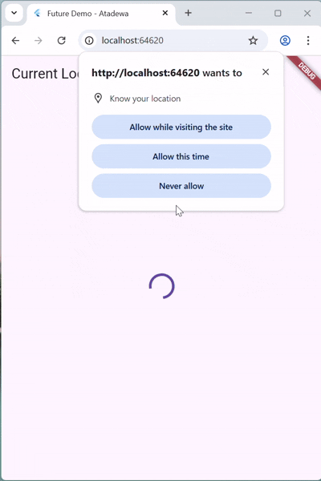
>
>   Ya, saya tetap mendapatkan koordinat GPS ketika menjalankan aplikasi di browser. Hal ini terjadi karena browser sudah memiliki API Geolocation bawaan yang dapat mengambil lokasi perangkat melalui izin akses lokasi (location permission) yang muncul pada browser.
>
> - Capture hasil praktikum Anda berupa GIF dan lampirkan di README
>
>   

---

## Praktikum 7: Manajemen `Future` dengan `FutureBuilder`

### Langkah 1: Memodifikasi method `getPosition()`

Membuka file `geolocation.dart` kemudian menggant isi method dengan kode berikut.

```dart
Future<Position> getPosition() async {
  await Geolocator.isLocationServiceEnabled();
  await Future.delayed(const Duration(seconds: 3));
  Position position = await Geolocator.getCurrentPosition();
  return position;
}
```

### Langkah 2: Menambahkan Variabel

Menambah variabel berikut di class `_LocationScreenState`

```dart
Future<Position>? position;
```

### Langkah 3: Menambahkan `initState()`

Tambah method berikut dan set variabel position

```dart
@override
void initState() {
  super.initState();
  position = getPosition();
}
```

### Langkah 4: Mengubah method `build()`

Melakukan comment pada kode lama dan mengubah atau menambahkan dengan kode berikut.

```dart
@override
Widget build(BuildContext context) {
  return Scaffold(
    appBar: AppBar(title: Text('Current Location - Atadewa')),
    body: Center(child: FutureBuilder(
      future: position,
      builder: (BuildContext context, AsyncSnapshot<Position>
          snapshot) {
        if (snapshot.connectionState ==
            ConnectionState.waiting) {
          return const CircularProgressIndicator();
        }
        else if (snapshot.connectionState ==
            ConnectionState.done) {
          return Text(snapshot.data.toString());
        }
        else {
          return const Text('');
        }
      },
    )),
  );
}
```

#### Soal 13

> - Apakah ada perbedaan UI dengan praktikum sebelumnya? Mengapa demikian?
>
>   Tidak ada perubahan pada tampilan utama, tetapi cara kerja UI berbeda. Pada praktikum sebelumnya, UI di-update dengan `setState()` secara manual. Dengan `FutureBuilder`, UI diperbarui secara otomatis sesuai status `Future` sehingga kode menjadi lebih rapi, efisien, dan reaktif.
> 
> - Capture hasil praktikum Anda berupa GIF dan lampirkan di README.
>   
>   

### Langkah 5: Menambahkan handling error

Menambahkan kode berikut untuk menangani ketika terjadi error

```dart
else if (snapshot.connectionState == ConnectionState.done) {
  if (snapshot.hasError) {
     return Text('Something terrible happened!');
  }
  return Text(snapshot.data.toString());
}
```

#### Soal 14

> - Apakah ada perbedaan UI dengan langkah sebelumnya? Mengapa demikian?
>
>   Tidak, tampilan masih sama, tetapi sekarang ketika terjadi error, UI menampilkan pesan kesalahan karena telah ditambahkan pengecekan `snapshot.hasError`, sehingga error tidak menyebabkan aplikasi crash dan pengguna mendapatkan informasi yang jelas.
>
> - Capture hasil praktikum Anda berupa GIF dan lampirkan di README.
>
>   

---

## Praktikum 8: Navigasi route dengan Future Function

### Langkah 1: Membuat file baru `navigation_first.dart`

Buatlah file baru tersebut di project lib.

### Langkah 2: Mengisi kode `navigation_first.dart`

#### Soal 15

> - Tambahkan nama panggilan Anda pada tiap properti title sebagai identitas pekerjaan Anda.
> - Silakan ganti dengan warna tema favorit Anda.

```dart
import 'package:flutter/material.dart';

class NavigationFirst extends StatefulWidget {
  const NavigationFirst({super.key});

  @override
  State<NavigationFirst> createState() => _NavigationFirstState();
}

class _NavigationFirstState extends State<NavigationFirst> {
  Color color = Colors.orange.shade200;

  @override
  Widget build(BuildContext context) {
    return Scaffold(
      backgroundColor: color,
      appBar: AppBar(
        title: const Text('Navigation First Screen - Atadewa'),
      ),
      body: Center(
        child: ElevatedButton(
          child: const Text('Change Color'),
          onPressed: () {
            _navigateAndGetColor(context);
          },
        ),
      ),
    );
  }
}
```

### Langkah 3: Menambahkan method di class `_NavigationFirstState`

Menambahkan method berikut.

```dart
  Future _navigateAndGetColor(BuildContext context) async {
    color =
        await Navigator.push(
          context,
          MaterialPageRoute(builder: (context) => const NavigationSecond()),
        ) ??
        Colors.orange.shade200;
    setState(() {});
  }
```

### Langkah 4: Membuat file baru `navigation_second.dart`

Membuat file baru di project lib.

### Langkah 5: Membuat class `NavigationSecond` dengan `StatefulWidget`

```dart
import 'package:flutter/material.dart';

class NavigationSecond extends StatefulWidget {
  const NavigationSecond({super.key});

  @override
  State<NavigationSecond> createState() => _NavigationSecondState();
}

class _NavigationSecondState extends State<NavigationSecond> {
  @override
  Widget build(BuildContext context) {
    Color color;

    return Scaffold(
      appBar: AppBar(
        title: const Text('Navigation Second Screen - Atadewa'),
      ),
      body: Center(
        child: Column(
          mainAxisAlignment: MainAxisAlignment.spaceEvenly,
          children: [
            ElevatedButton(
              child: const Text('Red'),
              onPressed: () {
                color = Colors.red.shade700;
                Navigator.pop(context, color);
              },
            ),
            ElevatedButton(
              child: const Text('Green'),
              onPressed: () {
                color = Colors.green.shade700;
                Navigator.pop(context, color);
              },
            ),
            ElevatedButton(
              child: const Text('Blue'),
              onPressed: () {
                color = Colors.blue.shade700;
                Navigator.pop(context, color);
              },
            ),
          ],
        ),
      ),
    );
  }
}
```

### Langkah 6: Mengubah Kode `main.dart`

Mengubah properti home.

```dart
home: const NavigationFirst(),
```

### Langkah 7: Running Aplikasi

#### Soal 16
> - Cobalah klik setiap button, apa yang terjadi ? Mengapa demikian ?
>
>   Ketika salah satu tombol warna ditekan pada halaman kedua, aplikasi mengirimkan nilai warna tersebut kembali ke halaman pertama menggunakan `Navigator.pop(context, color)`. Halaman pertama menerima nilai tersebut melalui `await Navigator.push()` dan melakukan `setState()` sehingga background halaman berubah. Hal tersebut dapat terjadi karena `Navigator` dapat mengembalikan data dari halaman tujuan ke halaman asal.
>
> - Gantilah 3 warna pada langkah 5 dengan warna favorit Anda!
>   ```dart
>      ElevatedButton(
>        child: const Text('Lavender'),
>        onPressed: () {
>          color = Colors.purple.shade200;
>          Navigator.pop(context, color);
>        },
>      ),
>      ElevatedButton(
>        child: const Text('Mint'),
>        onPressed: () {
>          color = Colors.teal.shade200;
>          Navigator.pop(context, color);
>        },
>      ),
>      ElevatedButton(
>        child: const Text('Sky Blue'),
>        onPressed: () {
>          color = Colors.lightBlue.shade200;
>          Navigator.pop(context, color);
>        },
>      ),
>   ```
>
> - Capture hasil praktikum Anda berupa GIF dan lampirkan di README.
>
>   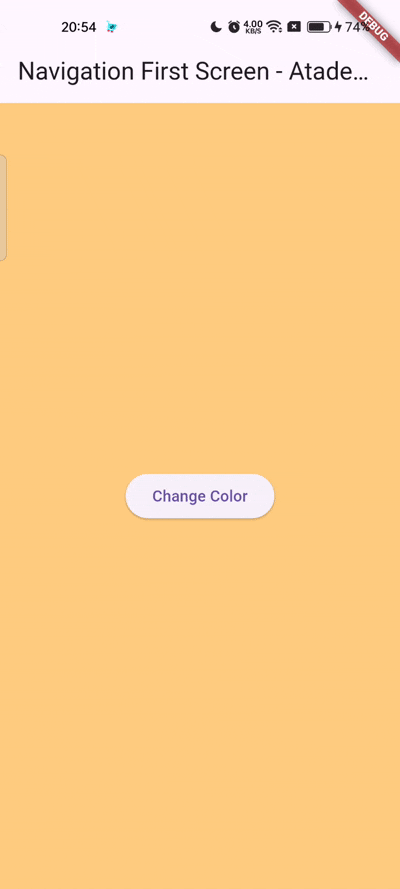
