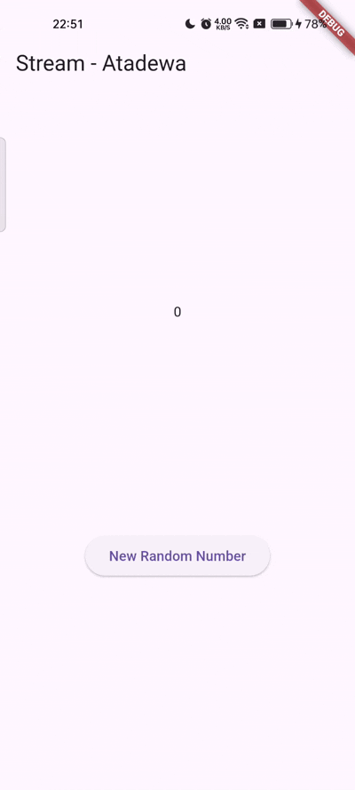
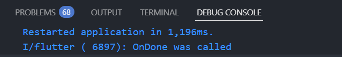
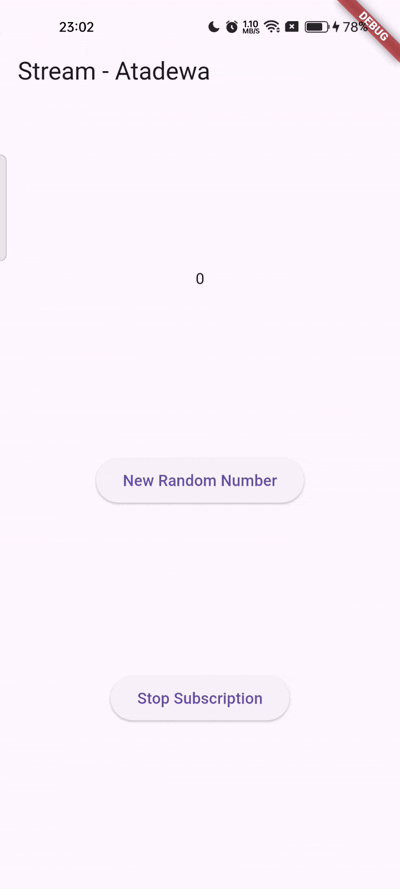
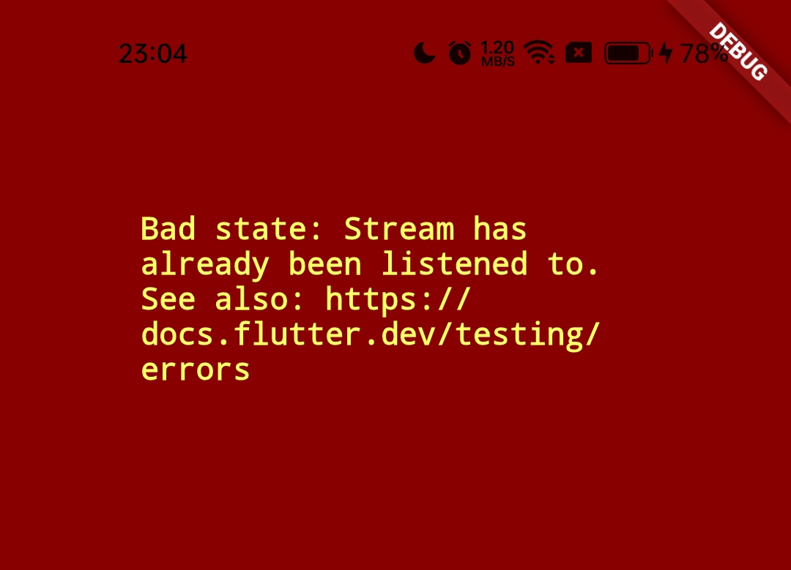
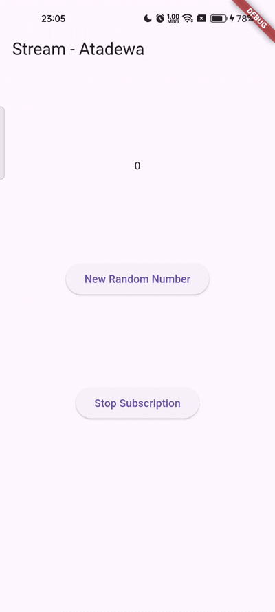
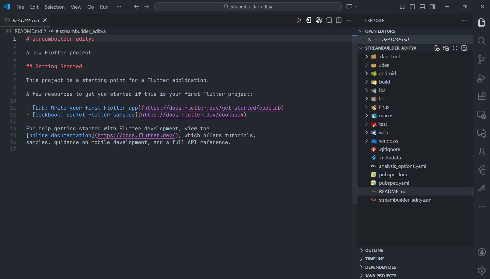
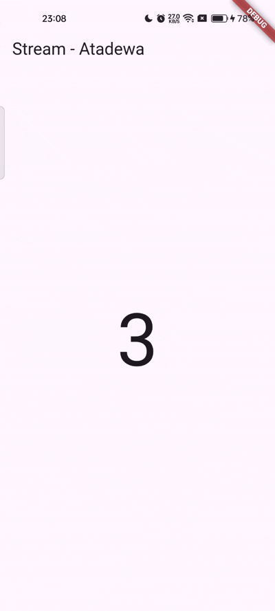
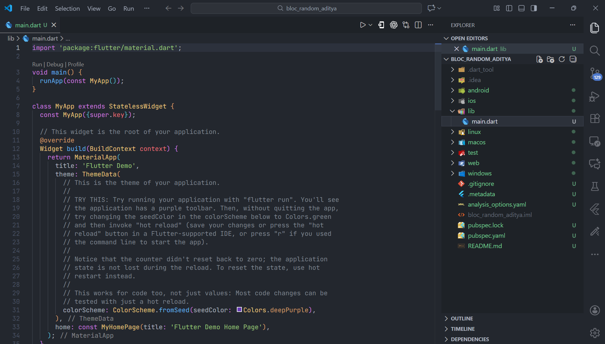
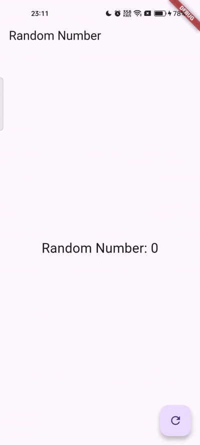

# Pertemuan 12 - State Management dengan Streams

**Nama : Aditya Atadewa**  
**Kelas : TI 3G**  
**NIM : 2341720174**  
**No. Absen : 01** 

---

## Praktikum 1: Dart Streams

### Langkah 1: Membuat Project Baru

Membuat sebuah project flutter baru dengan nama stream_aditya.


### Langkah 2: Mengubah kode file `main.dart`

Mengubah menjadi kode seperti berikut.

#### Soal 1

> Tambahkan nama panggilan Anda pada title app sebagai identitas hasil pekerjaan Anda.
> Gantilah warna tema aplikasi sesuai kesukaan Anda.

```dart
import 'package:flutter/material.dart';

void main() {
  runApp(const MyApp());
}

class MyApp extends StatelessWidget {
  const MyApp({super.key});

  @override
  Widget build(BuildContext context) {
    return MaterialApp(
      title: 'Stream - Atadewa',
      theme: ThemeData(
        primarySwatch: Colors.lightBlue,
      ),
      home: const StreamHomePage(),
    );
  }
}

class StreamHomePage extends StatefulWidget {
  const StreamHomePage({super.key});

  @override
  State<StreamHomePage> createState() => _StreamHomePageState();
}

class _StreamHomePageState extends State<StreamHomePage> {
  @override
  Widget build(BuildContext context) {
    return Container();
  }
}
```

### Langkah 3: Membuat file baru `stream.dart`

Membuat file baru di folder lib.

```dart
import 'package:flutter/material.dart';

class ColorStream {

}
```

### Langkah 4: Menambah variabel `colors`

Menambahkan variabel di dalam class ColorStream seperti berikut.

#### Soal 2

> Tambahkan 5 warna lainnya sesuai keinginan Anda pada variabel colors tersebut.

```dart
final List<Color> colors = [
  Colors.blueGrey,
  Colors.amber,
  Colors.deepPurple,
  Colors.lightBlue,
  Colors.teal,
  Colors.red,
  Colors.cyan,
  Colors.brown,
  Colors.lightGreen,
  Colors.deepOrange,
];
```

### Langkah 5: Menambahkan method `getColors()`

Di dalam class ColorStream, menambahkan method seperti kode berikut.

```dart
Stream<Color> getColors() async* {

}
```

Tanda bintang di akhir keyword `async*` digunakan untuk melakukan Stream data.

### Langkah 6: Menambahkan perintah `yield*`

Menambahkan kode berikut ini.

```dart
yield* Stream.periodic(
  const Duration(seconds: 1), (int t) {
    int index = t % colors.length;
    return colors[index];
});
```

#### Soal 3

> - Jelaskan fungsi keyword `yield*` pada kode tersebut!
>
>   `yield*` merupakan keyword yang digunakan pada `async*` function untuk:
>   - menghasilkan (mengalirkan) seluruh elemen dari Stream lain
>   - meneruskan Stream tersebut ke Stream yang sedang dibuat
>   - sehingga Stream akan mengeluarkan data dari Stream lain secara otomatis.
>
> - Apa maksud isi perintah kode tersebut?
>
>   - `Stream.periodic()` membuat stream yang menghasilkan data setiap 1 detik.
>   - Parameter (`int t`) adalah “hitungan detik” yang terus bertambah (0,1,2,3,...).
>   - `t % colors.length` digunakan untuk mengambil index warna secara berurutan dan kembali ke index 0 jika sudah habis (loop warna tidak terbatas).
>   - Setiap 1 detik, stream akan mengeluarkan 1 warna baru dari list colors.
>
>   Hasilnya yaitu background aplikasi berubah warna tiap 1 detik secara terus-menerus.

### Langkah 7: Melakukan import pada `main.dart`

Melakukan import pada file `main.dart`

```dart
import 'stream.dart';
```

### Langkah 8: Menambahkan variabel

Mengetik dua properti ini di dalam class `_StreamHomePageState`

```dart
Color bgColor = Colors.blueGrey;
late ColorStream colorStream;
```

### Langkah 9: Menambahkan method `changeColor()`

Mengetik kode seperti berikut pada file `main.dart`

```dart
void changeColor() async {
  await for (var eventColor in colorStream.getColors()) {
    setState(() {
      bgColor = eventColor;
    });
  }
}
```

### Langkah 10: Melakukan `override initState()`

Mengetik kode seperti berikut.

```dart
@override
void initState() {
  super.initState();
  colorStream = ColorStream();
  changeColor();
}
```

### Langkah 11: Mengubah isi `Scaffold()`

Menyesuaikan kode menjadi seperti berikut.

```dart
return Scaffold(
  appBar: AppBar(
    title: const Text('Stream'),
  ),
  body: Container(
    decoration: BoxDecoration(color: bgColor),
  ),
);
```

### Langkah 12: Running Aplikasi

Melakukan running pada aplikasi Flutter, maka akan terlihat berubah warna background setiap detik.

#### Soal 4

> Capture hasil praktikum Anda berupa GIF dan lampirkan di README.

**Output yang dihasilkan:**


### Langkah 13: Mengganti isi method `changeColor()`

```dart
colorStream.getColors().listen((eventColor) {
  setState(() {
    bgColor = eventColor;
  });
});
```

#### Soal 5

> Jelaskan perbedaan menggunakan listen dan await for (langkah 9)!
>
> - `await for`  
> 
>   Menunggu setiap data dari stream satu per satu. Mirip seperti loop. Dipakai jika ingin memproses seluruh stream sampai selesai.
>
> - `listen()`
>
>   Mendaftarkan listener (callback) yang akan dipanggil setiap ada event baru dab tidak menghentikan fungsi lain.

---

## Praktikum 2: Stream Controllers dan Sinks

### Langkah 1: Mengedit file `stream.dart`

Melakukan impor dengan mengetik kode ini.

```dart
import 'dart:async';
```

### Langkah 2: Menambahkan class `NumberStream`

Menambahkan class baru seperti berikut.

```dart
class NumberStream {
  
}
```

### Langkah 3: Menambahkan `StreamController`

Di dalam class `NumberStream` membuat variabel seperti berikut.

```dart
final StreamController<int> controller = StreamController<int>();
```

### Langkah 4: Menambahkan method `addNumberToSink`

Membuat method seperti berikut.

```dart
void addNumberToSink(int newNumber) {
  controller.sink.add(newNumber);
}
```

### Langkah 5: Menambahkan method close()

Menambahkan method seperti berikut.

```dart
close() {
  controller.close();
}
```

### Langkah 6: Menambahkan import pada `main.dart`

Mengetik kode import seperti berikut.

```dart
import 'dart:async';
import 'dart:math';
```

### Langkah 7: Menambahkan variabel

Di dalam class `_StreamHomePageState`, menambahkan variabel berikut.

```dart
int lastNumber = 0;
late StreamController numberStreamController;
late NumberStream numberStream;
```

### Langkah 8: Mengubah method `initState()`

Mengubah kode pada method `initState()` seperti berikut.

```dart
@override
void initState() {
  numberStream = NumberStream();
  numberStreamController = numberStream.controller;
  Stream stream = numberStreamController.stream;
  stream.listen((event) {
    setState(() {
      lastNumber = event;
    });
  });
  super.initState();
}
```

### Langkah 9: Mengubah method `dispose()`

Mengubah kode pada method `dispose()` seperti berikut.

```dart
@override
void dispose() {
  numberStreamController.close();
  super.dispose();
}
```

### Langkah 10: Menambahkan method `addRandomNumber()`

```dart
void addRandomNumber() {
  Random random = Random();
  int myNum = random.nextInt(10);
  numberStream.addNumberToSink(myNum);
}
```

### Langkah 11: Mengubah method `build()`

```dart
body: SizedBox(
  width: double.infinity,
  child: Column(
    mainAxisAlignment: MainAxisAlignment.spaceEvenly,
    crossAxisAlignment: CrossAxisAlignment.center,
    children: [
      Text(lastNumber.toString()),
      ElevatedButton(
        onPressed: () => addRandomNumber(),
        child: Text('New Random Number'),
      ),
    ],
  ),
),
```

### Langkah 12: Running Aplikasi

Lakukan running pada aplikasi Flutter.

**Output yang dihasilkan**:


#### Soal 6

> - Jelaskan maksud kode langkah 8 dan 10 tersebut!
>   
>   **Langkah 8**
>
>   Melakukan inisialisasi stream dengan membuat objek `NumberStream`, mengambil `StreamController`, dan mendapatkan stream dari controller tersebut. Stream kemudian dipantau menggunakan `listen()`, sehingga setiap event (angka baru) yang dikirimkan stream akan diperbarui ke variabel lastNumber melalui `setState()`. Hasilnya, UI menampilkan angka terbaru setiap kali ada data masuk dari stream.
>
>   **Langkah 10**
>   
>   method `addRandomNumber()` menghasilkan angka acak dari 0–9 menggunakan `Random().nextInt(10)` dan mengirimkannya ke stream menggunakan `addNumberToSink()`. Setiap angka yang dikirim akan ditangkap oleh listener pada langkah 8 sehingga tampil langsung di layar aplikasi.
>
> - Capture hasil praktikum Anda berupa GIF dan lampirkan di README.
>
>   

### Langkah 13: Mengubah file `stream.dart`

Menambahkan method berikut ini.

```dart
addError() {
  controller.sink.addError('error');
}
```

### Langkah 14: Buka main.dart

Menambahkan method `onError` di dalam class `StreamHomePageState` pada method listen di fungsi `initState()` seperti berikut ini.

```dart
stream.listen((event) {
  setState(() {
    lastNumber = event;
  });
}).onError((error) {
  setState(() {
    lastNumber = -1;
  });
});
```

### Langkah 15: Mengubah method `addRandomNumber()`

Melakukan comment pada dua baris kode berikut, lalu mengetik kode seperti berikut ini.

```dart
void addRandomNumber() {
  Random random = Random();
  //int myNum = random.nextInt(10);
  //numberStream.addNumberToSink(myNum);
  numberStream.addError();
}
```

#### Soal 7

> - Jelaskan maksud kode langkah 13 sampai 15 tersebut!
>
>   **Langkah 13**
>
>   Menambahkan method `addError()` yang mengirim error ke stream menggunakan `controller.sink.addError('error')`. Hal tersebut digunakan untuk menguji bahwa stream dapat menghasilkan event error selain event data biasa.
>
>   **Langkah 14**
>
>   listener ditambahkan penanganan error melalui `onError`. Ketika stream mengirim event error, nilai lastNumber diubah menjadi -1 sehingga UI dapat menampilkan indikator bahwa terjadi error pada stream.
>
>   **Langkah 15**
>
>   Mengubah fungsi `addRandomNumber()` sehingga tombol tidak lagi mengirim angka acak, tetapi memicu error melalui `addError()`. Dengan demikian, setiap penekanan tombol menghasilkan event error yang langsung ditangani oleh `onError` dan ditampilkan sebagai nilai -1 pada UI.
>
> - Kembalikan kode seperti semula pada Langkah 15, comment addError() agar Anda dapat melanjutkan ke praktikum 3 berikutnya.
>   ```dart
>   void addRandomNumber() {
>     Random random = Random();
>     int myNum = random.nextInt(10);
>     numberStream.addNumberToSink(myNum);
>     // numberStream.addError();
>   } 
>   ```

---

## Praktikum 3: Injeksi Data ke Streams

### Langkah 1: Mengubah kode `main.dart`

Menambahkan variabel baru di dalam class `_StreamHomePageState`.

```dart
late StreamTransformer transformer;
```

### Langkah 2: Menambahkan kode pada `initState`

Menambahkan kode berikut ke `initState`.

```dart
transformer = StreamTransformer<int, int>.fromHandlers(
  handleData: (value, sink) {
    sink.add(value * 10);
  },
  handleError: (error, trace, sink) {
    sink.add(-1);
  },
  handleDone: (sink) => sink.close(),
);
```

### Langkah 3: Mengubah kode pada `initState`

Mengubah kode menjadi seperti berikut.

```dart
stream.transform(transformer).listen((event) {
  setState(() {
    lastNumber = event;
  });
}).onError((error) {
  setState(() {
    lastNumber = -1;
  });
});
super.initState();
```

### Langkah 4: Running Aplikasi

Melakukan running pada aplikasi Flutter

#### Soal 8

> - Jelaskan maksud kode langkah 1-3 tersebut!
>
>   **Langkah 1**
>
>   Variabel `StreamTransformer` ditambahkan untuk menampung transformasi yang akan diterapkan pada aliran data. Transformer tersebut memungkinkan setiap data dalam stream diproses atau dimodifikasi terlebih dahulu sebelum diterima oleh listener.
>
>   **Langkah 2**
>
>   Transformer didefinisikan menggunakan` StreamTransformer.fromHandlers`. Bagian `handleData` mengubah setiap nilai yang masuk dengan mengalikannya 10, `handleError` mengubah error menjadi nilai -1, dan `handleDone` menutup aliran. Transformer berperan sebagai filter dan pemroses data sebelum sampai ke UI.
>
>   **Langkah 3**
>
>   Stream dihubungkan dengan transformer melalui `stream.transform(transformer)`, sehingga setiap data yang masuk sudah dalam bentuk hasil transformasi. Listener kemudian menerima data yang telah diproses dan memperbarui UI menggunakan `setState()`, sementara error ditampilkan sebagai -1 melalui `onError`.
>
> - Capture hasil praktikum Anda berupa GIF dan lampirkan di README.
>
>   

---

## Praktikum 4: Subscribe ke Stream Events

### Langkah 1: Menambahkan variabel

Menambahkan variabel berikut di class `_StreamHomePageState`

```dart
late StreamSubscription subscription;
```

### Langkah 2: Mengubah `initState()`

Mengubah kode seperti berikut ini.

```dart
@override
void initState() {
  numberStream = NumberStream();
  numberStreamController = numberStream.controller;
  Stream stream = numberStreamController.stream;
  subscription = stream.listen((event) {
    setState(() {
      lastNumber = event;
    });
  });
  super.initState();
}
```

### Langkah 3: Tetap di `initState()`

Menambahkan kode berikut ini.

```dart
subscription.onError((error) {
  setState(() {
    lastNumber = -1;
  });
});
```

### Langkah 4: Menambahkan properti `onDone()`

Menambahkan kode berikut setelah `onError`

```dart
subscription.onDone(() {
  print('OnDone was called');
});
```

### Langkah 5: Menambahkan method baru

Menambahkan method berikut di dalam class `_StreamHomePageState`

```dart
void stopStream() {
  numberStreamController.close();
}
```

### Langkah 6: Pindah ke method `dispose()`

Menambahkan kode berikut di dalam method `dispose()`.

```dart
subscription.cancel();
```

### Langkah 7: Pindah ke method `build()`

Menambahkan button kedua dengan kode seperti berikut.

```dart
ElevatedButton(
  onPressed: () => stopStream(),
  child: const Text('Stop Subscription'),
)
```

### Langkah 8: Mengubah method `addRandomNumber()`

Mengubah kode seperti berikut ini.

```dart
void addRandomNumber() {
  Random random = Random();
  int myNum = random.nextInt(10);
  if (!numberStreamController.isClosed) {
    numberStream.addNumberToSink(myNum);
  } else {
    setState(() {
      lastNumber = -1;
    });
  }
}
```

### Langkah 9: Running Aplikasi

Melakukan running pada aplikasi Flutter, akan menampilkan dua button.


### Langkah 10: Menekan button ‘Stop Subscription'

Terdapat pesan di Debug Console seperti berikut.



### Soal 9

> - Jelaskan maksud kode langkah 2, 6 dan 8 tersebut!
>
>   **Langkah 2**
>
>   Stream di-subscribe menggunakan `stream.listen()`, dan setiap data baru yang diterima langsung diperbarui ke variabel `lastNumber` melalui `setState()`. Dengan menggunakan `StreamSubscription`, proses pendengaran stream bisa dikontrol, misalnya diberi handler error atau dihentikan sewaktu-waktu.
>
>   **Langkah 6**
>
>   `subscription.cancel()` digunakan untuk menghentikan pendengaran stream saat widget dihancurkan. Hal tersebut mencegah widget menerima event lagi dan menghindari potensi error.
>
>   **Langkah 8**
>
>   Method `addRandomNumber()` hanya mengirim angka ke stream jika controller belum ditutup (`!isClosed`). Jika stream sudah dihentikan, UI menampilkan nilai -1. Hal tersebut memastikan data tidak dikirim ke stream yang sudah tidak aktif agar tidak terjadi error.
>
> - Capture hasil praktikum Anda berupa GIF dan lampirkan di README.
>
>   

---

## Praktikum 5: Multiple Stream Subscriptions

### Langkah 1: Mengubah file `main.dart`

Menambahkan variabel berikut di class `_StreamHomePageState`.

```dart
late StreamSubscription subscription2;
String values = '';
```

### Langkah 2: Mengubah `initState()`

Mengubah menjadi kode seperti berikut.

```dart
subscription = stream.listen((event) {
  setState(() {
    values += '$event - ';
  });
});

subscription2 = stream.listen((event) {
  setState(() {
    values += '$event - ';
  });
});
```

### Langkah 3: Running Aplikasi

Melakukan running pada aplikasi Flutter, maka akan tampil error seperti gambar berikut.



#### Soal 10

> Jelaskan mengapa error itu bisa terjadi ?
>
> Error terjadi karena stream default dari `StreamController` hanya mendukung **single subscription**. Saat dua listener (`subscription` dan `subscription2`) mencoba mendengarkan stream yang sama, stream menolak listener kedua dan memunculkan error “Bad state: Stream has already been listened to”. Stream hanya bisa multi-subscriber jika diubah menjadi broadcast stream.

### Langkah 4: Set broadcast stream

Mengetik kode seperti berikut pada method `initState()`

```dart
void initState() {
  numberStream = NumberStream();
  numberStreamController = numberStream.controller;
  Stream stream = numberStreamController.stream.asBroadcastStream();
  ...
}
```

### Langkah 5: Mengubah method `build()`

Menambahkan text seperti berikut.

```dart
child: Column(
  mainAxisAlignment: MainAxisAlignment.spaceEvenly,
  crossAxisAlignment: CrossAxisAlignment.center,
  children: [
    Text(values),
    ...
```

### Langkah 6: Running Aplikasi

Menekan button 'New Random Number' beberapa kali, maka akan tampil teks angka terus bertambah.

#### Soal 11

> - Jelaskan mengapa hal itu bisa terjadi ?
>
>   Setelah stream diubah menjadi **broadcast** menggunakan `asBroadcastStream()`, stream dapat memiliki lebih dari satu listener. Setiap event yang dikirim stream akan diterima oleh **dua listener**, sehingga setiap angka ditambahkan dua kali ke variabel `values`. Hasilnya, teks angka di layar akan semakin panjang setiap kali tombol ditekan.
>
> - Capture hasil praktikum Anda berupa GIF dan lampirkan di README.
>
>   

---

## Praktikum 6: StreamBuilder

### Langkah 1: Membuat Project Baru

Membuat sebuah project flutter baru dengan nama streambuilder_aditya.



### Langkah 2: Membuat file baru `stream.dart`

Mengetik kode seperti berikut.

```dart
class NumberStream {

}
```

### Langkah 3: Tetap di file `stream.dart`

Mengetik kode seperti berikut.

```dart
import 'dart:math';

class NumberStream {
  Stream<int> getNumbers() async* {
    yield* Stream.periodic(const Duration(seconds: 1), (int t) {
      Random random = Random();
      int myNum = random.nextInt(10);
      return myNum;
    });
  }
}
```

### Langkah 4: Mengubah `main.dart`

Mengetik kode seperti berikut.

```dart
import 'package:flutter/material.dart';
import 'stream.dart';
import 'dart:async';

void main() {
  runApp(const MyApp());
}

class MyApp extends StatelessWidget {
  const MyApp({super.key});

  @override
  Widget build(BuildContext context) {
    return MaterialApp(
      title: 'Stream - Atadewa',
      theme: ThemeData(
        primarySwatch: Colors.deepPurple,
      ),
      home: const StreamHomePage(),
    );
  }
}

class StreamHomePage extends StatefulWidget {
  const StreamHomePage({super.key});

  @override
  State<StreamHomePage> createState() => _StreamHomePageState();
}

class _StreamHomePageState extends State<StreamHomePage> {
  @override
  Widget build(BuildContext context) {
    return Scaffold(
      appBar: AppBar(
        title: const Text('Stream - Atadewa'),
      ),
      body: Container(
        
      ),
    );
  }
}
```

### Langkah 5: Menambahkan variabel

Di dalam class `_StreamHomePageState`, menambahkan variabel seperti berikut.

```dart
late Stream<int> numberStream;
```

### Langkah 6: Mengubah `initState()`

Mengetik kode seperti berikut.

```dart
@override
void initState() {
  numberStream = NumberStream().getNumbers();
  super.initState();
}
```

### Langkah 7: Mengubah method `build()`

```dart
body: StreamBuilder(
  stream: numberStream,
  initialData: 0,
  builder: (context, snapshot) {
    if (snapshot.hasError) {
      print('Error!');
    }
    if (snapshot.hasData) {
      return Center(
        child: Text(
          snapshot.data.toString(),
          style: const TextStyle(fontSize: 96),
        )
      );
    } else {
      return const SizedBox.shrink();
    }
  },
),
```

### Langkah 8: Running Aplikasi

Melakukan running pada aplikasi Flutter. Hasilnya, setiap detik akan tampil angka baru seperti berikut.

#### Soal 12

> - Jelaskan maksud kode pada langkah 3 dan 7 !
>
>   **Langkah 3**
>
>   `getNumbers()` membuat stream yang menghasilkan angka acak setiap detik menggunakan `Stream.periodic`. Setiap tick, dibuat `Random()` lalu dipilih angka 0–9, dan `yield*` meneruskan seluruh event dari periodic stream tersebut sebagai output. Hasilnya adalah stream yang terus mengirim angka baru secara berkala.
>
>   **Langkah 7**
>
>   `StreamBuilder` memantau stream dan membangun ulang UI setiap kali ada data baru. `initialData` memberi nilai awal, dan `snapshot.data` menampilkan angka terbaru yang diterima dari stream. Jika ada error, snapshot menandainya, dan UI tetap aman. Hasilnya, angka di layar otomatis berubah mengikuti event stream.
>
> - Capture hasil praktikum Anda berupa GIF dan lampirkan di README.
>
>   

---

## Praktikum 7: BLoC Pattern

### Langkah 1: Membuat Project baru

Membuat sebuah project flutter baru dengan nama bloc_random_aditya.



### Langkah 2: Membuat file `random_bloc.dart`

Menambahkan kode import berikut ini.

```dart
import 'dart:async';
import 'dart:math';
```

### Langkah 3: Membuat class `RandomNumberBloc()`

```dart
class RandomNumberBloc {

}
```

### Langkah 4: Membuat variabel `StreamController`

Di dalam class `RandomNumberBloc()` ketik variabel berikut ini

```dart
// StreamController for input events
final _generateRandomController = StreamController<void>();
// StreamController for output
final _randomNumberController = StreamController<int>();

// Input Sink
Sink<void> get generateRandom => _generateRandomController.sink;
// Output Stream.
Stream<int> get randomNumber => _randomNumberController.stream;

_secondsStreamController.sink;
```

### Langkah 5: Membuat constructor

```dart
RandomNumberBloc() {
  _generateRandomController.stream.listen((_) {
    final random = Random().nextInt(10);
    _randomNumberController.sink.add(random);
  });
}
```

### Langkah 6: Membuat method `dispose()`

```dart
void dispose() {
  _generateRandomController.close();
  _randomNumberController.close();
}
```

### Langkah 7: Mengubah kode `main.dart`

```dart
class MyApp extends StatelessWidget {
  const MyApp({super.key});

  @override
  Widget build(BuildContext context) {
    return MaterialApp(
      title: 'Flutter Demo - Atadewa',
      theme: ThemeData(
        primarySwatch: Colors.blue,
      ),
      home: const RandomScreen(),
    );
  }
}
```

### Langkah 8: Membuat file baru `random_screen.dart`

Di dalam folder lib project, Membuat file baru `random_screen.dart`.

### Langkah 9: Melakukan import material dan `random_bloc.dart`

Mengetik kode seperti berikut di file baru `random_screen.dart`

```dart
import 'package:flutter/material.dart';
import 'random_bloc.dart';
```

### Langkah 10: Membuat StatefulWidget RandomScreen

Membuat StatefulWidget RandomScreen di dalam file `random_screen.dart`

### Langkah 11: Membuat variabel

Membuat variabel seperti berikut di dalam class `_RandomScreenState`

```dart
final _bloc = RandomNumberBloc();
```

### Langkah 12: Membuat method `dispose()`

Mengetik kode berikut di dalam class `_StreamHomePageState`.

```dart
@override
void dispose() {
  _bloc.dispose();
  super.dispose();
}
```

### Langkah 13: Mengubah method `build()`

Mengetik kode berikut di dalam class `_StreamHomePageState`

```dart
@override
Widget build(BuildContext context) {
  return Scaffold(
    appBar: AppBar(title: const Text('Random Number')),
    body: Center(
      child: StreamBuilder<int>(
        stream: _bloc.randomNumber,
        initialData: 0,
        builder: (context, snapshot) {
          return Text(
            'Random Number: ${snapshot.data}',
            style: const TextStyle(fontSize: 24),
          );
        },
      ),
    ),
    floatingActionButton: FloatingActionButton(
      onPressed: () => _bloc.generateRandom.add(null),
      child: const Icon(Icons.refresh),
    ),
  );
}
```

### Langkah 14: Running Aplikasi

Melakjukan running aplikasi, maka terlihat angka acak antara angka 0 sampai 9 setiap kali menekan tombol `FloactingActionButton`.

#### Soal 13

> - Jelaskan maksud praktikum ini! Dimanakah letak konsep pola BLoC-nya?
>
>   Praktikum ini bertujuan untuk menerapkan pola **BLoC (Business Logic Component)**, yaitu memisahkan logika bisnis dari tampilan UI. Proses menghasilkan angka acak tidak dilakukan di UI, tetapi dikelola di dalam class `RandomNumberBloc`. UI hanya mengirim event melalui **input sink** (`generateRandom`) dan menerima hasil melalui **output stream** (`randomNumber`) yang kemudian ditampilkan menggunakan `StreamBuilder`.  
>
>   Konsep BLoC terlihat pada tiga bagian utama:
>     - (1) **Input Sink** sebagai penerima event dari UI
>     - (2) bagian **Business Logic** di constructor BLoC yang memproses event dan menghasilkan angka acak
>     - (3) **Output Stream** yang mengirim data hasil proses kembali ke UI untuk ditampilkan. Hasilnya, UI tetap bersih dan hanya berfungsi sebagai pihak yang menampilkan data.
>
> - Capture hasil praktikum Anda berupa GIF dan lampirkan di README.
>
>   