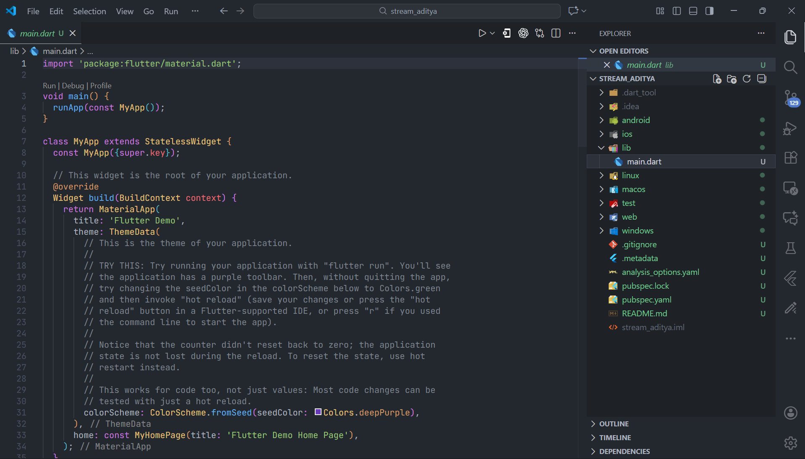
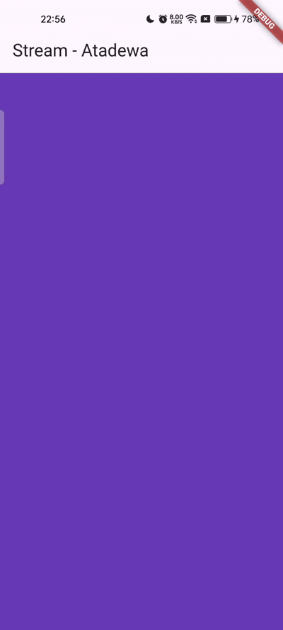

# Pertemuan 12 - State Management dengan Streams

**Nama : Aditya Atadewa**  
**Kelas : TI 3G**  
**NIM : 2341720174**  
**No. Absen : 01** 

---

## Praktikum 1: Dart Streams

### Langkah 1: Membuat Project Baru

Membuat sebuah project flutter baru dengan nama stream_aditya.



### Langkah 2: Mengubah kode file `main.dart`

Mengubah menjadi kode seperti berikut.

#### Soal 1

> Tambahkan nama panggilan Anda pada title app sebagai identitas hasil pekerjaan Anda.
> Gantilah warna tema aplikasi sesuai kesukaan Anda.

```dart
import 'package:flutter/material.dart';

void main() {
  runApp(const MyApp());
}

class MyApp extends StatelessWidget {
  const MyApp({super.key});

  @override
  Widget build(BuildContext context) {
    return MaterialApp(
      title: 'Stream - Atadewa',
      theme: ThemeData(
        primarySwatch: Colors.lightBlue,
      ),
      home: const StreamHomePage(),
    );
  }
}

class StreamHomePage extends StatefulWidget {
  const StreamHomePage({super.key});

  @override
  State<StreamHomePage> createState() => _StreamHomePageState();
}

class _StreamHomePageState extends State<StreamHomePage> {
  @override
  Widget build(BuildContext context) {
    return Container();
  }
}
```

### Langkah 3: Membuat file baru `stream.dart`

Membuat file baru di folder lib.

```dart
import 'package:flutter/material.dart';

class ColorStream {

}
```

### Langkah 4: Menambah variabel `colors`

Menambahkan variabel di dalam class ColorStream seperti berikut.

#### Soal 2

> Tambahkan 5 warna lainnya sesuai keinginan Anda pada variabel colors tersebut.

```dart
final List<Color> colors = [
  Colors.blueGrey,
  Colors.amber,
  Colors.deepPurple,
  Colors.lightBlue,
  Colors.teal,
  Colors.red,
  Colors.cyan,
  Colors.brown,
  Colors.lightGreen,
  Colors.deepOrange,
];
```

### Langkah 5: Menambahkan method `getColors()`

Di dalam class ColorStream, menambahkan method seperti kode berikut.

```dart
Stream<Color> getColors() async* {

}
```

Tanda bintang di akhir keyword `async*` digunakan untuk melakukan Stream data.

### Langkah 6: Menambahkan perintah `yield*`

Menambahkan kode berikut ini.

```dart
yield* Stream.periodic(
  const Duration(seconds: 1), (int t) {
    int index = t % colors.length;
    return colors[index];
});
```

#### Soal 3

> - Jelaskan fungsi keyword `yield*` pada kode tersebut!
>
>   `yield*` merupakan keyword yang digunakan pada `async*` function untuk:
>   - menghasilkan (mengalirkan) seluruh elemen dari Stream lain
>   - meneruskan Stream tersebut ke Stream yang sedang dibuat
>   - sehingga Stream akan mengeluarkan data dari Stream lain secara otomatis.
>
> - Apa maksud isi perintah kode tersebut?
>
>   - `Stream.periodic()` membuat stream yang menghasilkan data setiap 1 detik.
>   - Parameter (`int t`) adalah “hitungan detik” yang terus bertambah (0,1,2,3,...).
>   - `t % colors.length` digunakan untuk mengambil index warna secara berurutan dan kembali ke index 0 jika sudah habis (loop warna tidak terbatas).
>   - Setiap 1 detik, stream akan mengeluarkan 1 warna baru dari list colors.
>
>   Hasilnya yaitu background aplikasi berubah warna tiap 1 detik secara terus-menerus.

### Langkah 7: Melakukan import pada `main.dart`

Melakukan import pada file `main.dart`

```dart
import 'stream.dart';
```

### Langkah 8: Menambahkan variabel

Mengetik dua properti ini di dalam class `_StreamHomePageState`

```dart
Color bgColor = Colors.blueGrey;
late ColorStream colorStream;
```

### Langkah 9: Menambahkan method `changeColor()`

Mengetik kode seperti berikut pada file `main.dart`

```dart
void changeColor() async {
  await for (var eventColor in colorStream.getColors()) {
    setState(() {
      bgColor = eventColor;
    });
  }
}
```

### Langkah 10: Melakukan `override initState()`

Mengetik kode seperti berikut.

```dart
@override
void initState() {
  super.initState();
  colorStream = ColorStream();
  changeColor();
}
```

### Langkah 11: Mengubah isi `Scaffold()`

Menyesuaikan kode menjadi seperti berikut.

```dart
return Scaffold(
  appBar: AppBar(
    title: const Text('Stream'),
  ),
  body: Container(
    decoration: BoxDecoration(color: bgColor),
  ),
);
```

### Langkah 12: Running Aplikasi

Melakukan running pada aplikasi Flutter, maka akan terlihat berubah warna background setiap detik.

#### Soal 4

> Capture hasil praktikum Anda berupa GIF dan lampirkan di README.

**Output yang dihasilkan:**



### Langkah 13: Mengganti isi method `changeColor()`

```dart
colorStream.getColors().listen((eventColor) {
  setState(() {
    bgColor = eventColor;
  });
});
```

#### Soal 5

> Jelaskan perbedaan menggunakan listen dan await for (langkah 9)!
>
> - `await for`  
> 
>   Menunggu setiap data dari stream satu per satu. Mirip seperti loop. Dipakai jika ingin memproses seluruh stream sampai selesai.
>
> - `listen()`
>
>   Mendaftarkan listener (callback) yang akan dipanggil setiap ada event baru dab tidak menghentikan fungsi lain.