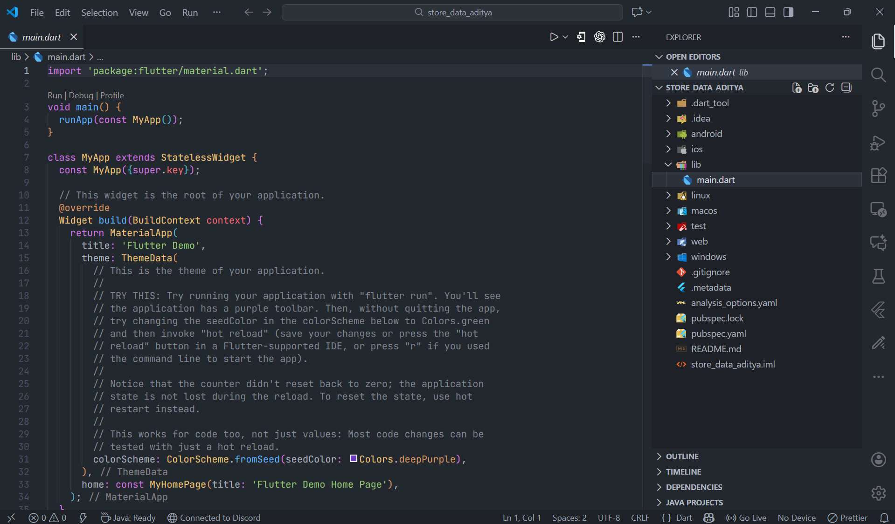
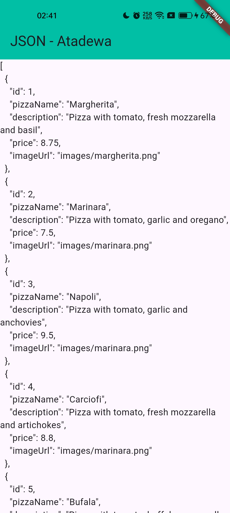
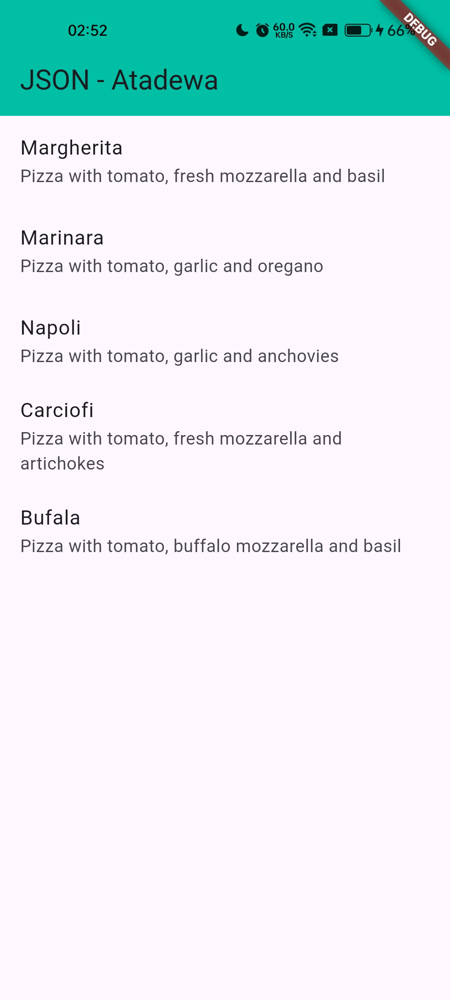
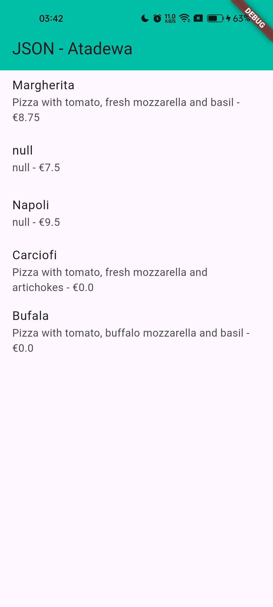
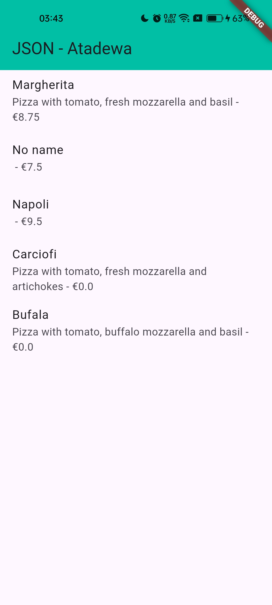
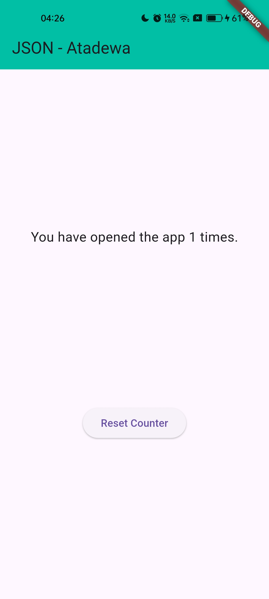
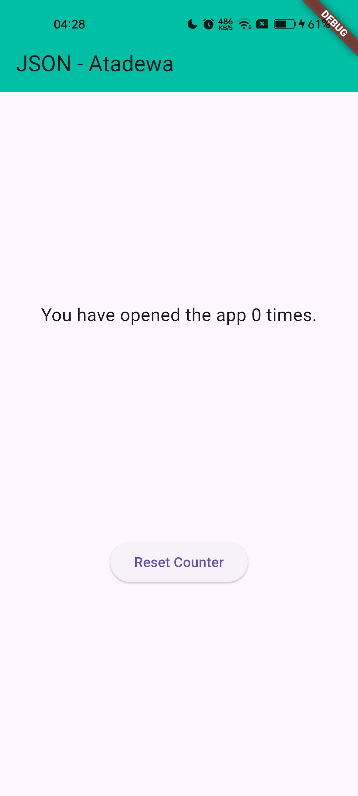

# Pertemuan 13 - Persistensi Data

**Nama : Aditya Atadewa**  
**Kelas : TI 3G**  
**NIM : 2341720174**  
**No. Absen : 01** 

---

## Praktikum 1: Konversi Dart model ke JSON

### Langkah 1: Membuat Project Baru

Membuat project flutter baru dengan nama `store_data_aditya`.



### Langkah 2: Buka file main.dart

#### Soal 1
> - Tambahkan nama panggilan Anda pada title app sebagai identitas hasil pekerjaan Anda.
> - Gantilah warna tema aplikasi sesuai kesukaan Anda.

```dart
import 'package:flutter/material.dart';

void main() {
  runApp(const MyApp());
}

class MyApp extends StatelessWidget {
  const MyApp({super.key});

  // This widget is the root of your application.
  @override
  Widget build(BuildContext context) {
    return MaterialApp(
      title: 'Flutter JSON Demo - Atadewa',
      theme: ThemeData(
        primarySwatch: Colors.lightGreen,
      ),
      home: const MyHomePage(),
    );
  }
}

class MyHomePage extends StatefulWidget {
  const MyHomePage({super.key});

  @override
  State<MyHomePage> createState() => _MyHomePageState();
}

class _MyHomePageState extends State<MyHomePage> {
  @override
  Widget build(BuildContext context) {
    return Scaffold(
      appBar: AppBar(
        title: const Text('JSON - Atadewa'),
      ),
      body: Container(),
    );
  }
}
```

### Langkah 3: Membuat folder baru assets

Membuat folder baru assets di root project.

### Langkah 4: Membuat file baru `pizzalist.json`

Letakkan file `pizzalist.json` di dalam folder assets, lalu salin data JSON berikut ke file tersebut.

```json
[ 
    { 
      "id": 1, 
      "pizzaName": "Margherita", 
      "description": "Pizza with tomato, fresh mozzarella and basil",
      "price": 8.75, 
      "imageUrl": "images/margherita.png" 
    }, 
    { 
      "id": 2, 
      "pizzaName": "Marinara", 
      "description": "Pizza with tomato, garlic and oregano",
      "price": 7.50, 
      "imageUrl": "images/marinara.png"  
    }, 
    { 
      "id": 3, 
      "pizzaName": "Napoli", 
      "description": "Pizza with tomato, garlic and anchovies",
      "price": 9.50, 
      "imageUrl": "images/marinara.png"  
    }, 
    { 
      "id": 4, 
      "pizzaName": "Carciofi", 
      "description": "Pizza with tomato, fresh mozzarella and artichokes",
      "price": 8.80, 
      "imageUrl": "images/marinara.png"  
    }, 
    { 
      "id": 5, 
      "pizzaName": "Bufala", 
      "description": "Pizza with tomato, buffalo mozzarella and basil",
      "price": 12.50, 
      "imageUrl": "images/marinara.png"  
    }
]
```

### Langkah 5: Mengedit `pubspec.yaml`

Tambahkan referensi folder `assets` ke file `pubspec.yaml` seperti berikut ini.

```dart
  assets:
    - assets/
```

### Langkah 6: Mengedit `main.dart`

Membuat variabel seperti berikut di class `_MyHomePageState`.

```dart
  String pizzaString = '';
```

### Langkah 7: Tetap di `main.dart`

Untuk membaca isi dari file `pizzalist.json` di dalam class `_MyHomePageState`, maka perlu untuk menambahkan method `readJsonFile` seperti kode berikut untuk membaca file json.

```dart
  Future readJsonFile() async {
    String myString = await DefaultAssetBundle.of(context)
        .loadString('assets/pizzalist.json');

    setState(() {
      pizzaString = myString;
    });
  }
```

### Langkah 8: Panggil method readJsonFile

Panggil method readJsonFile di initState

```dart
  @override
  void initState() {
    super.initState();
    readJsonFile();
  }
```


### Langkah 9: Tampilkan hasil JSON

Kemudian tampilkan hasil JSON di body scaffold.

```dart
body:Text(pizzaString),
```

### Langkah 10: Run

### Soal 2

> Masukkan hasil capture layar ke laporan praktikum Anda.
>
> 

### Langkah 11: Membuat file baru pizza.dart

Kita ingin mengubah data json tersebut dari String menjadi objek List. Maka perlu memMembuat file class baru di folder lib/model dengan nama file pizza.dart.

### Langkah 12: Model pizza.dart

Ketik kode berikut pada file pizza.dart

```dart
class Pizza {
  final int id;
  final String pizzaName;
  final String description;
  final double price;
  final String imageUrl;
}
```

### Langkah 13: Membuat constructor()

Di dalam class Pizza definisikan constructor fromJson, yang mana akan mengambil data berupa Map sebagai parameter dan mengubah Map ke objek Pizza seperti kode berikut:

```dart
  factory Pizza.fromJson(Map<String, dynamic> json) {
    return Pizza(
      id: json['id'] ?? 0,
      pizzaName: json['pizzaName'] ?? '',
      description: json['description'] ?? '',
      price: (json['price'] as num?)?.toDouble() ?? 0.0,
      imageUrl: json['imageUrl'] ?? '',
    );
  }
```

### Langkah 14: Pindah ke class _MyHomePageState

Tambahkan kode jsonDecode seperti berikut.

```dart
  Future<List<Pizza>> readJsonFile() async {
    String myString = await DefaultAssetBundle.of(context)
        .loadString('assets/pizzalist.json');
    List pizzaMapList = jsonDecode(myString);
```

### Langkah 15: Pastikan impor class

Perhatikan pada bagian atas file bahwa telah berhasil impor kedua file berikut.

```dart
import 'dart:convert';
import 'package:store_data_aditya/model/pizza.dart';
```

Anda telah berhasil mengimpor pustaka yang diperlukan dan melakukan decoding string JSON menjadi List pizzaMapList pada Langkah ini. Selanjutnya, kita akan mengonversi List Map tersebut ### menjadi List objek Dart (List<Pizza>).


### Langkah 16: Konversi List Map ke List Objek Dart

Di dalam method readJsonFile(), setelah baris List pizzaMapList = jsonDecode(myString);, tambahkan kode berikut untuk mengonversi setiap Map di pizzaMapList menjadi objek Pizza dan menyimpannya ke myPizzas.

```dart
    List<Pizza> myPizzas = [];
    for (var pizza in pizzaMapList) {
      Pizza myPizza = Pizza.fromJson(pizza);
      myPizzas.add(myPizza);
    }
```

### Langkah 17: return myPizzas

Hapus atau komentari setState yang menampilkan pizzaString dari ### Langkah 7. Kemudian, kembalikan myPizzas.

```dart
    return myPizzas;
```

### Langkah 18: Perbarui Signature Method

Perbarui signature method readJsonFile() untuk secara eksplisit menunjukkan bahwa ia mengembalikan Future yang berisi List.

```dart
 Future<List<Pizza>> readJsonFile() async {
```

### Langkah 19: Deklarasikan Variabel State

Di dalam class _MyHomePageState, deklarasikan variabel state baru untuk menampung List objek Pizza.

```dart
    List<Pizza> myPizzas = [];
```

### Langkah 20: Panggil di initState dan Perbarui State

Perbarui method initState() di _MyHomePageState untuk memanggil readJsonFile(). Karena readJsonFile() mengembalikan Future, gunakan .then() untuk mendapatkan hasilnya, dan perbarui state myPizzas.

```dart
  @override
  void initState() {
    super.initState();
    readJsonFile().then((value) {
      setState(() {
        myPizzas = value;
      });
    });
  }
```

### Langkah 21: Tampilkan Data di ListView

Perbarui body dari Scaffold untuk menggunakan ListView.builder yang menampilkan pizzaName sebagai judul dan description sebagai subjudul dari setiap objek Pizza.

```dart
body: ListView.builder(
  itemCount: myPizzas.length,
  itemBuilder: (context, index) {
    return ListTile(
      title: Text(myPizzas[index].pizzaName),
      subtitle: Text(myPizzas[index].description),
    );
  },
);
```

### Langkah 22: Run

Jalankan aplikasi. Sekarang, Anda akan melihat data pizza ditampilkan dalam daftar yang lebih terstruktur sebagai objek List Dart.

#### Soal 3

> Masukkan hasil capture layar ke laporan praktikum Anda.
>
> 

### Langkah 23: Tambahkan Method toJson() (Serialization)

Di file pizza.dart, tambahkan method toJson() ke class Pizza. Method ini berfungsi untuk mengonversi objek Dart kembali menjadi Map (langkah pertama menuju JSON String).

```dart
  Map<String, dynamic> toJson() {
    return {
      'id': id,
      'pizzaName': pizzaName,
      'description': description,
      'price': price,
      'imageUrl': imageUrl,
    };
  }
```

### Langkah 24: Membuat Fungsi Konversi JSON String

Di main.dart, tambahkan fungsi convertToJSON di dalam _MyHomePageState untuk menggunakan jsonEncode (dari dart:convert) yang mengubah List objek Dart menjadi JSON String.

```dart
  String convertToJSON(List<Pizza> pizzas) {
    return jsonEncode(pizzas.map((pizza) => pizza.toJson()).toList());
  }
```

### Langkah 25: Tampilkan Output JSON di Konsol

Di method readJsonFile(), tambahkan kode untuk memanggil convertToJSON dan mencetak hasilnya ke Debug Console sebelum mengembalikan myPizzas.
```dart
String json = convertToJSON(myPizzas);
print(json);
return myPizzas;
```

### Langkah 26: Cek Output Konsol

Jalankan aplikasi. Periksa Debug Console untuk melihat List objek Pizza telah berhasil dikonversi kembali menjadi JSON String.


---

## Praktikum 2: Handle kompatibilitas data JSON

### Langkah 1: Simulasikan Error

Anggaplah Anda telah mengganti file pizzalist.json dengan data yang tidak konsisten.

### Langkah 2: Lihat Error Tipe Data String ke Int

Jika ID pizza di JSON dikirim sebagai String (misalnya "id": "1" di JSON) sementara model Dart mengharapkan int, Anda akan melihat runtime error.

### Langkah 3: Terapkan tryParse dan Null Coalescing pada ID

Di Pizza.fromJson (file pizza.dart), ganti cara mendapatkan nilai id menggunakan int.tryParse dan null coalescing operator (??) untuk memberikan nilai default 0 jika parsing gagal atau nilainya null. Tujuannya adalah memastikan nilai id selalu integer.

```dart
int.tryParse(json['id'].toString()) ?? 0;
```

### Langkah 4: Simulasikan Error Null pada String

Jika Anda menjalankan ulang dan ada bidang yang hilang (misalnya imageUrl hilang), Anda mungkin mendapatkan error Null.

### Langkah 5: Terapkan Null Coalescing pada String

Tambahkan null coalescing operator (??) pada imageUrl untuk memberikan string kosong ('') jika nilai yang diterima adalah null. Lakukan hal yang sama untuk bidang String lainnya seperti pizzaName dan description jika perlu.

### Langkah 6: Gunakan toString() untuk Field String

Untuk memastikan semua nilai yang digunakan sebagai String benar-benar String (bahkan jika mereka mungkin dikirim sebagai int atau tipe lain), gunakan toString().

```dart
Pizza.fromJson(Map<String, dynamic> json) {
  id = json['id'];
  pizzaName = json['pizzaName'].toString();
  description = json['description'].toString();
  price = json['price'];
  imageUrl = json['imageUrl'] ?? '';
}
```

### Langkah 7: Simulasikan Error Tipe Data String ke Double

Jika Anda menjalankan ulang, Anda mungkin menemukan error saat mengonversi String ke Double untuk bidang price.

### Langkah 8: Terapkan double.tryParse

Terapkan double.tryParse dengan null coalescing (?? 0) untuk bidang price, sama seperti yang Anda lakukan pada id.

```dart
Pizza.fromJson(Map<String, dynamic> json) {
  id = int.tryParse(json['id'].toString());
  pizzaName = json['pizzaName'].toString();
  description = json['description'].toString();
  price = double.tryParse(json['price'].toString()) ?? 0;
  imageUrl = json['imageUrl'].toString();
}
```

### Langkah 9: Run dan Perhatikan Output Null

Setelah mengimplementasikan semua perbaikan tipe data, aplikasi akan berjalan, tetapi mungkin menampilkan "null" di UI jika ada bidang yang hilang atau gagal diparsing (seperti pizzaName atau description).



### Langkah 10: Tambahkan Operator Ternary untuk Output User-Friendly

Perbaiki masalah tampilan "null" dengan menambahkan operator ternary yang memeriksa apakah nilai null sebelum mengubahnya menjadi String. Jika null, berikan nilai pengganti yang ramah pengguna seperti 'No name' atau string kosong ('').

```dart
Pizza.fromJson(Map<String, dynamic> json) {
  id = int.tryParse(json['id'].toString()) ?? 0;
  pizzaName = json['pizzaName'] != null ? json['pizzaName'].toString() : 'No name';
  description = (json['description'] != null) ? json['description'].toString() : '';
  price = double.tryParse(json['price'].toString()) ?? 0;
  imageUrl = json['imageUrl'] ?? '';
}
```

### Langkah 11: Run

Jalankan aplikasi. Sekarang data yang tidak konsisten telah ditangani dengan baik, dan UI tidak menampilkan nilai null.

#### Soal 4

> Capture hasil running aplikasi Anda, kemudian impor ke laporan praktikum Anda!
>
> 

---

## Praktikum 3: Menangani Error JSON

### Langkah 1: Buka pizza.dart dan Buat Konstanta

Di bagian atas file pizza.dart, di luar class Pizza, deklarasikan konstanta untuk setiap kunci JSON.

```dart
const keyId = 'id';
const keyName = 'pizzaName';
const keyDescription = 'description';
const keyPrice = 'price';
const keyImage = 'imageUrl';
```

### Langkah 2: Perbarui fromJson() menggunakan Konstanta

Di constructor Pizza.fromJson, ganti semua string literal kunci JSON (misalnya 'id') dengan konstanta yang sesuai (keyId).

```dart
Pizza.fromJson(Map<String, dynamic> json) {
  id = int.tryParse(json[keyId].toString()) ?? 0;
  pizzaName = json[keyName] != null ? json[keyName].toString() : 'No name';
  description = (json[keyDescription] != null) ? json[keyDescription].toString() : '';
  price = double.tryParse(json[keyPrice].toString()) ?? 0;
  imageUrl = json[keyImage] ?? '';
}
```

### Langkah 3: Perbarui toJson() menggunakan Konstanta

Perbarui juga method toJson() agar menggunakan konstanta yang sama.

```dart
Map<String, dynamic> toJson() {
  return {
    keyId: id,
    keyName: pizzaName,
    keyDescription: description,
    keyPrice: price,
    keyImage: imageUrl,
  };
}
```

### Langkah 4: Run

Jalankan aplikasi. Tidak akan ada perubahan visual, tetapi kode Anda kini lebih safe dan maintainable.

#### Soal 5

> - Jelaskan maksud kode lebih safe dan maintainable!
>
>   Kode menjadi lebih *safe* dan *maintainable* karena penggunaan konstanta untuk key JSON mengurangi risiko salah ketik (typo) dan mencegah error saat proses parsing data, serta mempermudah perawatan kode jika ada perubahan nama key pada API, cukup diperbarui pada satu tempat (konstanta) tanpa harus mengubah banyak bagian kode sehingga lebih aman dan mudah dikembangkan ke depannya.
>
> - Capture hasil praktikum Anda dan lampirkan di README.
>   
>   

---

## Praktikum 4: SharedPreferences

### Langkah 1: Tambahkan Dependensi

Di Terminal, tambahkan package shared_preferences.

```dart
flutter pub add shared_preferences
```

### Langkah 2: Install Dependensi

Jalankan flutter pub get jika editor Anda tidak melakukannya secara otomatis.

### Langkah 3: Lakukan Import

Di file main.dart, tambahkan import untuk shared_preferences.

```dart
import 'package:shared_preferences/shared_preferences.dart';
```

### Langkah 4: Tambahkan Variabel appCounter

Di dalam class _MyHomePageState (atau State class yang Anda gunakan), deklarasikan variabel appCounter.

```dart
  int appCounter = 0;
```

### Langkah 5: Buat Method readAndWritePreference

Buat method asinkron readAndWritePreference().

```dart
  Future<void> readAndWritePreference() async {}
```

### Langkah 6: Dapatkan Instance SharedPreferences

Di dalam method tersebut, dapatkan instance SharedPreferences. Perlu diingat bahwa ini adalah operasi asinkron, jadi gunakan await.

```dart
    SharedPreferences prefs = await SharedPreferences.getInstance();
```

### Langkah 7: Baca, Cek Null, dan Increment Counter

Baca nilai appCounter dari storage. Gunakan null coalescing (?? 0) untuk memastikan nilai default 0 jika data belum ada. Kemudian increment nilai tersebut.

```dart
    appCounter = prefs.getInt('appCounter') ?? 0;
    appCounter++;
```

### Langkah 8: Simpan Nilai Baru

Simpan nilai appCounter yang sudah di-increment kembali ke storage menggunakan prefs.setInt().

```dart
    await prefs.setInt('appCounter', appCounter);
```

### Langkah 9: Perbarui State

Panggil setState() untuk memperbarui UI dengan nilai baru appCounter.

```dart
    setState(() {
      appCounter = appCounter;
    });
  }
```

### Langkah 10: Panggil di initState()

Panggil readAndWritePreference() di initState() agar penghitung dibaca saat aplikasi pertama kali dibuka.

```dart
  void initState() {
    super.initState();
    readAndWritePreference();
  }
```

### Langkah 11: Perbarui Tampilan (body)

Ganti body Scaffold Anda dengan tata letak yang menampilkan hitungan dan tombol 'Reset counter'.

```dart
      body: Center(
        child: Column(
          mainAxisAlignment: MainAxisAlignment.spaceEvenly,
          children: [
            Text(
              'You have opened the app $appCounter times.',
              style: const TextStyle(fontSize: 18),
            ),
            ElevatedButton(
              onPressed: () {
                deletePreference();
              },
              child: const Text('Reset Counter'),
            ),
          ],
```

### Langkah 12: Run

Aplikasi sekarang akan menampilkan "You have opened the app 1 times" (jika ini pembukaan pertama).



### Langkah 13: Buat Method deletePreference()

Tambahkan method asinkron deletePreference() yang berfungsi untuk menghapus data menggunakan prefs.clear().

```dart
  Future<void> deletePreference() async {
    SharedPreferences prefs = await SharedPreferences.getInstance();
    await prefs.clear();
    setState(() {
      appCounter = 0;
    });
  }
```

### Langkah 14: Panggil deletePreference()

Hubungkan deletePreference() ke tombol 'Reset counter'.

```dart
    onPressed: () {
      deletePreference();
    },
    child: const Text('Reset Counter'),
```

### Langkah 15: Run

Jalankan aplikasi. Tombol reset sekarang akan berfungsi, menghapus semua pasangan kunci-nilai dan mereset hitungan.

#### Soal 6

> Capture hasil praktikum Anda berupa GIF dan lampirkan di README.
>
> 
