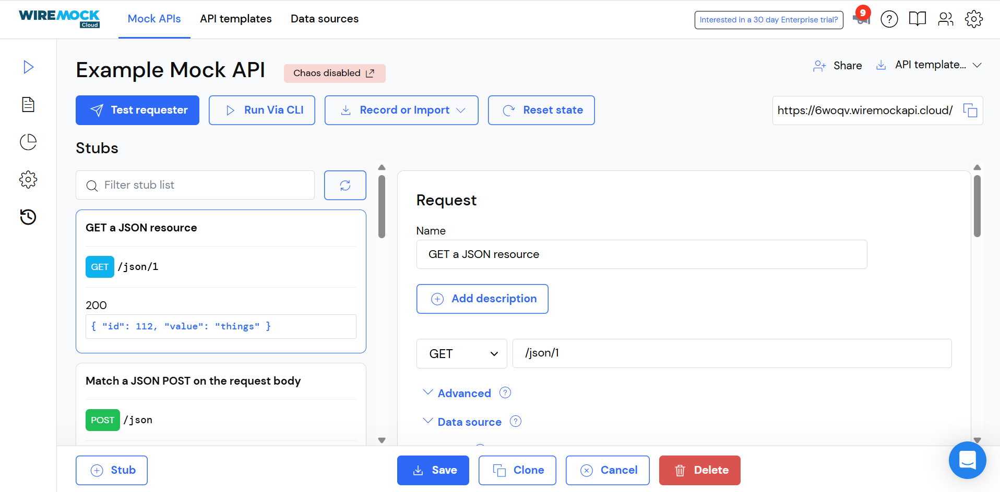
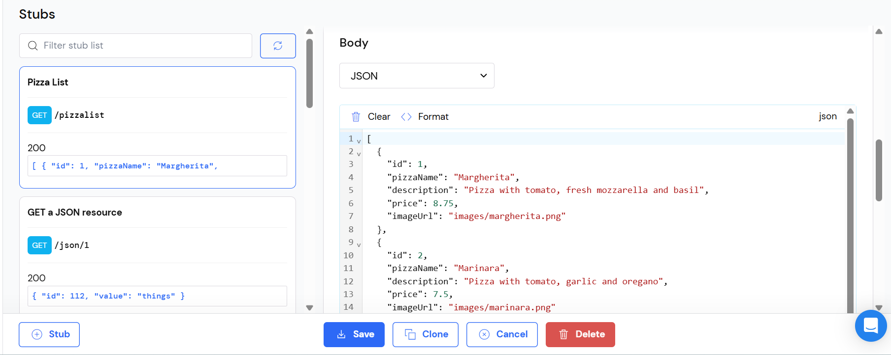
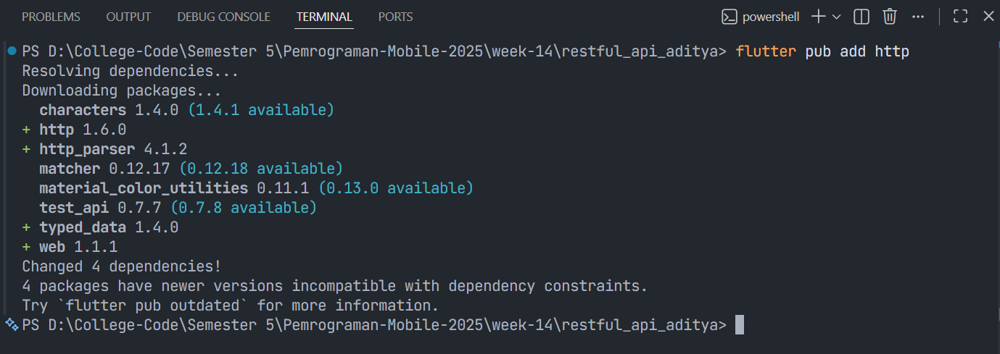
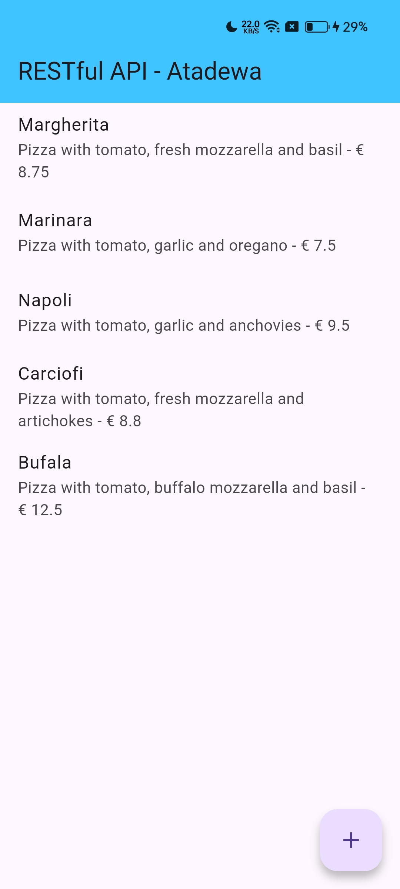
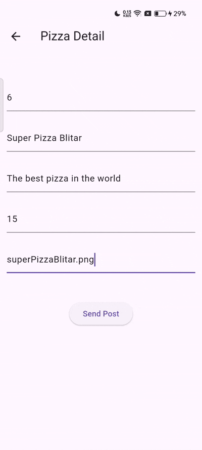
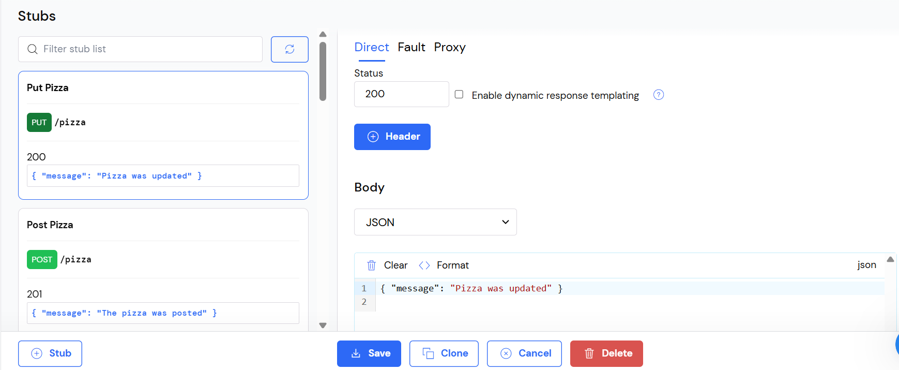
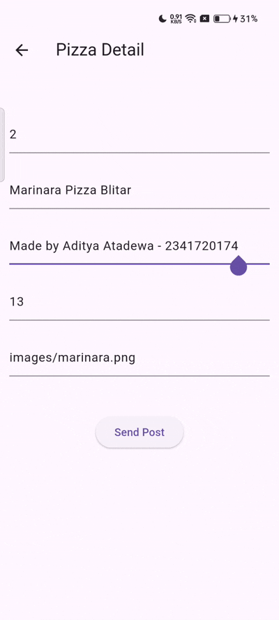
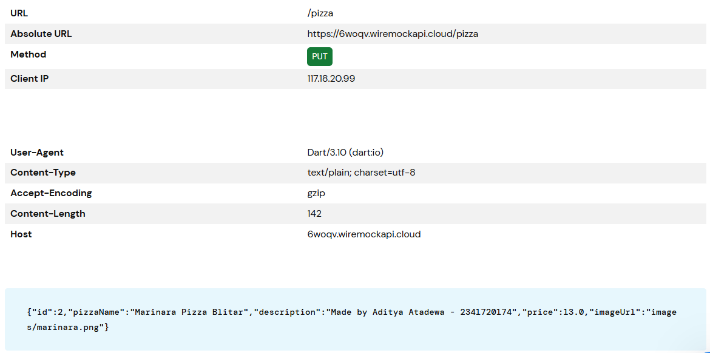
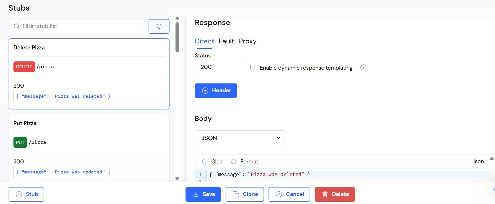
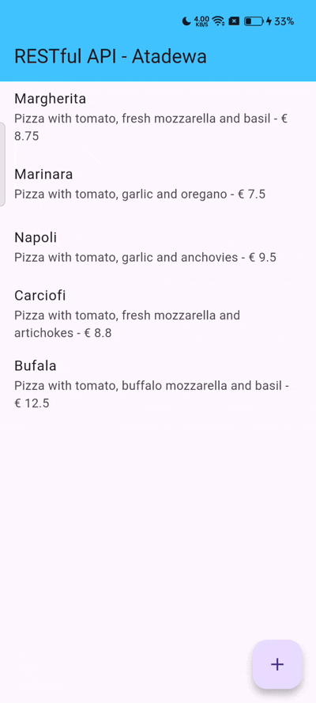

# Pertemuan 14 - RESTful API

**Nama : Aditya Atadewa**  
**Kelas : TI 3G**  
**NIM : 2341720174**  
**No. Absen : 01** 

---

## Praktikum 1: Membuat layanan Mock API

### Langkah 1: Masuk ke Layanan Mock Lab



### Langkah 2: Membuat Endpoint API Baru

Klik pada tombol New. Untuk Namanya, ketik Pizza List, biarkan GET sebagai verb, dan di kotak teks di dekat verb GET, ketik /pizzalist. Kemudian, di bagian Response, untuk status 200, pilih JSON sebagai format dan tempel konten JSON yang tersedia di `https://bit.ly/pizzalist`.



### Langkah 3: Menambahkan Dependensi HTTP

Mengetik perintah berikut di terminal.

```terminal
flutter pub add http
```



### Langkah 4: Membuat file baru `httphelper.dart`

```dart
import 'dart:io'; 
import 'package:http/http.dart' as http; 
import 'dart:convert'; 
import 'pizza.dart'; 

class HttpHelper {
  final String authority = '6woqv.wiremockapi.cloud';
  final String path = 'pizzalist';
  Future<List<Pizza>> getPizzaList() async {
    final Uri url = Uri.https(authority, path);
    final http.Response result = await http.get(url);
    if (result.statusCode == HttpStatus.ok) {
      final jsonResponse = json.decode(result.body);
      //provide a type argument to the map method to avoid type 
      //error
      List<Pizza> pizzas =
          jsonResponse.map<Pizza>((i) => 
            Pizza.fromJson(i)).toList();
      return pizzas;
    } else {
      return [];
    }
  }
}
```

### Langkah 5: Menambahkan method `callPizzas`

Di file `main.dart`, di kelas `_MyHomePageState`, ditambahkan method bernama `callPizzas`. Hal tersebut mengembalikan `Future` dari List objek Pizza dengan memanggil method `getPizzaList` dari kelas `HttpHelper`, sebagai berikut:

```dart
Future<List<Pizza>> callPizzas() async {
  HttpHelper helper = HttpHelper(); 
  List<Pizza> pizzas = await helper.getPizzaList(); 
  return pizzas; 
} 
```

### Langkah 6: Menambahkan `FutureBuilder`

Di metode build dari kelas `_MyHomePageState`, di body `Scaffold` ditambahkan `FutureBuilder` yang membangun `ListView` dari widget `ListTile` yang berisi objek `Pizza`.

```dart
Widget build(BuildContext context) {
  return Scaffold(
    appBar: AppBar(
      title: const Text('RESTful API - Atadewa'),
      backgroundColor: Colors.lightBlueAccent,
    ),
    body: FutureBuilder(
      future: callPizzas(),
      builder: (BuildContext context, AsyncSnapshot<List<Pizza>> snapshot) {
        if (snapshot.hasError) {
          return const Text('Something went wrong');
        }
        if (!snapshot.hasData) {
          return const CircularProgressIndicator();
        }
        return ListView.builder(
          itemCount: (snapshot.data == null) ? 0 : snapshot.data!.length,
          itemBuilder: (BuildContext context, int position) {
            return ListTile(
              title: Text(snapshot.data![position].pizzaName),
              subtitle: Text(
                snapshot.data![position].description +
                    ' - € ' +
                    snapshot.data![position].price.toString(),
              ),
            );
          },
        );
      },
    ),
  );
}
```

### Langkah 7: Running Aplikasi

#### Soal 1

> - Tambahkan nama panggilan Anda pada title app sebagai identitas hasil pekerjaan Anda.
> - Gantilah warna tema aplikasi sesuai kesukaan Anda.
>
>   ```dart
>      Widget build(BuildContext context) {
>        return MaterialApp(
>          title: 'RESTful API - Atadewa',
>          theme: ThemeData(primarySwatch: Colors.lightBlue),
>          home: const MyHomePage(),
>        );
>      }
>   ```
>
> - Capture hasil aplikasi Anda, lalu masukkan ke laporan di README.
> 
>   

## Praktikum 2: Mengirim Data ke Web Service (POST)

### Langkah 1: Membuat Stub Baru

- Nama: Post Pizza
- Verb: POST
- Alamat: /pizza
- Status: 201
- Tipe Body: json
- Body: {"message": "The pizza was posted"}


### Langkah 2: Membuat method `postPizza`

Di file `httphelper.dart`, di kelas `HttpHelper`, membuat method baru `postPizza`, sebagai berikut:

```dart
Future<String> postPizza(Pizza pizza) async {
  const postPath = '/pizza';
  String post = json.encode(pizza.toJson());
  Uri url = Uri.https(authority, postPath);
  http.Response r = await http.post(
    url,
    body: post,
  );
  return r.body;
}
```

### Langkah 3: Membuat file `pizza_detail.dart`

```dart
import 'package:flutter/material.dart';
import 'pizza.dart';
import 'httphelper.dart';

class PizzaDetailScreen extends StatefulWidget {
  const PizzaDetailScreen({super.key});

  @override
  State<PizzaDetailScreen> createState() => _PizzaDetailScreenState();
}

class _PizzaDetailScreenState extends State<PizzaDetailScreen> {
  final TextEditingController txtId = TextEditingController();
  final TextEditingController txtName = TextEditingController();
  final TextEditingController txtDescription = TextEditingController();
  final TextEditingController txtPrice = TextEditingController();
  final TextEditingController txtImageUrl = TextEditingController();
  String operationResult = '';

  @override
  void dispose() {
    txtId.dispose();
    txtName.dispose();
    txtDescription.dispose();
    txtPrice.dispose();
    txtImageUrl.dispose();
    super.dispose();
  }

  @override
  Widget build(BuildContext context) {
    return Scaffold(
      appBar: AppBar(title: const Text('Pizza Detail')),
      body: Padding(
        padding: const EdgeInsets.all(12),
        child: SingleChildScrollView(
          child: Column(
            children: [
              Text(
                operationResult,
                style: TextStyle(
                  backgroundColor: Colors.green[200],
                  color: Colors.black,
                ),
              ),
              const SizedBox(height: 24),
              TextField(
                controller: txtId,
                decoration: const InputDecoration(hintText: 'Insert ID'),
              ),
              const SizedBox(height: 24),
              TextField(
                controller: txtName,
                decoration: const InputDecoration(
                  hintText: 'Insert Pizza Name',
                ),
              ),
              const SizedBox(height: 24),
              TextField(
                controller: txtDescription,
                decoration: const InputDecoration(
                  hintText: 'Insert Description',
                ),
              ),
              const SizedBox(height: 24),
              TextField(
                controller: txtPrice,
                decoration: const InputDecoration(hintText: 'Insert Price'),
              ),
              const SizedBox(height: 24),
              TextField(
                controller: txtImageUrl,
                decoration: const InputDecoration(hintText: 'Insert Image Url'),
              ),
              const SizedBox(height: 48),
              ElevatedButton(
                child: const Text('Send Post'),
                onPressed: () {
                  postPizza();
                },
              ),
            ],
          ),
        ),
      ),
    );
  }

  Future postPizza() async {
    HttpHelper helper = HttpHelper();
    Pizza pizza = Pizza(
      id: int.tryParse(txtId.text) ?? 0,
      pizzaName: txtName.text,
      description: txtDescription.text,
      price: double.tryParse(txtPrice.text) ?? 0.0,
      imageUrl: txtImageUrl.text,
    );
    String result = await helper.postPizza(pizza);
    setState(() {
      operationResult = result;
    });
  }
}
```

### Langkah 4: Melakukan import di `main.dart`

```dart
import 'pizza_detail.dart';
```

### Langkah 5: Menambahkan `FLoatingActionButton`

Di `Scaffold` dari metode `build()` kelas `_MyHomePageState`, ditambahkan `FloatingActionButton` yang akan navigasi ke rute PizzaDetail:

```dart
    floatingActionButton: FloatingActionButton(
      child: const Icon(Icons.add),
      onPressed: () {
        Navigator.push(
          context,
          MaterialPageRoute(builder: (context) => const PizzaDetailScreen()),
        );
      },
    ),
```

### Langkah 6: Running Aplikasi

#### Soal 2

> - Tambahkan field baru dalam JSON maupun POST ke Wiremock!
> - Capture hasil aplikasi Anda berupa GIF di README
>
>   | Screenshot | GIF |
>   |:----------:|:--------:|
>   |  |  |

## Praktikum 3: Memperbarui Data di Web Service (PUT)

### Langkah 1: Membuat Stub Baru

- Nama: Put Pizza
- Verb: PUT
- Alamat: /pizza
- Status: 200
- Tipe Body: json
- Body: {"message": "Pizza was updated"}



### Langkah 2: Menambahkan method `putPizza` ke kelas `HttpHelper`

```dart
Future<String> putPizza(Pizza pizza) async {
  const putPath = '/pizza';
  String put = json.encode(pizza.toJson());
  Uri url = Uri.https(authority, putPath);
  http.Response r = await http.put(
    url,
    body: put,
  );
  return r.body;
}
```

### Langkah 3: Mengubah `pizza_detail.dart`

Di kelas `PizzaDetailScreen` di file `pizza_detail.dart`, ditambahkan dua properti, sebuah Pizza dan sebuah boolean, dan di konstruktor, atur kedua properti seperti berikut:

```dart
final Pizza pizza;
final bool isNew;

const PizzaDetailScreen(
    {super.key, required this.pizza, required this.isNew});
```

Di kelas `PizzaDetailScreenState`, melakukan override metode `initState`. Ketika properti `isNew` dari kelas `PizzaDetail` bukan baru, akan mengatur konten TextField dengan nilai-nilai objek Pizza yang diteruskan:

```dart
@override
void initState() {
  if (!widget.isNew) {
    txtId.text = widget.pizza.id.toString();
    txtName.text = widget.pizza.pizzaName;
    txtDescription.text = widget.pizza.description;
    txtPrice.text = widget.pizza.price.toString();
    txtImageUrl.text = widget.pizza.imageUrl;
  }
  super.initState();
}
```

Mengubah metode `savePizza` sehingga memanggil metode `helper.postPizza` ketika `isNew` benar, dan `helper.putPizza` ketika salah:

```dart
Future savePizza() async {
...
    final result = await (widget.isNew
  ? helper.postPizza(pizza)
  : helper.putPizza(pizza));    
  setState(() {
      operationResult = result;
    });
  }
 ``` 

### Langkah 4: Mengubah `main.dart`

Di file main.dart, di metode build dari `_MyHomePageState`, ditambahkan properti `onTap` ke `ListTile` sehingga ketika pengguna mengetuknya, aplikasi akan mengubah rute dan menampilkan layar `PizzaDetail`, meneruskan pizza saat ini dan false untuk parameter `isNew`:

```dart
    return ListTile(
      title: Text(snapshot.data![position].pizzaName),
      subtitle: Text(
        snapshot.data![position].description +
            ' - € ' +
            snapshot.data![position].price.toString(),
      ),
      onTap: () {
        Navigator.push(
          context,
          MaterialPageRoute(
            builder: (context) => PizzaDetailScreen(
              pizza: snapshot.data![position],
              isNew: false,
            ),
          ),
        );
      },
    );
```

Di `floatingActionButton`, diteruskan Pizza baru dan `true` untuk parameter `isNew` ke rute `PizzaDetail`:

```dart
    floatingActionButton: FloatingActionButton(
      child: Icon(Icons.add),
      onPressed: () {
        Navigator.push(
          context,
          MaterialPageRoute(
            builder: (context) =>
                PizzaDetailScreen(pizza: Pizza(), isNew: true),
          ),
        );
      },
    ),
```

### Langkah 5: Running Aplikasi

#### Soal 3

> - Ubah salah satu data dengan Nama dan NIM Anda, lalu perhatikan hasilnya di Wiremock.
> - Capture hasil aplikasi Anda berupa GIF di README
>
>   
>
>   

## Praktikum 4: Menghapus Data dari Web Service (DELETE)

### Langkah 1: Membuat Stub Baru

- Nama: Delete Pizza
- Verb: DELETE
- Alamat: /pizza
- Status: 200
- Tipe Body: json
- Body: {"message": "Pizza was deleted"}



### Langkah 2: Menambahkan method `deletePizza`

Mambahkan method `deletePizza` ke kelas `HttpHelper` di file `http_helper.dart`:

```dart
  Future<String> deletePizza(int id) async {
    const deletePath = '/pizza';
    Uri url = Uri.https(authority, deletePath);
    http.Response r = await http.delete(url);
    return r.body;
  }
```

### Langkah 3: Mengubah `main.dart`

Di file `main.dart`, di metode `build` dari kelas `_MyHomePageState`, melakukan refactor `itemBuilder` dari `ListView.builder` sehingga `ListTile` terkandung dalam widget `Dismissible`, sebagai berikut:

```dart
    return ListView.builder(
      itemCount: (snapshot.data == null) ? 0 : snapshot.data!.length,
      itemBuilder: (BuildContext context, int position) {
        return Dismissible(
          key: Key(position.toString()),
          onDismissed: (item) {
            HttpHelper helper = HttpHelper();
            snapshot.data!.removeWhere(
              (element) => element.id == snapshot.data![position].id,
            );
            helper.deletePizza(snapshot.data![position].id);
          },
          child: ListTile(
            ...
```

### Langkah 4: Running Aplikasi

### Soal 4

> Capture hasil aplikasi Anda berupa GIF di README
>
> 